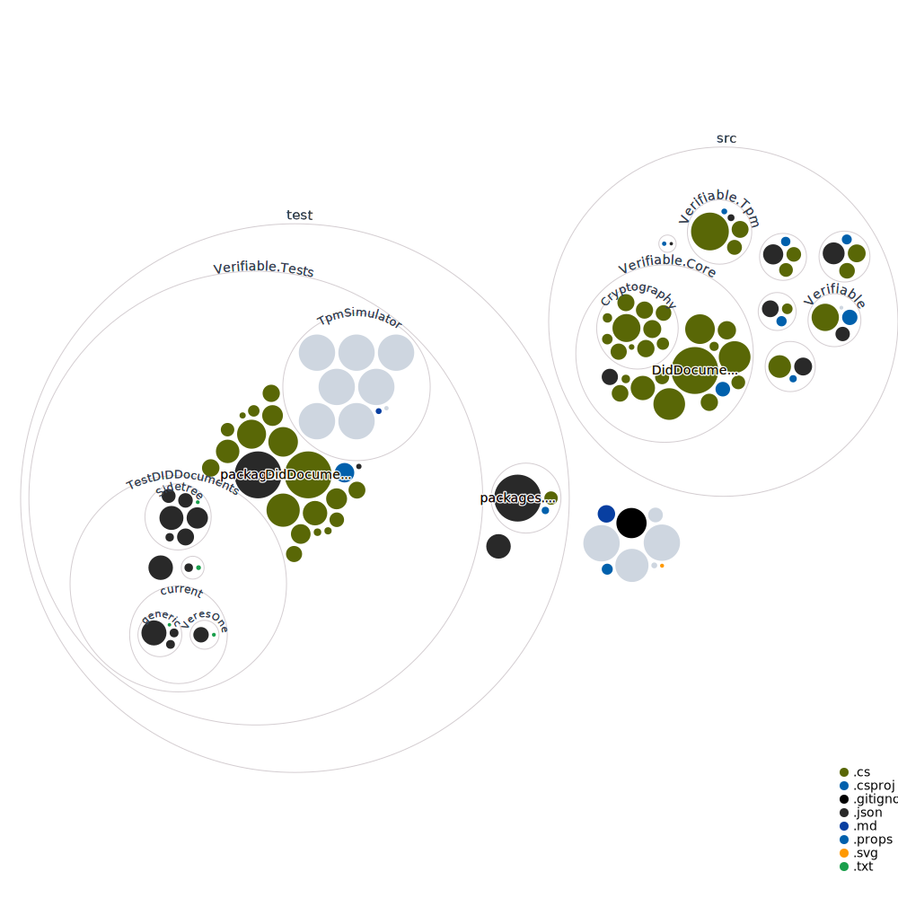

#### Decentralized identifiers, verifiable credentials, associated protocols and key management with hardware security elements.

This repository contains projects that implement .NET libraries for [W3C decentralized identifier specification (DID)](https://www.w3.org/TR/did-core/), [Verifiable Credentials](https://www.w3.org/TR/vc-data-model/) and related technologies from [Decentralized Identity Foundation (DIF)](https://identity.foundation/).

In simple terms these libraries implement a specification for documents that have distinquishing identifier, can be signed, linked, timestamped, managed and combined into representations without the necessity of a central, governing party but can also function well with such parties ([eIDAS](https://en.wikipedia.org/wiki/EIDAS) may be one).

Since this technology and its likely applications rely on cryptography, these libraries include basic implementation for management of secrets such as the created documents and their material. Technologies include _trusted platform modules_ (TPM), _hardware security modules_ (HSM) and other potential technology such secure enclaves.

## Features

- Decentralized identifiers (DID).
- Verifiable credentials (VC).
- Various related protocols to DIDs and VCs.
- Key and secrets management.

## The design principles

- **Agnostic to serialization and deserialization library.** The design principles for DIDs and VCs and other data elements do not rely on specific deserialization and serialization (e.g. no library specific attributes on types) libraries. Current implementation uses [System.Text.Json](https://www.nuget.org/packages/System.Text.Json/) converters. [CBOR](https://github.com/dotnet/runtime/issues/32121) could be interesting.
- **Data oriented programming**. Or leaning towards it. The code is structured around the idea of parameters going in functions and results from return values. Or in more length: code is separate from (immutable) data, leaning generic data structures and general-purpose functions (extenstions methods and static methods).
- **Sensitive memory is ring-fenced using types.** The goal is to recognize sensitive key material and handle it appropriately (noting security practices and regulations). Currently public, private and other key material is ring-fenced to types. The types are wrappes that know how to point to and and unwrap material to operations. The material can be allocated using [MemoryPool&lt;T&gt;](https://docs.microsoft.com/en-us/dotnet/api/system.buffers.memorypool-1) and so a custom allocator can be provided (e.g. for [mlocked](https://man7.org/linux/man-pages/man2/mlock.2.html) memory regions).
- **Agnostic to underlying cryptographic implementation**. The design should allow using external, special libraries. Currently [BouncyCastle](https://www.nuget.org/packages/Portable.BouncyCastle/), [NSec.Cryptography](https://www.nuget.org/packages/NSec.Cryptography) and [.NET standard cryptography](https://docs.microsoft.com/en-us/dotnet/standard/security/cryptography-model) are included (TPM is in progress).
- **Hardware security elements**. It should be possible to use hardware security elements, such as [trusted platform modules](https://en.wikipedia.org/wiki/Trusted_Platform_Module).
- **Developer experience**. Writing against an evolving specification or some specific specifications can be difficult. It takes time to learn. So code shoud link in comments to W3C and RFCs where approprite (see code for examples).
- **Tests and tests that use real data**. There should be as much tests as possible. Also thests that use as test vectors data from other implementations to cross-check.

## Vulnerability disclosure

If you find a vulnerability in this project please let us know as soon as possibly. For secure disclosure, please see the [security policy](.github/SECURITY.md).

## Contributing

Please, read [contribution guidelines](.github/contributing.md) for technicalities.

For development, the code and project should run on Windows, Linux and MacOS. Some hardware specific elements may work on only some operating systems.

.NET 6 is needed. Community at [TPM.DEV](https://developers.tpm.dev/) for TPM related study materials and discussions could be great, they have also.

Taking something from contribution guide and adding specific ideas.

#### The usual things :)

:eyes: Please, do write issues.

:raised_hands: By all means, do create pull requests (see [contribution guidelines](.github/contributing.md)).

:star: Stars also help.

#### The code things

:white_check_mark: Adding tests is really good, of course.

:computer: adding TPM functionality (signing, encryption, permissions) &ndash; and tests.

:thought_balloon: Issue templates and other improvements to project.

:rocket: improve continuous integration automation is always good!

:closed_lock_with_key: Add more cryptographic and security capabilities.

:key: As a corollary, add X509 related functionality.

:blue_book: Support for more protocols (see at https://identity.foundation/).

#### The things writing code

:memo: Threat and privacy modelling diagrams and explanations would be cool! [LINDDUN](https://www.linddun.org/) is a great one! But not the only one! A nice compilation to choose from is [SEI: Threat Modeling: 12 Available Methods](https://insights.sei.cmu.edu/blog/threat-modeling-12-available-methods/). These really need to be written down at some point.

:book: Draft plans, add documents and [eIDAS](https://en.wikipedia.org/wiki/EIDAS) data objects and some algorithms.

## Repository visualization

