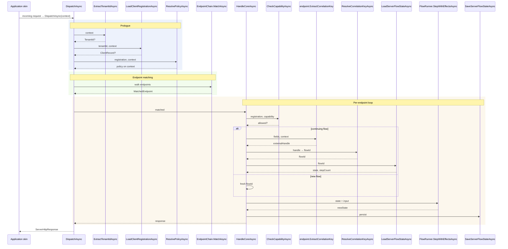
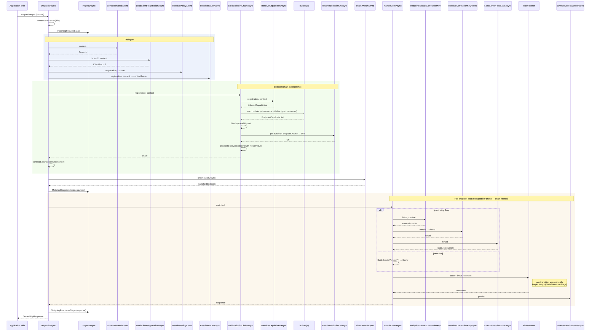

# Verifiable.OAuth — AuthorizationServer Design Notes

This is a living document. Decisions, scale assumptions, and open questions accumulate here as they surface in design discussion. Polish later. The goal is to keep architectural reasoning in one place so future work composes against a stable picture rather than re-deriving the picture each time.

For decisions that have settled into the codebase as committed architectural choices, see the `/documents/ADRs/` folder. This document is upstream of those — a working surface for thinking, not a record of finalised decisions.

---

## 1. Scale assumptions

The AS is designed for **agents-ready** throughput: millions of concurrent agents, including agents that may themselves run the AS. The deployment shape ranges from a single in-process AS for an embedded credential flow to a horizontally-scaled multi-region cluster handling autonomous-agent traffic.

The key consequence: **per-call certainty**, not statistical rarity. Every per-request operation must be deterministic-by-construction. "Rare" doesn't exist at scale. Two examples that illustrate the principle:

- A 64-bit random field with birthday collision at ~4 billion sounds safe in isolation. At millions of issuances per second it collides within an hour. Random fields used in any per-request artefact (nonces, jti values, opaque token bodies) need ≥128 bits when they're protecting freshness against an active attacker, or at least 96 bits when collision resistance is the only concern.
- A `kid` lookup taking 200 nanoseconds is fine alone. Multiplied across every request from millions of agents it's a bottleneck. Key resolvers must support in-process caching on the hot path; the library documents this expectation but cannot enforce it because the backend is the application's choice.

**Corollary on storage:** the per-request volume profile of some operations (DPoP JTI replay, RFC 9421 signature replay, attestation replay) is orders of magnitude higher than the per-flow volume of user-initiated handles (request_uri, code, device_code). Both go through the same storage abstraction; the application's backend choice (Redis cluster, Orleans grain, in-memory cache, signature-only stateless) absorbs the difference.

---

## 2. Pipeline overview

A request flows through three layers in order: **request prologue** (tenant, registration, policy), **endpoint chain** (matching), **per-endpoint loop** (state load → step → save). Every transition has a named typed delegate; the application wires the delegates, the library composes them.

The two diagrams below show the pre-9h current state and the post-9h future state. The 9h refactor's net effect: every per-call decision flows through a named typed delegate on `AuthorizationServerIntegration`; every per-call resolved value lives on `RequestContext`; every consumer reads from one source of truth. Inspection hooks at four well-defined points enable audit, telemetry, and security-event emission without library code changes.

#### Pre-9h current state

#### Post-9h future state

### 2.1 Prologue stage

| Delegate | Returns | Purpose |
|---|---|---|
| `ExtractTenantIdAsync` | `TenantId?` | Application reads tenant from whichever request signal identifies it (URL segment, subdomain, header, claim). Null → `400 invalid_request`. |
| `LoadClientRegistrationAsync` | `ClientRecord?` | Application loads the registration for the tenant. Null → `404`. Result stamped on `context.Registration`. |
| `ResolvePolicyAsync` | (writes to context) | Resolves per-request `PolicyProfile` and related policy state onto the context. Downstream code consults via typed `RequestContext` extensions. |

All three are required (the integration's `Validate()` enforces); applications must wire them at construction time.

### 2.2 Endpoint chain stage

`EndpointChain.MatchAsync` walks every registered endpoint's `MatchesRequest` until one returns a non-null `MatchPayload`. Endpoints are registered via `EndpointBuilders` (`AuthCodeEndpoints.Builder`, `Oid4VpEndpoints.Builder`, `MetadataEndpoints.Builder`, `RegistrationEndpoints.Builder`). Application chooses which builders to include.

### 2.3 Per-endpoint loop stage

`HandleCoreAsync` runs the 8-step state-machine loop:

1. Capability check (registration allows this endpoint's capability).
2. Stateless short-circuit (no state to load/save).
3. Get current state — either generate fresh `flowId` for new flows, or extract external handle → resolve correlation key → load state.
4. Stamp verified-at on context.
5. `endpoint.BuildInputAsync` produces typed input or early-exit response.
6. `FlowRunner.StepWithEffectsAsync` advances the PDA.
7. `endpoint.BuildResponse` produces the response.
8. Persist via `SaveServerFlowStateAsync`.

Step 8 is where the application's `SaveServerFlowStateAsync` lambda pattern-matches on state type to update secondary indexes for the next step's correlation lookup. This is how `request_uri`, `code`, `device_code`, and `(issuer, jti)` all get their lookup paths — same delegate, application-side discrimination.

### 2.4 Replay determinism

The PDA's state-step transitions are deterministic given identical inputs.
The `Save/LoadServerFlowStateAsync` shape captures state snapshots, not the
input log; replay against the persisted state stream reconstructs "what
the state was at each step", but re-running an action (e.g. a DPoP-proof
JTI lookup) against external state that has since changed could produce a
different action-result and therefore a different next state.

For deployments that need strict deterministic replay — forensic
reconstruction, long-trace property-based testing — the per-step
`(before-state, input, action-results, after-state)` tuple is the right
artefact to capture. The `InspectAsync(StateTransitionStage)` hook
introduced in phase 9h is the natural emission point; the deployment's
inspector lambda records each tuple into whatever event store the
forensic trail uses. The library's storage abstraction does not bake
this in — replay determinism is a deployment concern, not a library
invariant.

---

## 3. Layered delegate model

Every integration point falls into one of three layers. Each layer composes the layer below it.

### Bottom layer: storage delegates

The universal storage contract. Backend-agnostic by design.

| Delegate | Shape |
|---|---|
| `LoadServerFlowStateDelegate` | `(tenantId, correlationKey, context, ct) → (OAuthFlowState?, stepCount)` |
| `SaveServerFlowStateDelegate` | `(tenantId, correlationKey, state, stepCount, context, ct) → void` |
| `ResolveCorrelationKeyDelegate` | `(tenantId, flowKind, externalHandle, context, ct) → flowId?` |
| `LoadClientRegistrationDelegate` | `(tenantId, context, ct) → ClientRecord?` |

The application's implementation chooses the backend: Redis, Orleans, in-memory, signature-only stateless, distributed K/V, hybrid layered cache + persistent store. The library's contract is intentionally agnostic — different SLO regimes (single-instance demo vs millions of agents) use radically different backends behind the same delegate signatures.

### Middle layer: cryptographic primitive delegates

Tagged primitives routed through `CryptographicKeyFactory` registry and dispatched via `CryptographicKeyEvents`. Backends (`Verifiable.Microsoft`, `Verifiable.BouncyCastle`, `Verifiable.NSec`, future `Verifiable.Tpm`) provide concrete implementations.

| Delegate | Purpose |
|---|---|
| `ComputeDigestDelegate` | Hash of arbitrary `ReadOnlySequence<byte>` input. |
| `ComputeHmacDelegate` | Keyed hash; symmetric MAC. |
| `VerifyHmacDelegate` | Recompute-and-compare MAC verification. |
| `SigningDelegate` | Asymmetric signature production. |
| `VerificationDelegate` | Asymmetric signature verification. |

Key resolution sits alongside the primitives and uses a unified slot model across signing and HMAC. Rotation policy lives in a `KeySet` (slots: `Incoming`, `Current`, `Retiring`, `Historical`) — `Incoming` is pre-published but not yet used for issuance; `Current` is active; `Retiring` is no longer used for issuance but still accepted for verification; `Historical` is archived (not verifiable, not published). The signing-side equivalent is the existing `SigningKeySet` per `ClientRecord.SigningKeys[usage]`; the HMAC-side `KeySet` (non-generic, lives at integration level) and its in-process default `InProcessKeySet` both store `KeyId` per slot. Material loading is decoupled from rotation.

Selection and byte-loading are separate delegates:

| Role | Signing | HMAC |
|---|---|---|
| Slot store | `SigningKeySet` (per `KeyUsageContext`) | `KeySet` (non-generic, stores `KeyId` per slot) |
| Selector | `SelectSigningKeyDelegate` → `KeyId` | `SelectHmacKeyDelegate` → `KeyId?` |
| Byte-loader (private) | `ServerSigningKeyResolverDelegate(KeyId, TenantId, …) → PrivateKeyMemory?` | `ResolveServerHmacKeyDelegate(KeyId, TenantId, …) → SymmetricKey?` |
| Byte-loader (public) | `ServerVerificationKeyResolverDelegate(KeyId, TenantId, …) → PublicKeyMemory?` | (not applicable — symmetric) |
| Material type | `PrivateKeyMemory` / `PublicKeyMemory` | `SymmetricKey` |
| Publishable in JWKS | Always (`Incoming + Current + Retiring`) | Opt-in per keyset; renders as `kty=oct` per RFC 7518 §6.4 |

The signing side stores `KeyId` per slot and loads material lazily via the byte-loader — HSM/KMS-friendly by construction. The HMAC in-process default holds a `Dictionary<KeyId, SymmetricKey>` side store alongside the slot tracker (`InProcessKeySet`); an HSM-backed HMAC deployment would wire a different byte-loader and reuse the same slot model.

All byte-loaders take `(KeyId keyId, TenantId tenantId, RequestContext, CancellationToken)`. `TenantId` is threaded for application convenience — it lets the resolver shard by tenant first before looking up by kid within the tenant. Applications that don't need per-tenant isolation ignore the parameter. Selection happens upstream; byte-loaders perform no rotation logic, no selection logic, no slot-membership gating. Verifiability-by-slot is checked separately via `KeySet.IsKidValidForVerification(KeyId)` before invoking the byte-loader.

`ServerDecryptionKeyResolverDelegate` continues to return `PrivateKeyMemory?` for OID4VP encrypted-payload decryption; it's a per-key lookup without the rotation surface (no current decryption kid selection beyond the registration-time-bound `ClientRecord.EncryptionKeyId`).

### Top layer: application integration delegates

Application-shaped integration points that compose the layers below.

| Delegate | Composes |
|---|---|
| `ExtractTenantIdAsync` | (no lower-layer composition; pure request inspection) |
| `ResolvePolicyAsync` | Reads from registration, writes to context |
| `ParseClientMetadataServerDelegate` | Application's JSON layer; inbound RFC 7591/7592 body parsing |
| `ValidateRegistrationAccessTokenDelegate` | Comparison against application's stored credential form |
| `IssueDpopNonceDelegate` (planned, DPoP) | Composes `ComputeHmacAsync` + `ResolveServerHmacKey` + random + time |
| `ValidateDpopNonceDelegate` (planned, DPoP) | Composes `ComputeHmacAsync` + `ResolveServerHmacKey` |
| `ValidateDpopProofDelegate` | Composes `VerificationDelegate` + `ComputeDigestAsync` + replay-check via `Load/SaveServerFlowState` |

Top-layer delegates are where the library provides defaults that wire the lower layers together for the common case, and where applications override when their requirements differ from the defaults.

---

## 4. Storage abstraction philosophy

The library's storage contract is intentionally agnostic. `Load/SaveServerFlowStateDelegate` takes whatever parameters the protocol requires (`tenantId`, `correlationKey`, state, context) and the application decides how to fulfil them.

This means:

- **A single-instance development deployment** wires the delegate to an in-memory `ConcurrentDictionary`. Lookup is microseconds.
- **A horizontally-scaled cluster** wires it to Redis (with consistent-hashed sharding for the JTI volume), Orleans grains, DragonflyDB, ScyllaDB, or whatever the deployment's operational team chose.
- **A signature-stateless deployment** wires it to a custom impl that doesn't persist anything for some state types — for example, `ParRequestReceivedState` could be HMAC-encoded into the returned `request_uri` value rather than stored. The application's `LoadServerFlowStateDelegate` decodes the HMAC'd handle back into the state. This is genuinely allowed by the contract; the library doesn't know the difference.

The **secondary index pattern** lives entirely inside the application's `SaveServerFlowStateDelegate` lambda. Application pattern-matches on the inbound state type and writes whatever index entries the next protocol step needs to find via `ResolveCorrelationKeyAsync`. The library never sees the index structure.

**Implication for high-volume per-request operations** (DPoP JTI replay being the first concrete case): the same delegate handles them. Volume is the application's concern. The library's contract supports any reasonable backend; it's the deployment's job to wire one that meets its SLO.

---

## 5. Operational ordering on validation

Per-request validation follows a strict cheap-first ordering:

1. **Structural parse** — is the input syntactically well-formed? Cheap, no backend calls.
2. **Format and policy checks** — required fields present, claim shapes correct, expiry windows in tolerance.
3. **Cryptographic verification** — signature, HMAC. Compute-bound, no backend calls.
4. **Storage-backed checks** — replay defense (JTI lookup), binding lookup (access-token thumbprint), revocation lookup.

This is the order RFC 9449 §4.3 explicitly mandates for DPoP proof validation, and it's the right ordering for every per-request validation in the library. Three reasons:

- **DoS resistance.** An attacker hammering the AS with malformed proofs wastes only structural-parse cycles, not storage backend round-trips. Storage cost stays proportional to legitimate traffic, not attack volume.
- **Cost gradient.** The cheapest checks fail the largest fraction of bad inputs. Doing them first minimises total work.
- **Spec alignment.** Some specs (RFC 9449 §4.3 is the explicit case) mandate this ordering directly. Following it everywhere keeps protocol behaviour predictable.

**Exception case worth noting:** an application may legitimately want to interpose an even cheaper check before cryptographic verification — for example, a Bloom filter of known-bad-jti values for a rapid-revocation feed. The library's design doesn't preclude this; the application's `ValidateDpopProofDelegate` (or equivalent) can compose whatever it wants. The library's defaults follow the standard ordering; the application's overrides can choose differently if the threat model demands.

---

## 6. Per-call delegate guidance

Documented expectations for delegate implementations. None of these are enforced by the library (the application owns the backend); they're guidance the library's documentation should set.

- **Resolvers MUST cache in-process on the hot path.** `LoadClientRegistrationAsync`, `ResolveCorrelationKeyAsync`, `ResolveServerSigningKey`, `ResolveServerHmacKey` are called on every request. KMS / HSM / database round-trips on every call collapse throughput. The application's implementation must maintain an in-process cache (TTL-bounded, invalidated on rotation events) and only hit the cold backend on cache miss.
- **Backends MUST be async-capable.** The library's primitive delegates are all `ValueTask<T>`; software backends return synchronously-completed `ValueTask<T>` with state-machine elision (zero overhead), hardware backends genuinely await. Don't wrap a blocking backend in `Task.Run`; it defeats the purpose.
- **Failures MUST be deterministic.** The library doesn't retry on delegate failures — that's the application's HTTP handler chain's job. A delegate that throws gets its exception surfaced to the application; a delegate that returns null gets its semantic null-handling per the contract. No silent retries, no eventual-consistency tolerance inside the library.
- **`RequestContext` is the universal sidecar.** Every delegate takes it; applications can read prior decisions (`context.TenantId`, `context.Registration`, `context.Policy`) and write to it for downstream consumption. State that flows through the pipeline should travel via `RequestContext` extensions, not via the delegate parameters.

---

## 7. Open questions

Items genuinely undecided at the time of writing. Resolve in discussion; promote to settled section when decided.

### 7.1 Default DPoP nonce wire format

Stateless HMAC nonces using `ComputeHmacAsync`. The library will ship a default implementation; what fields does the default include?

- `kid` (key identifier for rotation) — required.
- `issuedAt` (Unix uint64 ms or sec) — required.
- `audienceHash` (first 16 bytes of SHA-256 of audience URI) — defense against cross-server replay.
- `random` (≥128 bits of CSPRNG) — collision resistance under high issuance volume.
- `hmacTag` (HMAC-SHA-256 over the preceding fields) — authentication.

Format encoding: binary packed for compactness (~80 bytes binary, ~110 bytes base64url) versus JWT-shaped (using the future JWS HS256 surface) for inspectability. Default proposal: binary packed. Rationale: nonces are opaque to clients (just echoed); compactness in HTTP header dominates; JWS HS256 isn't built yet (it's a listed-open consumer of the HMAC primitives). Override path: application replaces the default `IssueDpopNonceDelegate` / `ValidateDpopNonceDelegate` with their own implementation.

### 7.2 Server HMAC key lifecycle defaults — *settled, see §8*

Resolved by OAuth phases 6b → 9e (commits `9ad8065`, `9c5ce82`, `4cbf76b`, `1c0d19c`). The library ships `InProcessKeySet` (non-generic, slot-aware, `IDisposable`) as the in-process default for HMAC keys, with the same `Incoming`/`Current`/`Retiring`/`Historical` slot semantics used by the signing side. The byte-loader (`ResolveServerHmacKeyDelegate`) takes `(KeyId, TenantId, …)` and returns `SymmetricKey?`. Selection lives in `SelectHmacKeyDelegate`. Validation paths gate on slot membership (`KeySet.IsKidValidForVerification`) before invoking the byte-loader, so `Incoming` and `Historical` kids never validate inbound artefacts.

### 7.3 Forthcoming compositions

The library's nonce/proof/binding primitives will compose with two emerging protocols, expected to land as proper specs within the year:

- **DPoP-aware HTTP signing (RFC 9421 / draft-ietf-httpbis-message-signatures based)** — message signatures over the HTTP request itself, possibly binding the DPoP proof's key into the signature context.
- **HW-attested OAuth client authentication** via `draft-ietf-oauth-attestation-based-client-auth` — `urn:ietf:params:oauth:client-assertion-type:jwt-client-attestation` with EUDI Wallet WTE (Wallet Trust Evidence) / Apple App Attest / Google Play Integrity / TPM-backed attestation evidence flowing through.

The library's design must compose with both without changing the existing delegate signatures. The top-layer delegate model (application implements `IssueDpopNonceDelegate` / `ValidateDpopNonceDelegate` and can bake whatever extra fields it needs into the HMAC input) supports HTTP-signing composition naturally. Attestation-based client authentication composes through `ValidateClientAssertionDelegate` (currently shaped for `private_key_jwt` and will need extension for the attestation variant) — design TBD when the draft stabilises.

Reference links (to be verified against current versions before any phase that depends on them):

- `draft-ietf-oauth-attestation-based-client-auth`: <https://datatracker.ietf.org/doc/draft-ietf-oauth-attestation-based-client-auth/>
- EUDI ARF: <https://github.com/eu-digital-identity-wallet/architecture-and-reference-framework>
- HAIP: <https://openid.net/specs/openid4vc-high-assurance-interoperability-profile-1_0.html>
- OID4VCI §11.2 wallet attestation: <https://openid.net/specs/openid-4-verifiable-credential-issuance-1_0.html>
- RFC 9421 (HTTP Message Signatures): <https://www.rfc-editor.org/rfc/rfc9421>
- Android Keystore attestation: <https://source.android.com/docs/security/features/keystore/attestation>
- Apple App Attest: <https://developer.apple.com/documentation/devicecheck/>
- TPM-based attestation: TCG Credential Profile EK 2.0; `TPM2_Quote` for platform state; `TPM2_Certify` for key attestation.

### 7.4 JTI replay storage at agent-ready volume

The DPoP JTI replay storage hits `Load/SaveServerFlowStateAsync` on every DPoP-bearing request. At millions of requests per second the per-key write rate is order-of-magnitude above per-flow handles. The library's contract supports this — the delegate signature carries no inherent throughput limit — but real deployments will need carefully-chosen backends (Redis cluster with sharded keyspace, DragonflyDB, or similar) plus careful TTL management.

The library should document this clearly in the `Load/SaveServerFlowStateAsync` XML doc comments — what kinds of state types exist, their volume profiles, and the implications for backend selection. Currently the docs describe the contract but don't quantify the volume gap; that's a documentation improvement worth doing alongside any phase that adds per-request state types.

### 7.5 Self-hosted AS — agent-as-AS deployment shape

The scale assumption notes that agents may run the AS themselves. This implies a deployment shape where the library's AS code is part of an agent's runtime, handling its own outbound credential flows and possibly inbound calls from other agents. The implications for resource consumption, key isolation, and trust boundaries aren't fully worked through yet. Worth a dedicated section when the shape becomes concrete enough to design against.

---

## 8. Settled architectural decisions (promote when ready)

Decisions in this section have become so foundational they no longer need re-discussion. Move items here from §7 when they're settled across the codebase and tests, or split into ADRs in `/documents/ADRs/` when they deserve their own decision record.

- **Unified key-rotation primitive.** Both signing and HMAC use the same slot model (`Incoming` / `Current` / `Retiring` / `Historical`) — signing via the existing `SigningKeySet` per `ClientRecord.SigningKeys[usage]`, HMAC via the non-generic `KeySet` (with `InProcessKeySet` as the in-process default). Selection (`SelectSigningKeyDelegate` / `SelectHmacKeyDelegate`) is separated from byte-loading (`ServerSigningKeyResolverDelegate` / `ServerVerificationKeyResolverDelegate` / `ResolveServerHmacKeyDelegate`). All byte-loaders take typed `(KeyId, TenantId, RequestContext, CancellationToken)`. Closed audit MD #4. See §3 for the full layered model. Shipped across OAuth phases 6b → 9e (commits `9ad8065`, `9c5ce82`, `4cbf76b`, `1c0d19c`).
