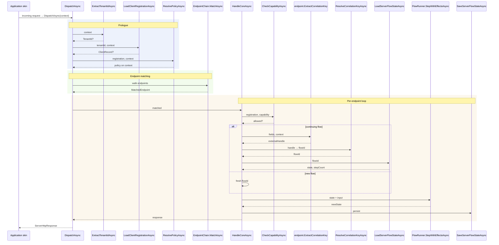
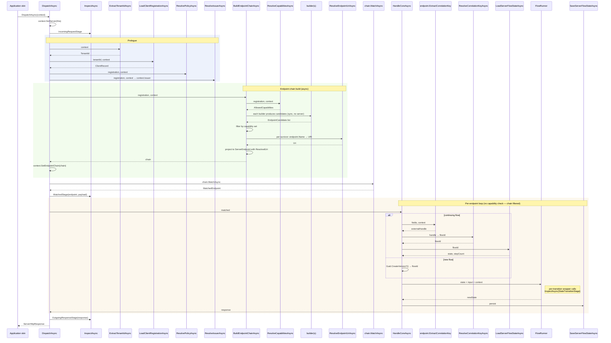

# Verifiable.OAuth — AuthorizationServer Design Notes

This is a living document. Decisions, scale assumptions, and open questions accumulate here as they surface in design discussion. Polish later. The goal is to keep architectural reasoning in one place so future work composes against a stable picture rather than re-deriving the picture each time.

For decisions that have settled into the codebase as committed architectural choices, see the `/documents/ADRs/` folder. This document is upstream of those — a working surface for thinking, not a record of finalised decisions.

---

## 1. Scale assumptions

The AS is designed for **agents-ready** throughput: millions of concurrent agents, including agents that may themselves run the AS. The deployment shape ranges from a single in-process AS for an embedded credential flow to a horizontally-scaled multi-region cluster handling autonomous-agent traffic.

The key consequence: **per-call certainty**, not statistical rarity. Every per-request operation must be deterministic-by-construction. "Rare" doesn't exist at scale. Two examples that illustrate the principle:

- A 64-bit random field with birthday collision at ~4 billion sounds safe in isolation. At millions of issuances per second it collides within an hour. Random fields used in any per-request artefact (nonces, jti values, opaque token bodies) need ≥128 bits when they're protecting freshness against an active attacker, or at least 96 bits when collision resistance is the only concern.
- A `kid` lookup taking 200 nanoseconds is fine alone. Multiplied across every request from millions of agents it's a bottleneck. Key resolvers must support in-process caching on the hot path; the library documents this expectation but cannot enforce it because the backend is the application's choice.

**Corollary on storage:** the per-request volume profile of some operations (DPoP JTI replay, RFC 9421 signature replay, attestation replay) is orders of magnitude higher than the per-flow volume of user-initiated handles (request_uri, code, device_code). Both go through the same storage abstraction; the application's backend choice (Redis cluster, Orleans grain, in-memory cache, signature-only stateless) absorbs the difference.

---

## 2. Pipeline overview

A request flows through three layers in order: **request prologue** (tenant, registration, policy), **endpoint chain** (matching), **per-endpoint loop** (state load → step → save). Every transition has a named typed delegate; the application wires the delegates, the library composes them.

The two diagrams below show the pre-9h current state and the post-9h future state. The 9h refactor's net effect: every per-call decision flows through a named typed delegate on `AuthorizationServerIntegration`; every per-call resolved value lives on `RequestContext`; every consumer reads from one source of truth. Inspection hooks at four well-defined points enable audit, telemetry, and security-event emission without library code changes.

#### Pre-9h current state

```mermaid
sequenceDiagram
    participant Skin as Application skin
    participant AS as DispatchAsync
    participant ETI as ExtractTenantIdAsync
    participant LCR as LoadClientRegistrationAsync
    participant RP as ResolvePolicyAsync
    participant EC as EndpointChain.MatchAsync
    participant HC as HandleCoreAsync
    participant CC as CheckCapabilityAsync
    participant ECK as endpoint.ExtractCorrelationKey
    participant RCK as ResolveCorrelationKeyAsync
    participant LFS as LoadServerFlowStateAsync
    participant Step as FlowRunner.StepWithEffectsAsync
    participant SFS as SaveServerFlowStateAsync

    Skin->>AS: incoming request → DispatchAsync(context)

    rect rgba(220, 230, 250, 0.5)
    note over AS,RP: Prologue
    AS->>ETI: context
    ETI-->>AS: TenantId?
    AS->>LCR: tenantId, context
    LCR-->>AS: ClientRecord?
    AS->>RP: registration, context
    RP-->>AS: policy on context
    end

    rect rgba(230, 250, 220, 0.5)
    note over AS,EC: Endpoint matching
    AS->>EC: walk endpoints
    EC-->>AS: MatchedEndpoint
    end

    rect rgba(250, 240, 220, 0.5)
    note over HC,SFS: Per-endpoint loop
    AS->>HC: matched
    HC->>CC: registration, capability
    CC-->>HC: allowed?
    alt continuing flow
        HC->>ECK: fields, context
        ECK-->>HC: externalHandle
        HC->>RCK: handle → flowId
        RCK-->>HC: flowId
        HC->>LFS: flowId
        LFS-->>HC: state, stepCount
    else new flow
        HC->>HC: fresh flowId
    end
    HC->>Step: state + input
    Step-->>HC: newState
    HC->>SFS: persist
    HC-->>AS: response
    end

    AS-->>Skin: ServerHttpResponse
```

#### Post-9h future state

```mermaid
sequenceDiagram
    participant Skin as Application skin
    participant AS as DispatchAsync
    participant INS as InspectAsync
    participant ETI as ExtractTenantIdAsync
    participant LCR as LoadClientRegistrationAsync
    participant RP as ResolvePolicyAsync
    participant RI as ResolveIssuerAsync
    participant BCA as BuildEndpointChainAsync
    participant RC as ResolveCapabilitiesAsync
    participant BLD as builder(s)
    participant REU as ResolveEndpointUriAsync
    participant EC as chain.MatchAsync
    participant HC as HandleCoreAsync
    participant ECK as endpoint.ExtractCorrelationKey
    participant RCK as ResolveCorrelationKeyAsync
    participant LFS as LoadServerFlowStateAsync
    participant Step as FlowRunner
    participant SFS as SaveServerFlowStateAsync

    Skin->>AS: DispatchAsync(context)
    AS->>AS: context.SetServer(this)
    AS->>INS: IncomingRequestStage

    rect rgba(220, 230, 250, 0.5)
    note over AS,RI: Prologue
    AS->>ETI: context
    ETI-->>AS: TenantId
    AS->>LCR: tenantId, context
    LCR-->>AS: ClientRecord
    AS->>RP: registration, context
    AS->>RI: registration, context → context.Issuer
    end

    rect rgba(230, 250, 220, 0.5)
    note over BCA,REU: Endpoint chain build (async)
    AS->>BCA: registration, context
    BCA->>RC: registration, context
    RC-->>BCA: AllowedCapabilities
    BCA->>BLD: each builder produces candidates (sync, no server)
    BLD-->>BCA: EndpointCandidate list
    BCA->>BCA: filter by capability set
    BCA->>REU: per survivor: endpoint.Name → URI
    REU-->>BCA: Uri
    BCA->>BCA: project to ServerEndpoint with ResolvedUri
    BCA-->>AS: chain
    AS->>AS: context.SetEndpointChain(chain)
    end

    AS->>EC: chain.MatchAsync
    EC-->>AS: MatchedEndpoint
    AS->>INS: MatchedStage(endpoint, payload)

    rect rgba(250, 240, 220, 0.5)
    note over HC,SFS: Per-endpoint loop (no capability check — chain filtered)
    AS->>HC: matched
    alt continuing flow
        HC->>ECK: fields, context
        ECK-->>HC: externalHandle
        HC->>RCK: handle → flowId
        RCK-->>HC: flowId
        HC->>LFS: flowId
        LFS-->>HC: state, stepCount
    else new flow
        HC->>HC: Guid.CreateVersion7() → flowId
    end
    HC->>Step: state + input + context
    note right of Step: per-transition wrapper calls<br/>InspectAsync(StateTransitionStage)
    Step-->>HC: newState
    HC->>SFS: persist
    HC-->>AS: response
    end

    AS->>INS: OutgoingResponseStage(response)
    AS-->>Skin: ServerHttpResponse
```

### 2.1 Prologue stage

| Delegate | Returns | Purpose |
|---|---|---|
| `ExtractTenantIdAsync` | `TenantId?` | Application reads tenant from whichever request signal identifies it (URL segment, subdomain, header, claim). Null → `400 invalid_request`. |
| `LoadClientRegistrationAsync` | `ClientRecord?` | Application loads the registration for the tenant. Null → `404`. Result stamped on `context.Registration`. |
| `ResolvePolicyAsync` | (writes to context) | Resolves per-request `PolicyProfile` and related policy state onto the context. Downstream code consults via typed `RequestContext` extensions. |

All three are required (the integration's `Validate()` enforces). Applications set these seams at construction and alter them while serving through the requested alteration operation described in [Live configuration](#41-live-configuration). That operation is specified for the following implementation commits; the current validation and publication boundaries are stated there separately.

### 2.2 Endpoint chain stage

`EndpointChain.MatchAsync` walks every registered endpoint's `MatchesRequest` until one returns a non-null `MatchPayload`. Endpoints are registered via `EndpointBuilders` (`AuthCodeEndpoints.Builder`, `Oid4VpEndpoints.Builder`, `MetadataEndpoints.Builder`, `RegistrationEndpoints.Builder`). Application chooses which builders to include.

`EndpointBuilders` is also the app-facing extension seam for *new* endpoints — including ones the library does not ship. `EndpointBuilderDelegate` and `EndpointCandidate` are public, and the library's own flows are nothing more than builders in this same set, so adding an endpoint is uniform regardless of author:

- **A new standard RFC endpoint** (e.g. RFC 7009 revocation, Global Token Revocation, RP-Initiated Logout) is shipped in the library as one builder-produced `EndpointCandidate` plus, where it needs an application decision, one named slot on `AuthorizationServerIntegration` (e.g. `RevokeTokenDelegate`). The chunk is small and shaped like every other endpoint; the library owns the wire and conformance-tests it.
- **A proprietary or experimental endpoint** an application needs can be authored entirely application-side: register a custom builder returning a custom `EndpointCandidate` with its own `MatchesRequest` / `BuildInputAsync` / `BuildResponse`. The candidate reaches application state through the `ExchangeContext` it is handed, not through a new integration slot (the sealed `AuthorizationServerIntegration` bundle is library-defined). No fork is required.

This is the same boundary that governs signals: the library owns the standard wire and the decision *seam*; the application owns the decision and any proprietary translation. A brand-new RFC that drops mid-cycle is therefore an additive chunk — a builder plus, optionally, a delegate slot — not a pipeline rewrite.

### 2.3 Per-endpoint loop stage

`HandleCoreAsync` runs the 8-step state-machine loop:

1. Capability check (registration allows this endpoint's capability).
2. Stateless short-circuit (no state to load/save).
3. Get current state — either generate fresh `flowId` for new flows, or extract external handle → resolve correlation key → load state.
4. Stamp verified-at on context.
5. `endpoint.BuildInputAsync` produces typed input or early-exit response.
6. `FlowRunner.StepWithEffectsAsync` advances the PDA.
7. `endpoint.BuildResponse` produces the response.
8. Persist via `SaveServerFlowStateAsync`.

Step 8 is where the application's `SaveServerFlowStateAsync` lambda pattern-matches on state type to update secondary indexes for the next step's correlation lookup. This is how `request_uri`, `code`, `device_code`, and `(issuer, jti)` all get their lookup paths — same delegate, application-side discrimination.

### 2.4 Replay determinism

The PDA's state-step transitions are deterministic given identical inputs.
The `Save/LoadServerFlowStateAsync` shape captures state snapshots, not the
input log; replay against the persisted state stream reconstructs "what
the state was at each step", but re-running an action (e.g. a DPoP-proof
JTI lookup) against external state that has since changed could produce a
different action-result and therefore a different next state.

For deployments that need strict deterministic replay — forensic
reconstruction, long-trace property-based testing — the per-step
`(before-state, input, action-results, after-state)` tuple is the right
artefact to capture. The `InspectAsync(StateTransitionStage)` hook
introduced in phase 9h is the natural emission point; the deployment's
inspector lambda records each tuple into whatever event store the
forensic trail uses. The library's storage abstraction does not bake
this in — replay determinism is a deployment concern, not a library
invariant.

---

## 3. Layered delegate model

Every integration point falls into one of three layers. Each layer composes the layer below it.

### Bottom layer: storage delegates

The universal storage contract. Backend-agnostic by design.

| Delegate | Shape |
|---|---|
| `LoadServerFlowStateDelegate` | `(tenantId, correlationKey, context, ct) → (OAuthFlowState?, stepCount)` |
| `SaveServerFlowStateDelegate` | `(tenantId, correlationKey, state, stepCount, context, ct) → void` |
| `ResolveCorrelationKeyDelegate` | `(tenantId, flowKind, externalHandle, context, ct) → flowId?` |
| `LoadClientRegistrationDelegate` | `(tenantId, context, ct) → ClientRecord?` |

The application's implementation chooses the backend: Redis, Orleans, in-memory, signature-only stateless, distributed K/V, hybrid layered cache + persistent store. The library's contract is intentionally agnostic — different SLO regimes (single-instance demo vs millions of agents) use radically different backends behind the same delegate signatures.

### Middle layer: cryptographic primitive delegates

Tagged primitives routed through `CryptographicKeyFactory` registry and dispatched via `CryptographicKeyEvents`. Backends (`Verifiable.Microsoft`, `Verifiable.BouncyCastle`, `Verifiable.Libsodium`, future `Verifiable.Tpm`) provide concrete implementations.

| Delegate | Purpose |
|---|---|
| `ComputeDigestDelegate` | Hash of arbitrary `ReadOnlySequence<byte>` input. |
| `ComputeHmacDelegate` | Keyed hash; symmetric MAC. |
| `VerifyHmacDelegate` | Recompute-and-compare MAC verification. |
| `SigningDelegate` | Asymmetric signature production. |
| `VerificationDelegate` | Asymmetric signature verification. |

Key resolution sits alongside the primitives and uses a unified slot model across signing and HMAC. Rotation policy lives in a `KeySet` (slots: `Incoming`, `Current`, `Retiring`, `Historical`) — `Incoming` is pre-published but not yet used for issuance; `Current` is active; `Retiring` is no longer used for issuance but still accepted for verification; `Historical` is archived (not verifiable, not published). The signing-side equivalent is the existing `SigningKeySet` per `ClientRecord.SigningKeys[usage]`; the HMAC-side `KeySet` (non-generic, lives at integration level) and its in-process default `InProcessKeySet` both store `KeyId` per slot. Material loading is decoupled from rotation.

Selection and byte-loading are separate delegates:

| Role | Signing | HMAC |
|---|---|---|
| Slot store | `SigningKeySet` (per `KeyUsageContext`) | `KeySet` (non-generic, stores `KeyId` per slot) |
| Selector | `SelectSigningKeyDelegate` → `KeyId` | `SelectHmacKeyDelegate` → `KeyId?` |
| Byte-loader (private) | `ServerSigningKeyResolverDelegate(KeyId, TenantId, …) → PrivateKeyMemory?` | `ResolveServerHmacKeyDelegate(KeyId, TenantId, …) → SymmetricKey?` |
| Byte-loader (public) | `ServerVerificationKeyResolverDelegate(KeyId, TenantId, …) → PublicKeyMemory?` | (not applicable — symmetric) |
| Material type | `PrivateKeyMemory` / `PublicKeyMemory` | `SymmetricKey` |
| Publishable in JWKS | Always (`Incoming + Current + Retiring`) | Opt-in per keyset; renders as `kty=oct` per RFC 7518 §6.4 |

The signing side stores `KeyId` per slot and loads material lazily via the byte-loader — HSM/KMS-friendly by construction. The HMAC in-process default holds a `Dictionary<KeyId, SymmetricKey>` side store alongside the slot tracker (`InProcessKeySet`); an HSM-backed HMAC deployment would wire a different byte-loader and reuse the same slot model.

All byte-loaders take `(KeyId keyId, TenantId tenantId, RequestContext, CancellationToken)`. `TenantId` is threaded for application convenience — it lets the resolver shard by tenant first before looking up by kid within the tenant. Applications that don't need per-tenant isolation ignore the parameter. Selection happens upstream; byte-loaders perform no rotation logic, no selection logic, no slot-membership gating. Verifiability-by-slot is checked separately via `KeySet.IsKidValidForVerification(KeyId)` before invoking the byte-loader.

`ServerDecryptionKeyResolverDelegate` continues to return `PrivateKeyMemory?` for OID4VP encrypted-payload decryption; it's a per-key lookup without the rotation surface (no current decryption kid selection beyond the registration-time-bound `ClientRecord.EncryptionKeyId`).

### Top layer: application integration delegates

Application-shaped integration points that compose the layers below.

| Delegate | Composes |
|---|---|
| `ExtractTenantIdAsync` | (no lower-layer composition; pure request inspection) |
| `ResolvePolicyAsync` | Reads from registration, writes to context |
| `ParseClientMetadataServerDelegate` | Application's JSON layer; inbound RFC 7591/7592 body parsing |
| `ValidateRegistrationAccessTokenDelegate` | Comparison against application's stored credential form |
| `IssueDpopNonceDelegate` (planned, DPoP) | Composes `ComputeHmacAsync` + `ResolveServerHmacKey` + random + time |
| `ValidateDpopNonceDelegate` (planned, DPoP) | Composes `ComputeHmacAsync` + `ResolveServerHmacKey` |
| `ValidateDpopProofDelegate` | Composes `VerificationDelegate` + `ComputeDigestAsync` + replay-check via `Load/SaveServerFlowState` |

Top-layer delegates are where the library provides defaults that wire the lower layers together for the common case, and where applications override when their requirements differ from the defaults.

---

## 4. Storage abstraction philosophy

The library's storage contract is intentionally agnostic. `Load/SaveServerFlowStateDelegate` takes whatever parameters the protocol requires (`tenantId`, `correlationKey`, state, context) and the application decides how to fulfil them.

This means:

- **A single-instance development deployment** wires the delegate to an in-memory `ConcurrentDictionary`. Lookup is microseconds.
- **A horizontally-scaled cluster** wires it to Redis (with consistent-hashed sharding for the JTI volume), Orleans grains, DragonflyDB, ScyllaDB, or whatever the deployment's operational team chose.
- **A signature-stateless deployment** wires it to a custom impl that doesn't persist anything for some state types — for example, `ParRequestReceivedState` could be HMAC-encoded into the returned `request_uri` value rather than stored. The application's `LoadServerFlowStateDelegate` decodes the HMAC'd handle back into the state. This is genuinely allowed by the contract; the library doesn't know the difference.

The **secondary index pattern** lives entirely inside the application's `SaveServerFlowStateDelegate` lambda. Application pattern-matches on the inbound state type and writes whatever index entries the next protocol step needs to find via `ResolveCorrelationKeyAsync`. The library never sees the index structure.

**The claim primitive.** `Load`/`SaveServerFlowStateDelegate` are read-then-write, not a concurrency control: two concurrent requests that load the same `(correlationKey, stepCount)` both pass verification and both save, the second silently clobbering the first — invisible in every single-writer test and real under load. `ClaimServerFlowStateDelegate` sits beside `Load`/`Save`/`DeleteServerFlowStateDelegate` as the fourth required storage primitive, called after verification and before an irreversible effect (minting a token, consuming a pushed-authorization `request_uri`): it returns `true` for exactly one caller per `(correlationKey, expectedStepCount)` and `false` for every other. An in-memory backend implements it as a single `ConcurrentDictionary<(string, int), byte>.TryAdd` — no read-modify-write over the state dictionary itself, so the claim can never race with `Load`/`Save`. A distributed backend implements it as a conditional write against the same version/step column `Load` reads and `Save` writes (a compare-and-swap, or `UPDATE ... WHERE step_count = @expectedStepCount`).

**Implication for high-volume per-request operations** (DPoP JTI replay being the first concrete case): the same delegate handles them. Volume is the application's concern. The library's contract supports any reasonable backend; it's the deployment's job to wire one that meets its SLO.

**Validation timing.** The integration seams are set at construction and altered while serving through the requested alteration operation described in [Live configuration](#41-live-configuration), which the following commits implement. Today, the first `DispatchAsync` uses a `Lazy<bool>` with `PublicationOnly`: an explicit successful `Validate()` skips the factory's check, and a configuration exception is retryable until the gate publishes success. Wiring a missing seam before that success permits the next dispatch to recover. Concurrent callers can run the factory more than once; publication of success does not synchronize setters. Later seam or configuration changes do not invalidate that success. `LoadFlowStateAsync`, `SaveFlowStateAsync`, `ClaimFlowStateAsync`, and `DeleteFlowStateAsync` are required storage seams; the base integration reports a missing seam by name.

**Revocation seams and storage.** `RevokeTokenDelegate` handles client-driven RFC 7009 requests using the wire token. The optional `RevokeIssuedTokenDelegate` handles library-driven code replay and refresh reuse using persisted `jti` and token type. RFC 6749 §4.1.2 says "SHOULD revoke (when possible)"; without this optional seam audited access tokens remain valid until expiry, while the required delete seam invalidates the claimed live refresh record. Rotation retires its presented record in place and retains its index for the successor refresh lifetime. Hosts expire these records and index entries by `ExpiresAt`. Reuse loads the predecessor audit and walks retained successor records with a visited set, claims `(tenantId, flowId, loadedStepCount)` before deletion, and reloads once after a lost claim. A second lost claim stops without deleting unclaimed state. The walk has no hop cap; a corrupted cycle stops at its repeated flow id, keeping completed revocations. Code replay uses the same successor walk rooted at `RefreshFlowId`. Valid reuse persists `RevokedAt` through `ServerRefreshTokenReuseDetected`; its once-only effect is sequential.

### 4.1 Live configuration

The server is altered while it serves. The host can request an alteration directly, an observer of registration events can request one from inside a request, and a signal handler can request one in response to a reload signal or a configuration change notification. The server owns admission, draining, validation, and publication so all three origins use the same operation.

**Mechanisms present today.** [EndpointServer.cs](../src/Verifiable.Server/EndpointServer.cs) publishes `ServerConfiguration` through `Volatile.Write` in `ApplyConfiguration` and reads it through `Volatile.Read` in `Configuration`. [ServerConfiguration.cs](../src/Verifiable.Server/ServerConfiguration.cs) and [EndpointBuilderSet.cs](../src/Verifiable.Server/EndpointBuilderSet.cs) provide immutable endpoint-builder membership. [EndpointChain.cs](../src/Verifiable.Server/Pipeline/EndpointChain.cs) captures `server.Configuration.EndpointBuilders` once when building each request chain, before awaiting its builders. That capture happens after the request prologue: a request admitted before a configuration change can still acquire the replacement if it has not reached chain construction. Only the builder set is captured; mutable state held by builders and integration seams is outside this publication boundary. Builders run on every chain build, and [MetadataEndpoints.cs](../src/Verifiable.OAuth/Server/Metadata/MetadataEndpoints.cs) calls `BuildJwksDocumentAsync` for each JWKS request. Document caching and precomputation belong to the application.

[EndpointServer.cs](../src/Verifiable.Server/EndpointServer.cs) loads the registration for each ordinary dispatch unless `context.Registration` supplies a record, then resolves policy through `ResolvePolicyAsync` onto that request's context. [EndpointChain.cs](../src/Verifiable.Server/Pipeline/EndpointChain.cs) resolves capabilities once for the chain. A stable resolver can observe changed application data on the next request without replacing its delegate. Fresh request contexts and application-owned immutable records keep these decisions scoped to the request; a read-only collection interface alone does not freeze its backing data.

[AuthorizationServerIntegration.cs](../src/Verifiable.OAuth/Server/AuthorizationServerIntegration.cs) owns an instance-scoped registration-event subject. Subscription changes copy the observer array under a lock and publish the replacement through a volatile field. Each emission captures that array and invokes its observers synchronously; it does not see membership edits partway through delivery. Concurrent emitters can call the same observer concurrently, disposal does not cancel a delivery already captured, and an observer exception propagates to the emitter and stops later callbacks for that emission. Registration operations emit the events; application observers supply persistence, routing, and cache effects. Events take their timestamps from the injected host clock. Capability-grant and capability-revocation notifications alone do not change the registration or endpoint reachability. [ClientRegistrationEvent.cs](../src/Verifiable.OAuth/Server/ClientRegistrationEvent.cs) carries the live request context today, and the registration event carries the plaintext registration access token; this is not an immutable event projection.

The settable integration seams in [ServerIntegration.cs](../src/Verifiable.Server/ServerIntegration.cs) and [AuthorizationServerIntegration.cs](../src/Verifiable.OAuth/Server/AuthorizationServerIntegration.cs) are plain properties. They provide no publication barrier, no per-request capture of the wiring, and no validation invalidation. The same limit applies to the child setters in [AuthorizationServerCryptography.cs](../src/Verifiable.OAuth/Server/AuthorizationServerCryptography.cs) and [AuthorizationServerCodecs.cs](../src/Verifiable.OAuth/Server/AuthorizationServerCodecs.cs). The family registry and action executor in [EndpointServer.cs](../src/Verifiable.Server/EndpointServer.cs), and handler registration in [AuthorizationDetailTypeRegistry.cs](../src/Verifiable.OAuth/Server/AuthorizationDetailTypeRegistry.cs) and [OAuthActionExecutor.cs](../src/Verifiable.OAuth/OAuthActionExecutor.cs), are independent mutable wiring. Separate reference assignments do not publish a coherent group, and consumers can reread seams after awaits within one request.

The lazy first-dispatch validation gate in [EndpointServer.cs](../src/Verifiable.Server/EndpointServer.cs) publishes initial success through `Lazy<bool>` with `PublicationOnly`. It retries faults only until success is published and skips checking when an explicit validation has set `IsValidated`. A successful gate remains successful after property, nested-group, registry, or configuration changes. Explicit validation checks the primary integration and a nonempty builder set; it does not validate the family registry relationship or every nested group and enabled-feature dependency. The global registration handler in [RegistrationEndpoints.cs](../src/Verifiable.OAuth/Server/Registration/RegistrationEndpoints.cs) is a separate entry point that bypasses this dispatch gate. These mechanisms do not establish coherent concurrent alteration of the serving wiring.

**Requested alteration.** The following commits implement a server-owned operation that queues an alteration and returns a task to its requester. It stops admitting requests, lets in-flight requests finish on the unchanged wiring, and applies queued alterations one at a time in queue order after the in-flight count reaches zero. The alteration callback receives a candidate copy of the integration seams, nested groups, family registry, executor bindings, and configuration snapshot. Coupled changes form one request. The candidate's mutable wiring containers are separate from the live containers; shared application resources retain their host-defined ownership and synchronization.

The server validates the candidate as a complete composition, including required seams such as `ResolveEndpointUriAsync`, the primary and family integration relationship, nested groups, enabled-feature dependencies, and endpoint-builder membership. An empty configuration is refused unless explicitly declared as maintenance mode. Only a coherent candidate replaces the live wiring, through one reference assignment. An incoherent candidate is discarded, the live wiring remains untouched, and only the requester's task faults with an `InvalidOperationException` naming the missing or incoherent wiring. Admission resumes on the unchanged composition; a later coherent alteration can succeed. A queued request from a registration-event observer returns immediately without waiting for its own dispatch to drain. Its alteration can take effect only after that dispatch completes.

Arrivals during draining or publication are held for a bounded policy interval, defaulting to a few seconds. They resume after the operation closes, or receive a refusal with `Retry-After` through the existing OAuth error path when that bound expires. Once the server serves, setters on the live integrations and their nested groups, `ApplyConfiguration`, `AddIntegration`, action-executor setters, and registry `Register` operations throw a named configuration fault on live objects. Alteration callbacks edit candidate objects; construction wiring and candidate setters remain available. Successful validation belongs to the wiring accepted when the alteration window closes; opening the window clears its validation state and closing it validates the candidate. The lazy first-dispatch modes are replaced by admission against validated wiring, including the global registration entry point. Before initial validation, admission faults rather than performing a per-request validation scan.

The drain quiesces requests, not flows. Load, claim, delete, save, and correlation resolution must refer to one coherent storage domain throughout a request. Persisted flow state can span several requests and remains in the storage seam that received it. A storage re-wire therefore requires the host's migration or forwarding step before those flows can continue against the replacement. After draining, the host can retire resources belonging to the replaced wiring once no retained flow still needs them. Draining does not migrate flow records or synchronize mutable state inside application delegates.

The registration plane stays outside the wiring alteration window: registrations, capabilities, and keys change through requests while the server serves. Its own authoritative commit boundary precedes optional observation. A required-persistence observer's failure propagates; an optional observer's failure is isolated and reported after commit. Per-registration revisions and conditional updates govern concurrent changes. Unique subscription entries make disposal idempotent. Events expose an immutable projection of identifiers, revision, and selected fields instead of the live request context and plaintext registration access token. Capability grants and revocations require an application state change visible to capability resolution. A registration event can request a wiring alteration, but emitting it does not itself alter or validate wiring.

**Existing proofs.** [LiveServerAlterationTests](../test/Verifiable.Tests/OAuth/LiveServerAlterationTests.cs) gathers the existing cases without changing their names or bodies. `DispatchThrowsTheNamedConfigurationFaultWhenClaimFlowStateAsyncIsMissing` proves the named initial fault in process; `DispatchRecoversOnTheNextCallAfterTheMissingSeamIsWiredAsync` proves recovery when wiring completes between in-process dispatches; `FullyWiredHostDispatchesWithoutAnExplicitValidateCall` proves initial lazy validation over the HTTP listener. These establish initial admission behavior, not candidate validation after successful traffic.

`RegisterClientFiresClientRegisteredEventWithCorrectPayload`, `RegistrationStoreIsPopulatedImmediatelyAfterRegisterClient`, `DeregisterClientRemovesFromRoutingTableAndDispatchReturns404`, `CapabilityGrantedEventCarriesCorrectPayload`, and `DeregisteredClientJwksAndDiscoveryReturn404` exercise registration notifications and routing effects in process. The capability case proves the notification payload, not a grant's reachability effect. `AfterKeyRotationJwksContainsNewKid` and `RotationLifecycleEmitsClientUpdatedAtEveryTransition` prove in-process key publication and lifecycle notifications. `EventTimestampsReflectFakeTimeProviderAndAreOrdered` proves timestamps against the injected clock.

`LibraryCallsBuildJwksDocumentDelegateOnEveryRequest`, `KeyRotationFiresClientUpdatedEventForCacheInvalidation`, `ContextBagReachesJwksDelegateOnEveryCallForPerCallDecisions`, and `DelegateCanServePrecomputedDocumentFromApplicationCache` exercise application-owned JWKS computation and caching through in-process dispatch. Cache eviction and precomputation are explicit test-side actions after event collection. `EndpointBuildersAreInvokedOncePerRequestNotCachedPerRegistration` installs a replacement configuration before dispatch and proves per-request builder invocation. These cases do not prove replacement during overlapping requests or event observation from a real registration flow.

**Proofs added by the following commits.** Each new case uses requests over the actual listener, deterministic barriers, invariant assertions, its own clause anchor, and a negative control that removes the effect it claims to prove. The cases establish: (a) an in-flight request completes on the old wiring while alteration waits for the drain; (b) an arrival during the window is held and served after closure, or refused with `Retry-After` after the bound; (c) a seam replaced on the candidate takes effect on the next request; (d) concurrent arrivals around a configuration alteration never observe mixed configurations; (e) an incoherent alteration cannot publish and faults by name, while a later coherent alteration succeeds; (f) a setter on live wiring outside the operation throws; and (g) storage replacement cannot split one load/claim/delete/save, including a flow spanning the replacement with the host's migration step.

The remaining cases establish: (h) a subscriber observing a real registration flow receives the immutable event projection; (i) a policy change resolves on the next request; (j) the global registration entry point faults on invalid wiring; (k) capability grant then revoke changes endpoint reachability over the wire; (l) an alteration requested inside a registration-event observer does not block that request and takes effect on the next request after it completes; (m) a signal-handler trigger queues and applies an alteration in the same way; (n) two concurrent alteration requests apply in queue order with each candidate validated; and (o) an incoherent candidate leaves the live wiring byte-identical, serves the next request through the old wiring, and faults only its requester's task.

---

## 5. Operational ordering on validation

Per-request validation follows a strict cheap-first ordering:

1. **Structural parse** — is the input syntactically well-formed? Cheap, no backend calls.
2. **Format and policy checks** — required fields present, claim shapes correct, expiry windows in tolerance.
3. **Cryptographic verification** — signature, HMAC. Compute-bound, no backend calls.
4. **Storage-backed checks** — replay defense (JTI lookup), binding lookup (access-token thumbprint), revocation lookup.

This is the order RFC 9449 §4.3 explicitly mandates for DPoP proof validation, and it's the right ordering for every per-request validation in the library. Three reasons:

- **DoS resistance.** An attacker hammering the AS with malformed proofs wastes only structural-parse cycles, not storage backend round-trips. Storage cost stays proportional to legitimate traffic, not attack volume.
- **Cost gradient.** The cheapest checks fail the largest fraction of bad inputs. Doing them first minimises total work.
- **Spec alignment.** Some specs (RFC 9449 §4.3 is the explicit case) mandate this ordering directly. Following it everywhere keeps protocol behaviour predictable.

**Exception case worth noting:** an application may legitimately want to interpose an even cheaper check before cryptographic verification — for example, a Bloom filter of known-bad-jti values for a rapid-revocation feed. The library's design doesn't preclude this; the application's `ValidateDpopProofDelegate` (or equivalent) can compose whatever it wants. The library's defaults follow the standard ordering; the application's overrides can choose differently if the threat model demands.

---

## 6. Per-call delegate guidance

Documented expectations for delegate implementations. None of these are enforced by the library (the application owns the backend); they're guidance the library's documentation should set.

- **Resolvers MUST cache in-process on the hot path.** `LoadClientRegistrationAsync`, `ResolveCorrelationKeyAsync`, `ResolveServerSigningKey`, `ResolveServerHmacKey` are called on every request. KMS / HSM / database round-trips on every call collapse throughput. The application's implementation must maintain an in-process cache (TTL-bounded, invalidated on rotation events) and only hit the cold backend on cache miss.
- **Backends MUST be async-capable.** The library's primitive delegates are all `ValueTask<T>`; software backends return synchronously-completed `ValueTask<T>` with state-machine elision (zero overhead), hardware backends genuinely await. Don't wrap a blocking backend in `Task.Run`; it defeats the purpose.
- **Failures MUST be deterministic.** The library doesn't retry on delegate failures — that's the application's HTTP handler chain's job. A delegate that throws gets its exception surfaced to the application; a delegate that returns null gets its semantic null-handling per the contract. No silent retries, no eventual-consistency tolerance inside the library.
- **`RequestContext` is the universal sidecar.** Every delegate takes it; applications can read prior decisions (`context.TenantId`, `context.Registration`, `context.Policy`) and write to it for downstream consumption. State that flows through the pipeline should travel via `RequestContext` extensions, not via the delegate parameters.

---

## 7. Open questions

Items genuinely undecided at the time of writing. Resolve in discussion; promote to settled section when decided.

### 7.1 Default DPoP nonce wire format

Stateless HMAC nonces using `ComputeHmacAsync`. The library will ship a default implementation; what fields does the default include?

- `kid` (key identifier for rotation) — required.
- `issuedAt` (Unix uint64 ms or sec) — required.
- `audienceHash` (first 16 bytes of SHA-256 of audience URI) — defense against cross-server replay.
- `random` (≥128 bits of CSPRNG) — collision resistance under high issuance volume.
- `hmacTag` (HMAC-SHA-256 over the preceding fields) — authentication.

Format encoding: binary packed for compactness (~80 bytes binary, ~110 bytes base64url) versus JWT-shaped (using the future JWS HS256 surface) for inspectability. Default proposal: binary packed. Rationale: nonces are opaque to clients (just echoed); compactness in HTTP header dominates; JWS HS256 isn't built yet (it's a listed-open consumer of the HMAC primitives). Override path: application replaces the default `IssueDpopNonceDelegate` / `ValidateDpopNonceDelegate` with their own implementation.

### 7.2 Server HMAC key lifecycle defaults — *settled, see §8*

Resolved by OAuth phases 6b → 9e (commits `9ad8065`, `9c5ce82`, `4cbf76b`, `1c0d19c`). The library ships `InProcessKeySet` (non-generic, slot-aware, `IDisposable`) as the in-process default for HMAC keys, with the same `Incoming`/`Current`/`Retiring`/`Historical` slot semantics used by the signing side. The byte-loader (`ResolveServerHmacKeyDelegate`) takes `(KeyId, TenantId, …)` and returns `SymmetricKey?`. Selection lives in `SelectHmacKeyDelegate`. Validation paths gate on slot membership (`KeySet.IsKidValidForVerification`) before invoking the byte-loader, so `Incoming` and `Historical` kids never validate inbound artefacts.

### 7.3 Forthcoming compositions

The library's nonce/proof/binding primitives will compose with two emerging protocols, expected to land as proper specs within the year:

- **DPoP-aware HTTP signing (RFC 9421 / draft-ietf-httpbis-message-signatures based)** — message signatures over the HTTP request itself, possibly binding the DPoP proof's key into the signature context.
- **HW-attested OAuth client authentication** via `draft-ietf-oauth-attestation-based-client-auth` — `urn:ietf:params:oauth:client-assertion-type:jwt-client-attestation` with EUDI Wallet WTE (Wallet Trust Evidence) / Apple App Attest / Google Play Integrity / TPM-backed attestation evidence flowing through.

The library's design must compose with both without changing the existing delegate signatures. The top-layer delegate model (application implements `IssueDpopNonceDelegate` / `ValidateDpopNonceDelegate` and can bake whatever extra fields it needs into the HMAC input) supports HTTP-signing composition naturally. Attestation-based client authentication composes through `ValidateClientAssertionDelegate` (currently shaped for `private_key_jwt` and will need extension for the attestation variant) — design TBD when the draft stabilises.

Reference links (to be verified against current versions before any phase that depends on them):

- `draft-ietf-oauth-attestation-based-client-auth`: <https://datatracker.ietf.org/doc/draft-ietf-oauth-attestation-based-client-auth/>
- EUDI ARF: <https://github.com/eu-digital-identity-wallet/architecture-and-reference-framework>
- HAIP: <https://openid.net/specs/openid4vc-high-assurance-interoperability-profile-1_0.html>
- OID4VCI §11.2 wallet attestation: <https://openid.net/specs/openid-4-verifiable-credential-issuance-1_0.html>
- RFC 9421 (HTTP Message Signatures): <https://www.rfc-editor.org/rfc/rfc9421>
- Android Keystore attestation: <https://source.android.com/docs/security/features/keystore/attestation>
- Apple App Attest: <https://developer.apple.com/documentation/devicecheck/>
- TPM-based attestation: TCG Credential Profile EK 2.0; `TPM2_Quote` for platform state; `TPM2_Certify` for key attestation.

### 7.4 JTI replay storage at agent-ready volume

The `(issuer, jti)` replay store is the single shared defense (`JtiReplayGuard` over `FlowKind.JtiReplay`) consulted by every `jti`-presenting path — the JAR request object (RFC 9101), the DPoP proof at the token endpoint (RFC 9449), the OID4VCI credential endpoint and SIOP nonce checks, and the JWT Bearer / ID-JAG assertion redemption (RFC 7523 §3 rule 7). All hit `Load/SaveServerFlowStateAsync` through the same correlation path the diagrams above show; the composite `(issuer, jti)` key isolates issuers. DPoP is the highest-volume consumer: at millions of requests per second the per-key write rate is order-of-magnitude above per-flow handles. The library's contract supports this — the delegate signature carries no inherent throughput limit — but real deployments will need carefully-chosen backends (Redis cluster with sharded keyspace, DragonflyDB, or similar) plus careful TTL management.

The library should document this clearly in the `Load/SaveServerFlowStateAsync` XML doc comments — what kinds of state types exist, their volume profiles, and the implications for backend selection. Currently the docs describe the contract but don't quantify the volume gap; that's a documentation improvement worth doing alongside any phase that adds per-request state types.

### 7.5 Self-hosted AS — agent-as-AS deployment shape

The scale assumption notes that agents may run the AS themselves. This implies a deployment shape where the library's AS code is part of an agent's runtime, handling its own outbound credential flows and possibly inbound calls from other agents. The implications for resource consumption, key isolation, and trust boundaries aren't fully worked through yet. Worth a dedicated section when the shape becomes concrete enough to design against.

---

## 8. Settled architectural decisions (promote when ready)

Decisions in this section have become so foundational they no longer need re-discussion. Move items here from §7 when they're settled across the codebase and tests, or split into ADRs in `/documents/ADRs/` when they deserve their own decision record.

- **Live configuration.** Integration seams are set at construction and altered while serving through the requested, drained, candidate-validated operation specified in [Live configuration](#41-live-configuration). The following commits implement this operation and the registration plane's separate commit boundary. The current configuration snapshot and observer-list publications do not make ordinary seam setters coherent under concurrent traffic, and the lazy gate retains initial validation success without checking later changes. `LiveServerAlterationTests` gathers the existing validation, registration, key-publication, and application-caching proofs; §4.1 distinguishes them from the additional listener scenarios. Revocation commands, administrative changes, and received signals converge when the application commits them to the same coherent state read by its per-request decision operations.

- **Unified key-rotation primitive.** Both signing and HMAC use the same slot model (`Incoming` / `Current` / `Retiring` / `Historical`) — signing via the existing `SigningKeySet` per `ClientRecord.SigningKeys[usage]`, HMAC via the non-generic `KeySet` (with `InProcessKeySet` as the in-process default). Selection (`SelectSigningKeyDelegate` / `SelectHmacKeyDelegate`) is separated from byte-loading (`ServerSigningKeyResolverDelegate` / `ServerVerificationKeyResolverDelegate` / `ResolveServerHmacKeyDelegate`). All byte-loaders take typed `(KeyId, TenantId, RequestContext, CancellationToken)`. Closed audit MD #4. See §3 for the full layered model. Shipped across OAuth phases 6b → 9e (commits `9ad8065`, `9c5ce82`, `4cbf76b`, `1c0d19c`).
- **Token revocation (RFC 7009), server side.** The revocation endpoint is stateless (the same `StartsNewFlow` + `FlowKind.Stateless` shape as `client_credentials`, not the stateful correlation-key path). The library owns the wire — client authentication via `ValidateClientCredentialsDelegate`, the §2.2 empty-200 that never reveals token validity, and a fail-closed candidate gate (the endpoint materializes only when both `RevokeTokenDelegate` and `ValidateClientCredentialsDelegate` are wired). The application owns the token store behind `RevokeTokenDelegate`: it scopes revocation to the authenticated client's tokens and cascades refresh → access (§2.1). That store is the same state the per-call decision seams (`EvaluateAccessDelegate`, `LoadClientRegistrationDelegate`) read, so a client-driven RFC 7009 revocation, an admin action, and an inbound SSF/CAEP `session-revoked` signal all converge on one piece of state — continuous access evaluation is then an emergent property of the existing per-call seams, not a separate mechanism. First slice of the global-logout arc.
- **Global Token Revocation (draft-parecki-oauth-global-token-revocation), server side.** A stateless JSON-body command endpoint (`global_token_revocation_endpoint`) that revokes all of a subject's tokens by RFC 9493 Subject Identifier. The `sub_id` reuses `Verifiable.Core.SecurityEvents.SubjectIdentifier` (the same type the Shared Signals subsystem uses); the body crosses the serialization firewall through `ParseGlobalTokenRevocationRequestDelegate` (default JSON ships in `Verifiable.Json`, see below); the command drops out to `RevokeSubjectTokensDelegate`, whose returned outcome maps to the §3 status codes (204/403/404/422), with 400 (malformed/invalid `sub_id`) and 401 (auth) handled by the endpoint. Fail-closed gate: capability + parse seam + revoke seam + client auth all required. **There is deliberately no library "orchestrator" object** — the revoke-subject seam *is* the global-logout fan-out: the application revokes the subject's grants against its store and, when it runs a Shared Signals Transmitter, MAY emit a CAEP `session-revoked` event. This is the "command" end of the signal/command spectrum (CAEP being the best-effort "signal" end). Shipped as its own `GlobalTokenRevocationEndpoints.Builder` in `Verifiable.OAuth.Logout`, demonstrating the §2.2 new-endpoint extension shape. The default JSON `sub_id` parser ships in `Verifiable.Json` (`GlobalTokenRevocationJsonParsing` + `UseDefaultGlobalTokenRevocationJsonParsing`, reusing `SsfJsonReadHelpers.ReadSubject`); the endpoint is folded into the all-capabilities discovery-coherence test, and the happy-path flow test exercises the production parser end-to-end.
- **Per-session `sid` + RP-Initiated Logout, server side.** The ID Token carries a `sid` established at authorize (the app stamps `ExchangeContext.SetSessionId`, mirroring `SetAuthTime`/`SetSubjectId`; threaded authorize→`ServerCodeIssuedState`→`IssuanceContext`→`SidClaimContributor`) — per-authentication-session, not per-subject. The `end_session_endpoint` (`EndSessionEndpoints` in `Verifiable.OAuth.Logout`) verifies the `id_token_hint` as an AS-issued JWS via **`Jws.VerifyAndDecodeAsync`** (the payload comes from the VERIFIED result; signature + `iss` only, **`exp` deliberately not enforced** per RP-Initiated §3 — so it does not reuse `JwsAccessTokenValidator`), extracts `sub`/`sid`, validates `post_logout_redirect_uri` against the new `ClientRecord.AllowedPostLogoutRedirectUris`, drops out to `TerminateSessionDelegate`, and redirects 302 with `state` echoed (else 200). Fail-closed gate: capability + `TerminateSessionAsync` + `VerificationKeyResolver`. Federated/cross-server logout *propagation* is deferred to the Back-Channel (Slice 5) and CAEP-emit (Slice 7) slices. **Non-legacy logout params:** §3 `logout_hint` is supported as a *sessionless* path through a sibling seam `TerminateSessionByHintDelegate` (`Integration.TerminateSessionByHintAsync`) — when `id_token_hint` is absent but `logout_hint` is present and that seam is wired, the library passes the opaque hint verbatim (it does not interpret it; the app resolves it to a session) and runs the same redirect-URI validation + 302/200; with the seam unwired, `id_token_hint` remains required (fail-closed). A sibling seam, not an overload of `TerminateSessionDelegate`, because the verified-`sub`/`sid` path and the opaque-hint path are distinct non-nullable contracts. §3 `ui_locales` has no library action (the library renders no UI), so the only supported surface is the **`ui_locales_supported`** discovery advertisement, app-contributed via `ContributeDiscoveryFieldsAsync`; `end_session_endpoint` itself is library-emitted. `frontchannel_logout_supported`/`_session_supported` are correctly omitted (Front-Channel is legacy/skipped); `backchannel_logout_supported`/`_session_supported` arrive with Slice 5.
- **Back-Channel Logout, server side.** The Logout Token is a dedicated OAuth-layer primitive pair (`BackChannelLogout.BuildLogoutTokenAsync` / `VerifyLogoutTokenAsync` in `Verifiable.OAuth.Logout`), NOT a generic RFC 8417 SET: its `sub`/`sid` are top-level JWT claims (not an RFC 9493 `sub_id`) and its explicit `typ` is `logout+jwt` (`WellKnownMediaTypes.Jwt.LogoutJwt`), so it composes the JCose signing/verification path directly rather than reusing `SecurityEventTokenIssuance`/`Verification` (whose `typ` is `secevent+jwt`) — same crypto, different envelope. The verifier enforces the §2.6 rules (signature first, then `iss`/`aud`/`iat`, a `sub` and/or `sid`, the back-channel logout member in `events`, and **no `nonce`**) and returns a typed `BackChannelLogoutVerificationResult`. **There is no library orchestrator and no new OP endpoint** (the OP is the sender; the RP owns the `backchannel_logout_uri`): the fan-out IS the `DeliverBackChannelLogoutDelegate` seam (`Integration.DeliverBackChannelLogoutAsync`) the end-session endpoint drops out to *after* `TerminateSessionDelegate`, passing the verified `sub`/`sid`; the app enumerates its own session→RP store, builds a Logout Token per RP with the primitive, and delivers it. Behaviour and advertisement share one gate — capability `OidcBackChannelLogout` allowed **and** the deliver seam wired — so `backchannel_logout_supported`/`backchannel_logout_session_supported` are advertised iff the OP will actually fan out (the OP carries the per-session `sid`, hence session-supported too). `ClientRecord.BackchannelLogoutUri`/`BackchannelLogoutSessionRequired` mirror the registration. Cross-server *propagation* is proven by the firewalled multi-RP HTTP e2e `FederatedBackChannelLogoutHttpTests.FederatedLogoutPropagatesLogoutTokenToEveryRegisteredRpOverHttp` (Slice 5d): one OP `sid` is shared across two registered RPs (SSO), the OP signs a Logout Token per RP and POSTs it to each `ClientRecord.BackchannelLogoutUri` over a real Kestrel socket, and each RP reconstructs from the wire bytes plus the OP's published public key alone, verifies §2.6, and drops the session keyed by `sid`. The deliberate scope choice — a multi-RP firewalled HTTP propagation e2e rather than the full Federation trust-ring — is sound because Back-Channel Logout is OP→RP (OIDC), not a federation-trust-chain feature; the ring would add multi-host realism, not a dependency. The OP-side session setup and `end_session` trigger run in-process (already covered by `EndSessionLogoutTests.EndSessionFansOutBackChannelLogoutAfterTerminate`); the security-critical OP→RP `logout_token` delivery is what crosses the wire.
- **CAEP `session-revoked` emit, application-composed (Slice 7).** A revoked/terminated session MAY be signalled to Receivers as a best-effort CAEP `session-revoked` SET (CAEP 1.0 §3.1) — the "signal" end of the signal/command spectrum, distinct from the directed Back-Channel Logout fan-out. **There is deliberately no library issuance helper and no emit orchestrator:** the SET is composed from the primitives the application already holds — the typed `CaepSessionRevokedEvent.ToSecurityEvent()` carried by `SecurityEventTokenIssuance.IssueAsync`, with the revoked subject as the SET `sub_id` — inside the application's own seam (`RevokeSubjectTokensDelegate` for Global Token Revocation, or `TerminateSessionDelegate` for RP-Initiated Logout). A dedicated `CaepSessionRevokedSetIssuance` wrapper was considered and **rejected as thin sugar** over that one-line composition (which `CaepInteropEventTests` already exercises inline) — adding public surface without earning it. Every underlying piece was already covered on its own (the typed event + projection, SET issuance/reception, interop-profile conformance, the HTTP SET round-trip in `SsfHttpFlowTests`, and the documented app-driven hook in the GTR §8 decision); Slice 7 is the *flow-level* proof that ties them to the real revocation endpoint. `GlobalLogoutCaepEmitHttpTests.GlobalTokenRevocationEmitsConformantSessionRevokedSetToReceiverOverHttp`: a real `global_token_revocation_endpoint` request (returning §3 204) drops to the revoke-subject seam, which emits a CAEP-Interop-conformant (non-empty `reason_admin`) session-revoked SET about the revoked iss_sub subject and pushes it firewalled over Kestrel to a Receiver, which reconstructs from the wire bytes plus the OP's published public key alone and confirms the event type and `sub_id` through the full reception pipeline.
- **RFC 8252 §7.3 loopback redirect exception, server side.** `RedirectUriMatching.IsRegisteredLoopback` is the narrow native-app companion to the exact-match matcher (`IsRegisteredExact`, which every call site tries first): a canonical-form gate first — `string.Equals(uri.OriginalString, uri.AbsoluteUri, Ordinal)` on both the requested URI and every registered candidate — refuses by construction the entire class of alternate-form bypasses (leading whitespace, non-canonical or default-re-stated ports, uppercase host casing, IPv4 shorthand/octal/decimal/hex encodings, longhand IPv6, and the bracketed-IPv6-plus-suffix trick where `Uri` folds a suffix into the path); only a candidate that survives it is compared on `Uri.Host` (against `127.0.0.1`, `[::1]`, and — only under the deployment opt-in `PolicyExchangeContextExtensions.IsLocalhostNameAcceptedForLoopbackRedirects`, default `false` per RFC 8252 §8.3's NOT RECOMMENDED — `localhost`), `Uri.IsLoopback`, `Uri.AbsolutePath`, and `Uri.Query`; the port is the one free variable RFC 8252 §7.3 grants, ignored on both the request and a ported registration alike. `AuthCodeEndpoints.IsAcceptableRedirectUri` gates the fallback to a public client (no declared `token_endpoint_auth_method`) presenting PKCE `S256` — narrower than whatever `code_challenge_method`s the deployment's general PKCE policy otherwise accepts — at all three authorization-time sites (PAR, direct Authorize, JAR). The authorize redirect's `Location` is built from `Uri.OriginalString`, never `Uri.ToString()`, so the AS hands the client back exactly the string the token endpoint's RFC 6749 §4.1.3 check later demands: present → ordinal-equal to the code's persisted redirect URI or `invalid_grant`; absent → accepted, since this library's unconditional PKCE requirement means the OAuth 2.1 draft-16 §4.1.2.1 "MUST reject requests without a code_challenge from public clients" branch never applies here (§10.2 supplies only the "MUST allow"/"MUST enforce" redirect_uri-in-token-request rule, not the code_challenge MUST) — removing the unconditional redirect_uri check trades away a defence-in-depth layer RFC 9700 never credited to it: §4.4.2.1's actual AS-mix-up control is the RFC 9207 `iss` authorization-response parameter (or an ID Token `iss`), not PKCE and not an access token's `iss` claim. Proven by `RedirectUriMatchingTests`: Part C's canonical-form vector table (including the bracketed-IPv6 bypass vectors, the ":80"/uppercase-host canonical refusals, a ported-registration's own port being ignored, and a registered-candidate fragment being refused) drives the matcher directly; Part D drives the wired fallback in-process end to end; Part E drives every clause — any port (including a genuinely bound `[::1]`), the https/localhost/non-loopback/plain-PKCE refusals, the localhost opt-in, the direct-Authorize and JAR gates, and the RFC 6749 §4.1.3 / OAuth 2.1 §10.2 token-endpoint rule — over TestHostShell's real Kestrel-bound HTTPS loopback socket. RFC 6749 §3.1.2's "MUST be an absolute URI" / "MUST NOT include a fragment component" is enforced identically on both tiers: `IsRegisteredExact` and `IsRegisteredLoopback`'s canonical-form gate each refuse a relative or fragment-bearing candidate on either side (the requested value or a registered entry) as a permanent non-match, checking `IsAbsoluteUri` before any other `Uri` member is read so a relative candidate never throws.
- **RFC 9470 step-up authentication, server side (Slice 6).** Step-up enforcement converges on one authorize-decision seam: `Integration.EvaluateAuthorizationRequestAsync` (`EvaluateAuthorizationRequestDelegate`) is handed an `AuthorizationRequestEvaluation` (the requested `acr_values`/`max_age` and the session's `EstablishedAcr`/`auth_time`) and returns an `AuthorizationRequestDecision` — `Permit`, or `Deny(reason)` carrying an `AuthorizationDenialReason`. The library maps the reason to the OAuth error and error-redirect (`MapDenialReasonToError` in `AuthCodeEndpoints`: `UnmetAuthenticationRequirements` → `unmet_authentication_requirements` per OIDCUAR, `AccessDenied` → `access_denied`; a null/unmapped reason defaults to `access_denied`). The division of labour is **semantic decisions to the application, temporal to the library**: the app compares `acr` against its own authentication context (the library cannot know what an acr value *means*), while the library enforces `max_age` (OIDC Core §3.1.2.1) itself by whole-second comparison with **no clock skew** — `auth_time` and now share the AS clock, and any skew tolerance would defeat `max_age=0`. Every authorize path — direct, PAR, JAR — runs the same seam, so step-up cannot be bypassed by choice of request channel. The issued JWT access token carries `acr` + `auth_time` (RFC 9068 §2.2.1) and both survive refresh; `acr_values_supported` is advertised in discovery. Two front-channel hardenings rode the same slice: `state` is echoed on authorize **error** redirects (RFC 6749 §4.1.2.1), and PAR/JAR keep the pushed / `request_uri`-referenced value authoritative over a tampered front-channel duplicate (RFC 9126 + RFC 9101 §6.3), emitting an OTel span event when a tampering attempt is detected and ignored. Proven by `StepUpAccessTokenClaimsTests`, `UnmetAuthenticationRequirementsTests`, `AuthorizeStateEchoTests`, and `ParRequestIntegrityTests`.
- **Token-endpoint error taxonomy, server side.** `EndpointCandidate`/`ServerEndpoint` carry an optional `HandleNotFoundError`/`HandleNotFoundErrorDescription` pair an endpoint uses to name its own refusal when its correlation handle resolves to no live flow — unknown, expired, or already consumed — read by `EndpointServer.HandleCoreAsync` at every "handle not found" site; `null` falls back to the host-generic `invalid_request` vocabulary, correct for an endpoint whose handle carries no protocol-specific error semantics. The Authorization Code token endpoint sets the pair to `invalid_grant` (RFC 6749 §5.2: "the provided authorization grant ... is invalid, expired, revoked"). A token request missing `code` is still MATCHED by the endpoint — rather than falling through to the host's bodiless 404 no endpoint recognizing it would otherwise produce — so the correlation-key-resolution failure inside `HandleCoreAsync` answers with the OAuth-shaped `invalid_request` body §5.2 requires ("The request is missing a required parameter"). Proven by `AuthCodeParPkceRealWireFlowTests` (an unknown code, an expired code via the injected `FakeTimeProvider`, and a missing `code` parameter).
- **Authorization-code lifecycle: hash at rest, claims, replay and reuse.** Authorization redirects carry the raw code; `ServerCodeIssuedState` persists its SHA-256 base64url `CodeHash`. Token correlation hashes the presented code, so the stored hash is not accepted as the wire code. Code redemption verifies PKCE, client, redirect URI, authentication, DPoP, authorization details and resource before claiming the loaded flow step and minting. PAR authorization claims its request URI in the same way. A valid code replay re-verifies through `VerifyCodeGrantPresentationAsync`, revokes the original issuance audit, then walks the refresh family rooted at `ServerTokenIssuedState.RefreshFlowId` through retired links to the live token. It records `RevokedAt` through the pure `ServerAuthorizationCodeReplayDetected` transition only after that work; sequential repeats skip revocation. Invalid code presentations revoke nothing (OAuth 2.1 draft-16 §7.5.3: "The authorization server SHOULD NOT revoke any issued tokens when receiving a replayed authorization code that contains invalid parameters").

- **Refresh rotation and reuse.** Live rotation and reuse call one `VerifyRefreshClientAsync` rule from OAuth 2.1 draft-16 §4.3.1: "if client authentication is included in the request, ensure that the refresh token was issued to the authenticated client, OR if a client_id is included in the request, ensure the refresh token was issued to the matching client". Validated credentials identify the registration; without credentials the form must identify the client. Neither identity means refusal. Confidential clients must authenticate. Both paths call `DpopTokenEndpointValidation.ValidateAsync`, validate any presented proof, and require a matching proof for a bound token. Rotation claims the loaded step before minting, side-saves a fresh refresh state, and retires the presented record with `SuccessorRefreshFlowId`. Its `ExpiresAt` is the maximum of issued-token expiry and successor refresh expiry. `PredecessorFlowId` on each live refresh state names the flow that audited its paired access token: the code flow initially, the presented refresh flow at rotation. The retirement transition preserves that backlink.

- **Family revocation and persistence.** Valid reuse first reads its predecessor's audit, then revokes its own audit and walks `SuccessorRefreshFlowId` through retained records. Each audited token reaches the optional `RevokeIssuedTokenAsync`; the live refresh record is claimed with its loaded step before the required `DeleteFlowStateAsync` deletes it. A lost claim reloads that same flow once and follows the retired successor. A second failed live claim stops without deleting unclaimed state. Missing or unexpected records stop traversal. There is no arbitrary hop cap: retention by `ExpiresAt` supplies the natural bound, and a visited set stops corruption-induced cycles while keeping completed revocations. After the walk, `ServerRefreshTokenReuseDetected` sets `RevokedAt` through a pure record-copy transition and the runner saves it. Sequential presentations skip the walk; concurrent reuses may repeat idempotent audit calls. Code replay uses the same successor walk. Every reuse refusal, including issuer-resolution failure, has the constant `invalid_grant` body; only response bytes are constant, not work or timing. A legitimate client's concurrent refresh can lose its grant when one request loads the retired record after another rotates it: OAuth 2.1 §4.3.1 states "The authorization server cannot determine which party submitted the invalid refresh token, but it will revoke the active refresh token as well as the access authorization grant associated with it."

- **PKCE policy.** The persisted `CodeChallengeMethod` travels from PAR/direct/JAR authorization to code verification. RFC 7636 §4.6 selects S256 hashing or plain comparison from that persisted value; a request cannot override it. `WellKnownCodeChallengeMethods.Plain` is available only under `PkceMethodSet.S256AndPlain` (`PolicyProfile.Rfc6749WithPkce`); OAuth 2.1 profiles use S256. Discovery advertises the resolved method set. The lifecycle is exercised over the listener by `AuthCodeParPkceRealWireFlowTests`, `RefreshConfidentialClientAuthenticationTests`, and `DpopBoundRefreshTests`; `LiveServerAlterationTests` pins initial configuration validation and recovery.
- **CAEP `credential-change` emit + credential status lists (the credential-side signal).** The signal/command spectrum extends from the *session* to the *credential*: where `session-revoked` (Slice 7) signals a revoked session, a CAEP `credential-change` SET (CAEP 1.0 §3.3, `change_type: revoke`, `credential_type: verifiable-credential`) signals a revoked credential — the same best-effort "signal" end, the same `SecurityEventTokenIssuance` / reception subsystem, the same **no library orchestrator** rule. The status runtime itself lives *outside* the AS, in `Verifiable.Core/StatusList`: one shared bit core (`StatusList` — packed N-bit entries over a pooled buffer, parameterized by a **required** `BitOrder`: least-significant-first for the IETF Token Status List, most-significant-first for the W3C Bitstring Status List) carrying two presentations — `StatusListToken` (IETF: ZLIB + base64url token) and `BitstringStatusListCodec` / `BitstringStatusListEntry` / `BitstringStatusListValidation` (W3C: GZIP + Multibase + the `BitstringStatusListCredential`, issued/verified over the existing JWS or Data Integrity surface). Revocation is the `UpdateCredentialStatusesDelegate` seam — the credential-side counterpart of `RevokeSubjectTokensDelegate`: the application flips the bit(s) and republishes each affected list once (the pull channel a verifier polls) and emits the `credential-change` SET to its Shared Signals receivers (the push channel). The seam is **batch-shaped** because a single credential may carry several entries across one or more lists (W3C §A.3/§A.4), grouped so a batch re-encodes each affected list exactly once with no half-applied intermediate. Proven by `BitstringStatusListRevocationDualChannelHttpTests` (one trigger → republished list + pushed SET, each verified firewalled) and `BitstringStatusListBatchRevocationTests`. Wire shapes verified against the verbatim specifications: Token Status List `draft-ietf-oauth-status-list-20` §4.1, CAEP 1.0 §3.3, RFC 8417 (SET), RFC 9493 (`sub_id`), and RFC 8935 (push delivery).

---

## 9. Token producer selection & identity issuance

The token endpoint issues one JWT per applicable `TokenProducer` per request. Which producers run, and what identity claims they're allowed to carry, is decided across three independent layers rather than one central switch. See `documents/ADRs/token-producer-selection-and-openid-anchoring.md` for the decision record; this section describes the resulting shape.

### 9.1 Endpoint match gates the grant capability

Each of the six token-issuing grants — `authorization_code`, `refresh_token`, `client_credentials`, `token_exchange`, `jwt_bearer`, `pre_authorized_code` — is its own `EndpointCandidate` carrying a `Capability` (`WellKnownCapabilityIdentifiers.OAuthAuthorizationCode` / `OAuthClientCredentials` / `OAuthTokenExchange` / `OAuthJwtBearer` / `Oid4VciPreAuthorizedCodeGrant`). `EndpointChain.MatchAsync` (§2.2) only reaches a grant's `BuildInputAsync` when the registration's resolved capability set allows that capability, so by the time an `IssuanceContext` is constructed the request has already proven the tenant may run this grant at all — the coarsest gate in the pipeline runs once, before any producer is considered.

`IssuanceContext.GrantType` (the wire `grant_type`, from `WellKnownGrantTypes`) carries that grant identity forward into the producer walk. It is not a re-check of what the endpoint match already gated — it's an independent signal producers read for decisions the endpoint match cannot express, because the endpoint match only knows "this tenant may run this grant", not "this grant establishes an authenticated End-User" or any other per-producer semantic the grant identity implies.

### 9.2 Producer selection: optional feature gate + grant-aware `IsApplicable`

`TokenProducer.RequiredCapability` is `CapabilityIdentifier?` — a coarse tenant-*feature* gate, orthogonal to the grant capability the endpoint match already checked. `null` means "not feature-gated at all"; the producer's applicability then rests entirely on `IsApplicable`.

- `Rfc9068AccessTokenProducer` sets `RequiredCapability = null`. An RFC 9068 access token is the default response of every token-issuing grant, and the grant's own endpoint match already gated the request before the producer walk begins — there is nothing left for a second capability check to gate. Its `IsApplicable` is unconditionally `true`.
- `Oidc10IdTokenProducer` keeps `RequiredCapability = WellKnownCapabilityIdentifiers.OidcOpenIdConnect`. Whether a tenant offers ID Tokens at all is a genuine opt-in feature, independent of which grant capability the request matched — a tenant can be `client_credentials`-only and never have OIDC wired at all. Its `IsApplicable` (`IsApplicableAsync`) is `openid ∈ scope AND GrantType ∈ {authorization_code, refresh_token}` — grant-aware, and checked independently of the capability gate (see §9.4).

The walk itself — `IssueTokensAsync` in `AuthCodeEndpoints.cs` — applies both filters per producer, in order: skip when `RequiredCapability` is set and absent from `context.ResolvedCapabilities`; skip when `IsApplicable` returns `false`; otherwise resolve the signing key for the producer's `KeyUsage` via `SigningKeySelection.ResolveSigningKeyIdAsync`, call `BuildAsync`, merge claim-contributor output, and sign. A producer that needs a coarser tenant switch than its own `IsApplicable` logic can express reaches for `RequiredCapability`; a producer whose applicability depends on values already on `IssuanceContext` (scope, grant type, or anything else on the record) expresses it in `IsApplicable` instead. The two are deliberately different axes, not a fallback chain.

### 9.3 One shared issuer

All six token-issuing grant sites used to inline the same producer-walk loop. `IssueTokensAsync` is that loop factored out once: it owns the `RequiredCapability`/`IsApplicable` filter, key resolution, algorithm derivation (`CryptoFormatConversions.DefaultTagToJwaConverter` from the resolved key's `Tag`), `BuildAsync`, the claim-contributor merge, `UnsignedJwt.SignAsync`, and compact serialization — returning a `TokenIssuanceResult` (the compact JWS and an `IssuedTokenAudit` — `jti`/`keyid`/`iat`/`exp` — per response field, plus the latest `exp` across every token issued in the walk) or a `server_error` `ServerHttpResponse` when a producer's signing key could not be resolved.

Each grant site keeps only what is genuinely grant-specific: constructing its `IssuanceContext` before the call, and shaping the response after it. `authorization_code` and `refresh_token` fold the audit dict into PDA state for `BuildResponse`; `client_credentials`, `token_exchange`, `jwt_bearer`, and `pre_authorized_code` write a scalar `expires_in` (read from `IssuedAudits[WellKnownTokenTypes.AccessToken]` rather than tracked separately) plus inline JSON. There is exactly one signing path in the library; a producer added for a new token type is correct at all six sites the moment it is added to `AuthorizationServerIntegration.TokenProducers`.

### 9.4 The `openid` ⇒ end-user invariant

`openid` in a token's scope is supposed to mean "this token identifies an authenticated End-User" — every ID Token and every UserInfo response makes that promise. The library defines its **end-user-authenticating grants** as `{authorization_code, refresh_token}`: the two grants where the library itself established an End-User authentication (refresh continues a prior one). `client_credentials` authenticates a client, not a person — its `sub` is the `client_id`. `pre_authorized_code` establishes no session at all. `token_exchange` and `jwt_bearer` are neither — whether the exchanged or asserted subject is an End-User is a decision the app's own authorization seam makes, not something the library can infer from the grant shape alone.

The invariant is enforced at three independent layers so that a defect in any one of them cannot by itself mint an identity assertion for a non-End-User subject:

1. **Source — scope narrowing.** `DropIdentityScopesForNonEndUserGrant` (`AuthCodeEndpoints.cs`) strips `openid` and the OIDC Core §5.4 identity scopes (`profile`/`email`/`address`/`phone`) from the granted scope before it reaches `IssuanceContext.Scope`, per the RFC 6749 §3.3 narrowing allowance. It runs at exactly the two grant sites with no authenticated End-User by construction — `client_credentials` and `pre_authorized_code` — and emits `OAuthEventNames.IdentityScopesDroppedForNonEndUserGrant` (an `ActivityEvent` tagged with the dropped scopes) when narrowing actually occurs, so a deployment can observe the drop rather than have it happen silently. `token_exchange` and `jwt_bearer` do **not** call it: their authorization seams (`AuthorizationServerIntegration.AuthorizeTokenExchangeAsync`, `ValidateJwtBearerAssertionAsync`) own whether the exchanged/asserted subject is an End-User, and the app opts into identity claims by granting `openid` itself.
2. **Consumer — the ID Token producer.** `Oidc10IdTokenProducer.IsApplicableAsync`'s grant-type check (§9.2) is independent of the scope check — it reads `IssuanceContext.GrantType` directly. Even if a defect ever left `openid` on a `client_credentials` or `token_exchange` token's scope, this producer still declines to synthesize an ID Token unless the grant is one the library itself recognizes as end-user-authenticating.
3. **Consumer — UserInfo.** `UserInfoEndpoints` keeps its pre-existing `openid`-in-token-scope check (OIDC Core §5.3.1), and that check is correct *because* layer 1 guarantees `client_credentials` and `pre_authorized_code` tokens never carry `openid`. A `token_exchange` or `jwt_bearer` token that legitimately carries `openid` is correctly served — the app vouched for the subject by granting it. Absent the source-side guarantee, this check alone would be exactly the failure mode `WellKnownScopes` warns against in its own documentation: an access token issued without `openid` authorizes actions but does not identify a user, and its presence must never substitute for proof of identity.

No single layer is trusted alone. The source layer is the one that actually prevents the leak; the two consumer layers are defense-in-depth against a defect that reaches them anyway.
