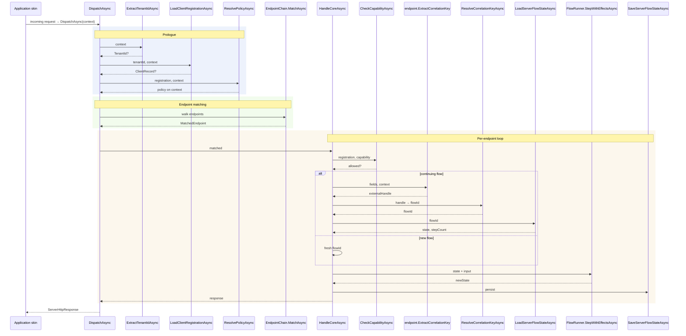
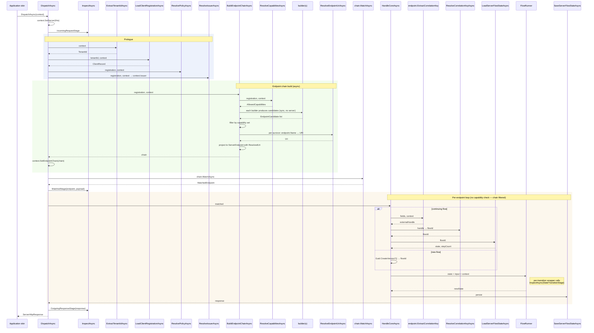

# Verifiable.OAuth — AuthorizationServer Design Notes

This is a living document. Decisions, scale assumptions, and open questions accumulate here as they surface in design discussion. Polish later. The goal is to keep architectural reasoning in one place so future work composes against a stable picture rather than re-deriving the picture each time.

For decisions that have settled into the codebase as committed architectural choices, see the `/documents/ADRs/` folder. This document is upstream of those — a working surface for thinking, not a record of finalised decisions.

---

## 1. Scale assumptions

The AS is designed for **agents-ready** throughput: millions of concurrent agents, including agents that may themselves run the AS. The deployment shape ranges from a single in-process AS for an embedded credential flow to a horizontally-scaled multi-region cluster handling autonomous-agent traffic.

The key consequence: **per-call certainty**, not statistical rarity. Every per-request operation must be deterministic-by-construction. "Rare" doesn't exist at scale. Two examples that illustrate the principle:

- A 64-bit random field with birthday collision at ~4 billion sounds safe in isolation. At millions of issuances per second it collides within an hour. Random fields used in any per-request artefact (nonces, jti values, opaque token bodies) need ≥128 bits when they're protecting freshness against an active attacker, or at least 96 bits when collision resistance is the only concern.
- A `kid` lookup taking 200 nanoseconds is fine alone. Multiplied across every request from millions of agents it's a bottleneck. Key resolvers must support in-process caching on the hot path; the library documents this expectation but cannot enforce it because the backend is the application's choice.

**Corollary on storage:** the per-request volume profile of some operations (DPoP JTI replay, RFC 9421 signature replay, attestation replay) is orders of magnitude higher than the per-flow volume of user-initiated handles (request_uri, code, device_code). Both go through the same storage abstraction; the application's backend choice (Redis cluster, Orleans grain, in-memory cache, signature-only stateless) absorbs the difference.

---

## 2. Pipeline overview

A request flows through three layers in order: **request prologue** (tenant, registration, policy), **endpoint chain** (matching), **per-endpoint loop** (state load → step → save). Every transition has a named typed delegate; the application wires the delegates, the library composes them.

The two diagrams below show the pre-9h current state and the post-9h future state. The 9h refactor's net effect: every per-call decision flows through a named typed delegate on `AuthorizationServerIntegration`; every per-call resolved value lives on `RequestContext`; every consumer reads from one source of truth. Inspection hooks at four well-defined points enable audit, telemetry, and security-event emission without library code changes.

#### Pre-9h current state

```mermaid
sequenceDiagram
    participant Skin as Application skin
    participant AS as DispatchAsync
    participant ETI as ExtractTenantIdAsync
    participant LCR as LoadClientRegistrationAsync
    participant RP as ResolvePolicyAsync
    participant EC as EndpointChain.MatchAsync
    participant HC as HandleCoreAsync
    participant CC as CheckCapabilityAsync
    participant ECK as endpoint.ExtractCorrelationKey
    participant RCK as ResolveCorrelationKeyAsync
    participant LFS as LoadServerFlowStateAsync
    participant Step as FlowRunner.StepWithEffectsAsync
    participant SFS as SaveServerFlowStateAsync

    Skin->>AS: incoming request → DispatchAsync(context)

    rect rgba(220, 230, 250, 0.5)
    note over AS,RP: Prologue
    AS->>ETI: context
    ETI-->>AS: TenantId?
    AS->>LCR: tenantId, context
    LCR-->>AS: ClientRecord?
    AS->>RP: registration, context
    RP-->>AS: policy on context
    end

    rect rgba(230, 250, 220, 0.5)
    note over AS,EC: Endpoint matching
    AS->>EC: walk endpoints
    EC-->>AS: MatchedEndpoint
    end

    rect rgba(250, 240, 220, 0.5)
    note over HC,SFS: Per-endpoint loop
    AS->>HC: matched
    HC->>CC: registration, capability
    CC-->>HC: allowed?
    alt continuing flow
        HC->>ECK: fields, context
        ECK-->>HC: externalHandle
        HC->>RCK: handle → flowId
        RCK-->>HC: flowId
        HC->>LFS: flowId
        LFS-->>HC: state, stepCount
    else new flow
        HC->>HC: fresh flowId
    end
    HC->>Step: state + input
    Step-->>HC: newState
    HC->>SFS: persist
    HC-->>AS: response
    end

    AS-->>Skin: ServerHttpResponse
```

#### Post-9h future state

```mermaid
sequenceDiagram
    participant Skin as Application skin
    participant AS as DispatchAsync
    participant INS as InspectAsync
    participant ETI as ExtractTenantIdAsync
    participant LCR as LoadClientRegistrationAsync
    participant RP as ResolvePolicyAsync
    participant RI as ResolveIssuerAsync
    participant BCA as BuildEndpointChainAsync
    participant RC as ResolveCapabilitiesAsync
    participant BLD as builder(s)
    participant REU as ResolveEndpointUriAsync
    participant EC as chain.MatchAsync
    participant HC as HandleCoreAsync
    participant ECK as endpoint.ExtractCorrelationKey
    participant RCK as ResolveCorrelationKeyAsync
    participant LFS as LoadServerFlowStateAsync
    participant Step as FlowRunner
    participant SFS as SaveServerFlowStateAsync

    Skin->>AS: DispatchAsync(context)
    AS->>AS: context.SetServer(this)
    AS->>INS: IncomingRequestStage

    rect rgba(220, 230, 250, 0.5)
    note over AS,RI: Prologue
    AS->>ETI: context
    ETI-->>AS: TenantId
    AS->>LCR: tenantId, context
    LCR-->>AS: ClientRecord
    AS->>RP: registration, context
    AS->>RI: registration, context → context.Issuer
    end

    rect rgba(230, 250, 220, 0.5)
    note over BCA,REU: Endpoint chain build (async)
    AS->>BCA: registration, context
    BCA->>RC: registration, context
    RC-->>BCA: AllowedCapabilities
    BCA->>BLD: each builder produces candidates (sync, no server)
    BLD-->>BCA: EndpointCandidate list
    BCA->>BCA: filter by capability set
    BCA->>REU: per survivor: endpoint.Name → URI
    REU-->>BCA: Uri
    BCA->>BCA: project to ServerEndpoint with ResolvedUri
    BCA-->>AS: chain
    AS->>AS: context.SetEndpointChain(chain)
    end

    AS->>EC: chain.MatchAsync
    EC-->>AS: MatchedEndpoint
    AS->>INS: MatchedStage(endpoint, payload)

    rect rgba(250, 240, 220, 0.5)
    note over HC,SFS: Per-endpoint loop (no capability check — chain filtered)
    AS->>HC: matched
    alt continuing flow
        HC->>ECK: fields, context
        ECK-->>HC: externalHandle
        HC->>RCK: handle → flowId
        RCK-->>HC: flowId
        HC->>LFS: flowId
        LFS-->>HC: state, stepCount
    else new flow
        HC->>HC: Guid.CreateVersion7() → flowId
    end
    HC->>Step: state + input + context
    note right of Step: per-transition wrapper calls<br/>InspectAsync(StateTransitionStage)
    Step-->>HC: newState
    HC->>SFS: persist
    HC-->>AS: response
    end

    AS->>INS: OutgoingResponseStage(response)
    AS-->>Skin: ServerHttpResponse
```

### 2.1 Prologue stage

| Delegate | Returns | Purpose |
|---|---|---|
| `ExtractTenantIdAsync` | `TenantId?` | Application reads tenant from whichever request signal identifies it (URL segment, subdomain, header, claim). Null → `400 invalid_request`. |
| `LoadClientRegistrationAsync` | `ClientRecord?` | Application loads the registration for the tenant. Null → `404`. Result stamped on `context.Registration`. |
| `ResolvePolicyAsync` | (writes to context) | Resolves per-request `PolicyProfile` and related policy state onto the context. Downstream code consults via typed `RequestContext` extensions. |

All three are required in every serving composition. Applications wire construction seams and request serving changes through the drained, candidate-validated operation in [Live configuration](#41-live-configuration).

### 2.2 Endpoint chain stage

`EndpointChain.MatchAsync` walks every registered endpoint's `MatchesRequest` until one returns a non-null `MatchPayload`. Endpoints are registered via `EndpointBuilders` (`AuthCodeEndpoints.Builder`, `Oid4VpEndpoints.Builder`, `MetadataEndpoints.Builder`, `RegistrationEndpoints.Builder`). Application chooses which builders to include.

`EndpointBuilders` is also the app-facing extension seam for *new* endpoints — including ones the library does not ship. `EndpointBuilderDelegate` and `EndpointCandidate` are public, and the library's own flows are nothing more than builders in this same set, so adding an endpoint is uniform regardless of author:

- **A new standard RFC endpoint** (e.g. RFC 7009 revocation, Global Token Revocation, RP-Initiated Logout) is shipped in the library as one builder-produced `EndpointCandidate` plus, where it needs an application decision, one named slot on `AuthorizationServerIntegration` (e.g. `RevokeTokenDelegate`). The chunk is small and shaped like every other endpoint; the library owns the wire and conformance-tests it.
- **A proprietary or experimental endpoint** an application needs can be authored entirely application-side: register a custom builder returning a custom `EndpointCandidate` with its own `MatchesRequest` / `BuildInputAsync` / `BuildResponse`. The candidate reaches application state through the `ExchangeContext` it is handed, not through a new integration slot (the sealed `AuthorizationServerIntegration` bundle is library-defined). No fork is required.

This is the same boundary that governs signals: the library owns the standard wire and the decision *seam*; the application owns the decision and any proprietary translation. A brand-new RFC that drops mid-cycle is therefore an additive chunk — a builder plus, optionally, a delegate slot — not a pipeline rewrite.

### 2.3 Per-endpoint loop stage

The capability filter (registration allows this endpoint's capability) selects the candidate set
in `EndpointChain.BuildForRequestAsync`, at chain-build time, before matching, before
`Integration.MaterializeRegistrationAsync` runs, and before `HandleCoreAsync` is ever entered — a
capability-filtered candidate never reaches the loop below. `Integration.MaterializeRegistrationAsync`,
when wired, then updates `context`'s registration from the wire `client_id`, so every step below
sees the materialized record. `HandleCoreAsync` runs an 8-step state-machine loop:

1. The endpoint's own pre-correlation step (`endpoint.BeforeCorrelationAsync`), when set — the
   endpoint's own check needing only the request, the materialized registration, and the server,
   run before either a flow is created or any stored record is correlated or loaded. A stateless
   or new-flow endpoint runs it here, first; a continuing-flow endpoint runs it after its own
   handle-presence refusal (below) has found a handle present. Every check it makes is
   request-only, so it is identical for a caller naming a handle that does not correlate to
   anything and one naming a live handle whose own checks fail the same way — but the identical
   answer rests on what each check reads, not on a shared constant every step answers "by
   construction": the code-redemption and refresh-token steps answer identification, the
   `code_verifier`'s (or nothing's) absence, and a resolver fault or decline through
   `endpoint.HandleNotFoundError` / `endpoint.HandleNotFoundErrorDescription` (falling back to
   the grant's own constant when the endpoint sets neither); a malformed `code_verifier`
   answers its own distinct `invalid_grant` "PKCE verification failed." (the grammar, not the
   endpoint's identity, decides that body); declared client authentication answers its own `401
   invalid_client` untranslated; and the request-only half of DPoP validation answers its own
   nonce challenge or `invalid_dpop_proof`. The `request_uri` completion's step answers two
   literal bodies of its own ("Missing client_id."; the registration-identification comparison),
   never an endpoint constant. This step is the one place in the loop that runs for a handle that
   does not exist BY DESIGN, and it may therefore consume single-use authentication material — a
   client assertion's or a DPoP proof's `jti`, a nonce — before any stored record is ever reached;
   see the consumption sentence on `BeforeCorrelationDelegate`'s own remarks and §5's
   cryptography-before-storage ordering this step exists to serve.
2. Stateless short-circuit (no state to load/save).
3. Get current state — either generate fresh `flowId` for new flows, or extract external handle → resolve correlation key → load state.
4. Stamp verified-at on context.
5. `endpoint.BuildInputAsync` produces typed input or early-exit response.
6. `FlowRunner.StepWithEffectsAsync` advances the PDA.
7. `endpoint.BuildResponse` produces the response.
8. Persist via `SaveServerFlowStateAsync`.

Step 8 is where the application's `SaveServerFlowStateAsync` lambda pattern-matches on state type to update secondary indexes for the next step's correlation lookup. This is how `request_uri`, `code`, `device_code`, and `(issuer, jti)` all get their lookup paths — same delegate, application-side discrimination.

### 2.4 Replay determinism

The PDA's state-step transitions are deterministic given identical inputs.
The `Save/LoadServerFlowStateAsync` shape captures state snapshots, not the
input log; replay against the persisted state stream reconstructs "what
the state was at each step", but re-running an action (e.g. a DPoP-proof
JTI lookup) against external state that has since changed could produce a
different action-result and therefore a different next state.

For deployments that need strict deterministic replay — forensic
reconstruction, long-trace property-based testing — the per-step
`(before-state, input, action-results, after-state)` tuple is the right
artefact to capture. The `InspectAsync(StateTransitionStage)` hook
introduced in phase 9h is the natural emission point; the deployment's
inspector lambda records each tuple into whatever event store the
forensic trail uses. The library's storage abstraction does not bake
this in — replay determinism is a deployment concern, not a library
invariant.

---

## 3. Layered delegate model

Every integration point falls into one of three layers. Each layer composes the layer below it.

### Bottom layer: storage delegates

The universal storage contract. Backend-agnostic by design.

| Delegate | Shape |
|---|---|
| `LoadServerFlowStateDelegate` | `(tenantId, correlationKey, context, ct) → (OAuthFlowState?, stepCount)` |
| `SaveServerFlowStateDelegate` | `(tenantId, correlationKey, state, stepCount, context, ct) → void` |
| `ResolveCorrelationKeyDelegate` | `(tenantId, flowKind, externalHandle, context, ct) → flowId?` |
| `LoadClientRegistrationDelegate` | `(tenantId, context, ct) → ClientRecord?` |

The application's implementation chooses the backend: Redis, Orleans, in-memory, signature-only stateless, distributed K/V, hybrid layered cache + persistent store. The library's contract is intentionally agnostic — different SLO regimes (single-instance demo vs millions of agents) use radically different backends behind the same delegate signatures.

### Middle layer: cryptographic primitive delegates

Tagged primitives routed through `CryptographicKeyFactory` registry and dispatched via `CryptographicKeyEvents`. Backends (`Verifiable.Microsoft`, `Verifiable.BouncyCastle`, `Verifiable.Libsodium`, future `Verifiable.Tpm`) provide concrete implementations.

| Delegate | Purpose |
|---|---|
| `ComputeDigestDelegate` | Hash of arbitrary `ReadOnlySequence<byte>` input. |
| `ComputeHmacDelegate` | Keyed hash; symmetric MAC. |
| `VerifyHmacDelegate` | Recompute-and-compare MAC verification. |
| `SigningDelegate` | Asymmetric signature production. |
| `VerificationDelegate` | Asymmetric signature verification. |

Key resolution sits alongside the primitives and uses a unified slot model across signing and HMAC. Rotation policy lives in a `KeySet` (slots: `Incoming`, `Current`, `Retiring`, `Historical`) — `Incoming` is pre-published but not yet used for issuance; `Current` is active; `Retiring` is not used for issuance but still accepted for verification; `Historical` is archived (not verifiable, not published). The signing-side equivalent is the existing `SigningKeySet` per `ClientRecord.SigningKeys[usage]`; the HMAC-side `KeySet` (non-generic, lives at integration level) and its in-process default `InProcessKeySet` both store `KeyId` per slot. Material loading is decoupled from rotation.

Selection and byte-loading are separate delegates:

| Role | Signing | HMAC |
|---|---|---|
| Slot store | `SigningKeySet` (per `KeyUsageContext`) | `KeySet` (non-generic, stores `KeyId` per slot) |
| Selector | `SelectSigningKeyDelegate` → `KeyId` | `SelectHmacKeyDelegate` → `KeyId?` |
| Byte-loader (private) | `ServerSigningKeyResolverDelegate(KeyId, TenantId, …) → PrivateKeyMemory?` | `ResolveServerHmacKeyDelegate(KeyId, TenantId, …) → SymmetricKey?` |
| Byte-loader (public) | `ServerVerificationKeyResolverDelegate(KeyId, TenantId, …) → PublicKeyMemory?` | (not applicable — symmetric) |
| Material type | `PrivateKeyMemory` / `PublicKeyMemory` | `SymmetricKey` |
| Publishable in JWKS | Always (`Incoming + Current + Retiring`) | Opt-in per keyset; renders as `kty=oct` per RFC 7518 §6.4 |

The signing side stores `KeyId` per slot and loads material lazily via the byte-loader — HSM/KMS-friendly by construction. The HMAC in-process default holds a `Dictionary<KeyId, SymmetricKey>` side store alongside the slot tracker (`InProcessKeySet`); an HSM-backed HMAC deployment would wire a different byte-loader and reuse the same slot model.

All byte-loaders take `(KeyId keyId, TenantId tenantId, RequestContext, CancellationToken)`. `TenantId` is threaded for application convenience — it lets the resolver shard by tenant first before looking up by kid within the tenant. Applications that don't need per-tenant isolation ignore the parameter. Selection happens upstream; byte-loaders perform no rotation logic, no selection logic, no slot-membership gating. Verifiability-by-slot is checked separately via `KeySet.IsKidValidForVerification(KeyId)` before invoking the byte-loader.

`ServerDecryptionKeyResolverDelegate` continues to return `PrivateKeyMemory?` for OID4VP encrypted-payload decryption; it's a per-key lookup without the rotation surface (no current decryption kid selection beyond the registration-time-bound `ClientRecord.EncryptionKeyId`).

### Top layer: application integration delegates

Application-shaped integration points that compose the layers below.

| Delegate | Composes |
|---|---|
| `ExtractTenantIdAsync` | (no lower-layer composition; pure request inspection) |
| `ResolvePolicyAsync` | Reads from registration, writes to context |
| `ParseClientMetadataServerDelegate` | Application's JSON layer; inbound RFC 7591/7592 body parsing |
| `ValidateRegistrationAccessTokenDelegate` | Comparison against application's stored credential form |
| `IssueDpopNonceDelegate` (planned, DPoP) | Composes `ComputeHmacAsync` + `ResolveServerHmacKey` + random + time |
| `ValidateDpopNonceDelegate` (planned, DPoP) | Composes `ComputeHmacAsync` + `ResolveServerHmacKey` |
| `ValidateDpopProofDelegate` | Composes `VerificationDelegate` + `ComputeDigestAsync` + replay-check via `Load/SaveServerFlowState` |
| `ResolveSubjectTrustChainDelegate` | Composes the federation entity-statement fetch and `VerificationDelegate` chain validation the application's own resolver performs, answering a `FederationResolveOutcome` |
| `ResolveIssuerKeyDelegate` | Composes `JwtVcIssuerMetadataDocuments` (JWT VC Issuer Metadata) or `SdJwtX5cTrustResolver` (Inline X.509 Certificates), or the application's own trust framework entirely |

Top-layer delegates are where the library provides defaults that wire the lower layers together for the common case, and where applications override when their requirements differ from the defaults.

---

## 4. Storage abstraction philosophy

The library's storage contract is intentionally agnostic. `Load/SaveServerFlowStateDelegate` takes whatever parameters the protocol requires (`tenantId`, `correlationKey`, state, context) and the application decides how to fulfil them.

This means:

- **A single-instance development deployment** wires the delegate to an in-memory `ConcurrentDictionary`. Lookup is microseconds.
- **A horizontally-scaled cluster** wires it to Redis (with consistent-hashed sharding for the JTI volume), Orleans grains, DragonflyDB, ScyllaDB, or whatever the deployment's operational team chose.
- **A signature-stateless deployment** wires it to a custom impl that doesn't persist anything for some state types — for example, `ParRequestReceivedState` could be HMAC-encoded into the returned `request_uri` value rather than stored. The application's `LoadServerFlowStateDelegate` decodes the HMAC'd handle back into the state. The host may choose this storage representation while satisfying the same flow-state operations.

The **secondary index pattern** lives entirely inside the application's `SaveServerFlowStateDelegate` lambda. Application pattern-matches on the inbound state type and writes whatever index entries the next protocol step needs to find via `ResolveCorrelationKeyAsync`. The library never sees the index structure. Load, save, claim, delete and correlation lookup form one storage domain and are published together in one alteration candidate. A replacement requires host migration or forwarding for retained flows.

**The claim primitive.** `Load`/`SaveServerFlowStateDelegate` are read-then-write, not a concurrency control: two concurrent requests that load the same `(correlationKey, stepCount)` both pass verification and both save, the second silently clobbering the first — invisible in every single-writer test and real under load. `ClaimServerFlowStateDelegate` sits beside `Load`/`Save`/`DeleteServerFlowStateDelegate` as the fourth required storage primitive, called after verification and before an irreversible effect (minting a token, consuming a pushed-authorization `request_uri`): it returns `true` for exactly one caller per `(correlationKey, expectedStepCount)` and `false` for every other. An in-memory backend can use `ConcurrentDictionary<(string, int), byte>.TryAdd` for one winner, but must coordinate that claim with the loaded version, tenant domain, saves, deletion and retention. An isolated claim dictionary does not establish those relationships. A distributed backend implements it as a conditional write against the same version/step column `Load` reads and `Save` writes (a compare-and-swap, or `UPDATE ... WHERE step_count = @expectedStepCount`).

**Implication for high-volume per-request operations** (DPoP JTI replay being the first concrete case): the same delegate handles them. Volume is the application's concern. The library's contract supports any reasonable backend; it's the deployment's job to wire one that meets its SLO.

**Validation timing.** Admission requires explicit `Validate()` or a successful requested alteration, as described in [Live configuration](#41-live-configuration). Construction edits invalidate validation. A serving alteration drains requests, validates an independent candidate and publishes the complete wiring only on success. Load, save, claim, delete and correlation operations must share one storage/version domain per request; the host migrates or forwards retained flow records when that domain changes.

**Revocation seams and storage.** `RevokeTokenDelegate` handles client-driven RFC 7009 requests using the wire token. The optional `RevokeIssuedTokenDelegate` handles library-driven code replay and refresh reuse using persisted `jti` and token type. RFC 6749 §4.1.2 says "SHOULD revoke (when possible)"; without this optional seam audited access tokens remain valid until expiry, while the required delete seam invalidates the claimed live refresh record. Rotation retires its presented record in place and retains its index for the successor refresh lifetime. Hosts expire these records and index entries by `ExpiresAt`. Reuse loads the predecessor audit and walks retained successor records with a visited set, claims `(tenantId, flowId, loadedStepCount)` before deletion, and reloads once after a lost claim. A second lost claim stops without deleting unclaimed state. The walk has no hop cap; a corrupted cycle stops at its repeated flow id, keeping completed revocations. Code replay uses the same successor walk rooted at `RefreshFlowId`. Valid reuse persists `RevokedAt` through `ServerRefreshTokenReuseDetected`; its once-only effect is sequential.

### 4.1 Live configuration

`EndpointServer.RequestAlterationAsync(Action<AlterationCandidate>, CancellationToken)` queues an alteration and returns its completion task. Direct host calls, registration observers and signal handlers use this operation. Requests already admitted complete before the alteration callback runs. New arrivals wait while the server drains requests and processes queued candidates in alteration enqueue order. An observer queues the alteration and returns; publication follows request completion. Awaiting the alteration inside its emitting dispatch would wait for that dispatch's own lease, so observers retain the task for an external consumer.

Each callback receives independent editable wiring containers: the primary integration, protocol-family registry, nested cryptography and codecs, action-handler and authorization-detail registries, together with immutable declaration and configuration snapshots. `AlterationCandidate.Integration` exposes the primary copy; `Family<T>()` resolves its family copy. `Configuration`, `ActionExecutor` and `AddIntegration<T>()` let coupled changes form one candidate. Every candidate assignment of a wiring component copies the supplied containers and refuses components attached to another server. This includes components nested in verification records and fresh integrations containing externally owned children. Ownership checks and copying hold the component locks together; refusal is a named `InvalidOperationException`. Candidate `AddIntegration<T>()` replaces both primary and family references when registered under the primary's concrete type; a different key registers a secondary family subject to validation. Delegate targets and application resources are shared shallow references; their synchronization remains application-owned. The authorization integration's registration-event subject stays shared so subscriptions survive publication. Secondary family containers and their nested registries participate in copying and freezing as well. Custom integrations extend `WiringComponent.CloneCore` and `Children` for their own mutable containers and override `ValidateFamily` for secondary-family dependencies.

A candidate is validated before one reference assignment publishes the complete composition. Validation checks required host seams, including `DeleteFlowStateAsync` and `ResolveEndpointUriAsync`, subject resolution, the primary/family identity, required cryptography and codec delegates, declaration coherence and wired feature dependencies. The authorization family returned by `OAuth()` must be the primary integration, so dispatch and protocol handlers use the same validated host seams. Secondary families validate their own requirements without duplicating the primary host's storage seams. Structural checks cannot prove arbitrary delegate behavior, backend availability or the correctness of application data. A signed OID4VP request_uri request needing an unregistered signing action receives a neutral server error without an internal type name. Structural validation requires ClaimFlowStateAsync before publication. Construction-time validation does not enumerate which optional actions a request will need. The unsigned redirect_uri request path does not require SignJarAction. An unexpected JAR response state receives a neutral server error without an internal type name. Every `AuthorizationServerIntegration`, including metadata-only hosting, must supply `Cryptography`, `Codecs`, `MemoryPool`, `Timings`, `TokenProducers`, `ClientAuthenticationMethodsSupported` and `ClientAssertionSigningAlgorithmsSupported`; this unconditional requirement is the accepted cost of structural validation without capability declarations. Presence does not establish delegate behavior: a resolver returning null satisfies its presence check.

An empty builder set is refused unless `ServerConfiguration.IsMaintenanceMode` is explicitly true. Maintenance requests receive the ordinary unmatched-endpoint response. `AdmissionWaitTimeout` bounds the total hold an arrival spends waiting for a window to close, defaults to five seconds, and must be positive and at most one minute. Expiry returns HTTP 503 with `ServerErrors.TemporarilyUnavailable` and `Retry-After: 1`, through `ServerHttpResponse` and the existing transport error path; the code is RFC 6749 §4.1.2.1's authorization-endpoint vocabulary reused as a transport-level refusal, not a §5.2 token-endpoint error response. DrainTimeout bounds the drain and abandonment reopens admission on unchanged wiring. AdmissionWaitTimeout and DrainTimeout reject nonpositive values and values above one minute in their init accessors with ArgumentOutOfRangeException. Both defaults are five seconds. An arrival is held only while the window closes within AdmissionWaitTimeout; a drain that runs to its bound refuses arrivals whose admission hold expires. Each queued request joins a specific window, whose membership is sealed by the drain wait's terminal outcome. Requests queued after the drain's terminal outcome belong to a fresh window and cannot inherit an abandoned window's fault. Each abandoned request is cancelled when its own token is cancelled; other requests receive the window's actual timeout or opening-request cancellation fault. The task outcome retains the actual cause without sampling a timer after continuation. Caller cancellation before a window opens cancels its request without touching admission. Once a window is open, cancellation is checked before its callback and after the callback returns. Cancellation after a callback edits its candidate discards and freezes that candidate before publication. RequestAlterationAsync throws synchronously for a null callback, a disposed serving owner or an invalid timeout policy, including calls from event observers. An exception escaping the worker faults every queued requester and reopens admission on the accepted wiring. The refusal body reuses RFC 6749 section 4.1.2.1 authorization-endpoint vocabulary as a transport-level refusal, not an RFC 6749 section 5.2 token-endpoint error response. The uniform OAuth-shaped body applies to every capability, including metadata and JWKS; HTTP 503 and Retry-After carry the refusal semantics.

An incoherent candidate is discarded and only its requester faults. The named `InvalidOperationException` identifies missing or incoherent wiring. Accepted live container references remain unchanged; subsequent requests use the accepted composition, and a later coherent alteration can succeed. A callback that throws discards its half-edited candidate, faults its requester with that exception and advances the queue. A null endpoint-builder member is rejected by ArgumentNullException before publication. Every accepted or discarded candidate and the original serving objects are frozen. Serving setters and registry registration require an alteration candidate. Setters on `ServerIntegration`, `AuthorizationServerIntegration`, nested groups, family registries and action executors throw a named fault; direct `ApplyConfiguration`, `AddIntegration` and action-bridge edits also throw. Construction setters remain available before first admission or successful requested publication. A construction edit invalidates validation, including edits to nested containers. A construction edit to a shared component invalidates every attached server. Component graphs are collected before their locks are acquired in ascending stable acquisition-key order, independent of composition order. A construction component shared between servers becomes frozen for every owner when any owner serves or publishes. Each owner can alter its own copied composition through its requested alteration afterwards. Disposing a server detaches its component ownership, including retained replaced or discarded views, without disposing application resources.

Admission requires explicit validation or a successful alteration. First admission freezes component setters and then rechecks validation before publishing or admitting a request. A lost construction race refuses admission with the named validation fault, and the host repairs the frozen wiring through a requested alteration. `Validate()` is available for fail-fast hosts; dispatch validates nothing itself. Validate refuses a call while an alteration window owns admission. Validation and construction mutation reject a disposed owner before attaching any component. `IsValidated` describes the current composition since its last edit and is false while alterations own admission. A rejected alteration resumes the accepted wiring's validation state. The ordinary dispatcher and global registration handler both acquire a ServerRequestLease through AcquireRequestAsync before reading any application seam. Every admitted request retains one complete wiring composition. `context.Server` identifies the serving owner; `context.RequestServer` is the fixed view used by builders, handlers, claim contributors and action callbacks. The lease lasts through outgoing inspection or global registration response construction. Disposing the exposed request view disposes its serving owner; disposing the lease only releases its request count. Direct helper callers outside a serving entry point can supply their own context server.

The drain quiesces requests, not flows; the host migrates or forwards retained state. Load, claim, delete, save and correlation operations in a request use one captured backend. Persisted flow records remain in the backend that received them and can span several requests. A storage alteration therefore includes the application's migration or forwarding step before publication. Once the alteration completes, the host can retire replaced wiring resources after accounting for any retained flows that still need them. The library does not dispose application-owned pools, providers, keys or stores. The host completes resource cleanup before reporting unconsumed request faults. A status-bearing presentation with no status resolver is refused and its captured fault names the missing resolver.

Policy is resolved once per request from its admitted wiring. Ordinary dispatch loads registration data unless the skin supplies a request snapshot, resolves capabilities once and retains the results on the request context. Applications publish immutable records and capability sets through synchronized stores, use fresh contexts and protect mutable delegate closures. `TimingPolicy` supplies deployment defaults; built-in profiles also define their own request lifetimes, and token producers apply registration overrides where specified. Captured timing records remain stable within a request. Token validators resolve their token shape through their own request paths.

Registration, capability and key data change under traffic through application operations, separately from wiring publication. Registration creation, conditional replacement and deletion commit through the required registration store before optional observers run. `AuthorizationServerIntegration.ClientRegistrationStore` supplies `IClientRegistrationStore.CreateAsync`, `TryUpdateAsync` and `DeleteAsync`; its operations and the registration loader share one synchronized storage domain for the record, routing indexes and protected management credential. Registration parsing or management-token validation requires ClientRegistrationStore in the validated composition. A required persistence exception propagates before notification and the operation emits no registration event. The client response and required create store receive the plaintext management credential; the application stores a hash or protected representation. Optional observer exceptions and exceptions from their inspection reports are isolated per subscription, preserving the committed response and delivery to later subscribers. `RegistrationObserverFailureStage` reports the immutable event and exception through `InspectAsync`, using an uncancelled diagnostic call after commitment. Applications protect diagnostic exception details; diagnostics are best effort and have no durable delivery guarantee.

Registration events carry immutable selected client data, event identifiers, tenant and client identifiers, occurrence times and per-registration revisions; they carry neither the request context nor the management credential. Event identifiers are allocated atomically within the instance-scoped stream, without application I/O after commitment. `ClientRegistrationProjection` selects client name and URI, immutable redirect URI, scope and capability sets, and copied default signing-key identifiers by usage. `ClientRegistrationEvent.Projection` replaces request-context delivery, `ClientRegistered` contains no credential or live record, and `ClientUpdated.Previous` carries the prior immutable projection while `Projection` carries the committed replacement. `ClientRecord.Revision` begins at one; the conditional store accepts only the loaded revision and a replacement exactly one greater. Concurrent updates that read one registration revision have exactly one successful conditional commit; a stale update returns HTTP 400 with invalid_client_metadata and emits nothing. This is the library's concurrency policy using the existing RFC 7592 §2.2 registration error path, not an additional wire revision field. Sequential requests may each succeed after loading successive revisions. The fixture's store commits both routing indexes under the same lock as its loader and management-token validation.

Each subscription owns a unique token; repeated concurrent disposal removes only that token, including when an observer subscribes more than once. Observer equality cannot substitute for subscription identity. Emission captures the subscription array, invokes each entry, and awaits any failure report before continuing. Concurrent emitters can invoke the same observer concurrently, with no global delivery order or replay; consumers use tenant, client and revision to discard stale cache updates. Disposal cannot cancel an already captured delivery. Capability grant and revoke signals require an application effect on synchronized registration and granted-capability state before endpoint reachability changes. Their projection identifies the source registration revision; the application advances its stored revision when applying a change. The fixture applies the signal to the registration revision and granted set atomically, and its resolver reads that granted set on each request. Grants add endpoint eligibility to the registration; revocation removes the active grant while retaining that eligibility, so the resolver enforces the refusal. Metadata-only replacement preserves revoked grants. Signals are best effort; an application needing durable capability effects must provide its own reliable effect mechanism.

A subscription made inside a candidate callback attaches to its shared stream immediately and survives that candidate's acceptance or rejection. A source component can be adopted by only one composition; a second adoption is refused with a named ownership fault. A candidate may adopt a component attached to its own composition by copying it; a component attached to another composition is refused. A fresh adopted authorization integration carries its event subject with its copy, so subscriptions made before adoption receive this server's registration events after publication. An adopted fresh stream supplies the observers for that replacement family; callers supply its required registration store as part of adoption. The async registration notification helpers require their caller to commit storage first; the registration endpoints and fixture operations do so explicitly. Notification helpers accept the caller context for API consistency and do not forward or retain it in optional diagnostics or events.

Observer failure reports receive a detached context containing no request, headers, body, live registration or management bearer. The stage contains only selected event data and the supplied exception. Outgoing inspection runs after the handler completes on every dispatch; its exceptions are recorded on the request Activity and the response returns as built. Incoming and matched inspection exceptions propagate before commitment.

Deletion retries a lost conditional race and emits a tombstone one revision beyond the atomically removed record, so delayed updates cannot repopulate a deleted cache entry. `DeleteAsync(record, expectedRevision, context, cancellationToken)` atomically returns the removed record or null without mutation. After a lost race the handler reloads the same identity; an absent or replaced identity receives HTTP 401 without another event. Consumers retain tombstone revisions after removing cached data. A delayed deletion cannot remove a different client's reused tenant index or grant state. For a persisted registration, an absent grant set or a different current client identity grants no capabilities to an overlapping request. A request-derived registration is resolved through the endpoint chain and materialized per request without being committed to ClientRegistrationStore. Capability effects apply only to their source identity and revision, so a delayed signal cannot overwrite a newer grant decision.

A management PUT requires the issued client_id; a missing or different identifier returns invalid_client_metadata without mutation or notification. The client update handler includes its issued client identifier in the complete replacement document. Management requests for absent clients or with invalid registration access tokens return HTTP 401. Registration responses carry an absolute configuration URI, the management bearer, the client identifier and every accepted metadata field. Read and update share the complete client-information response defined by RFC 7592 section 3. The validated presented bearer is echoed without requiring the store to recover its protected credential. The registered metadata retains copied immutable collections, and omitted replacement metadata is unset. The shared client/server metadata writer covers every supported field. `ClientRegistrationEvent.ClientId` and `TenantId` are computed get-only properties supplied through the required `Projection`; they have no independent init accessors or required-member obligations.

`LiveServerAlterationTests` holds the listener proofs for in-flight completion, held arrivals, bounded refusal, a bounded drain's abandonment and cancellation, the next request's seam and policy changes, configuration consistency under concurrent arrivals, named candidate rejection, a candidate's own copy of an adopted integration, serving setter guards, storage migration, global registration admission, observer and signal requests, and ordered concurrent alterations. Configuration observations exercise the combined drain and captured-view protections; either protection independently prevents a transition within one admitted request. A worker checkpoint registers the drain continuation before the held request is released. Race assertions concern invariants rather than which request wins. Notification-only cases retain their scope; endpoint observations use the listener.

### 4.2 Remote documents: the attempt is the library's, the cache is the application's

The storage rule above applies to every document the server fetches from elsewhere — a Client ID Metadata Document, the JWK Set a `jwks_uri` names, an authorization server's metadata. Decision record: [remote-documents-attempt-and-application-cache](ADRs/remote-documents-attempt-and-application-cache.md).

| | Library | Application |
|---|---|---|
| Reaching the wire | `OutboundFetch.FetchAsync` — the one chokepoint for every server-side fetch; SSRF policy from `ExchangeContext.OutboundFetchPolicy`, redirects, the size hint. The client-side flows (authorization code, refresh, revocation, the ID-JAG mint and redeem, the OID4VCI wallet's metadata, nonce, credential, deferred and notification calls, the OID4VP wallet's response and request-object posts) evaluate the same policy before invoking the application's transport delegate — from the call's context when it carries one, else from the client's deployment configuration (`OAuthClientInfrastructure.OutboundFetchPolicy`, `Oid4VciWalletConfiguration.OutboundFetchPolicy`, `Oid4VpWalletConfiguration.OutboundFetchPolicy`, default `SecureDefault`) — because the endpoints they dial are named by discovered metadata, which `OutboundRequest`'s remarks call as much an SSRF vector as a fetched URL. The OID4VCI wallet's OPTIONAL §4.1.3 by-reference Credential Offer GET (`Oid4VciWalletConfiguration.FetchCredentialOffer`) does not follow that evaluate-then-invoke shape: it dials through this same `OutboundFetch.FetchAsync` chokepoint rather than a single-hop transport delegate, so it carries the chokepoint's own redirect re-validation and per-hop policy evaluation, bounded by `MaximumCredentialOfferBytes` | `OutboundTransportDelegate` and the client-side transport delegates — the single-hop primitives; no `HttpClient` in the library; a browser host sends every request built for these seams with credentials omitted, since the Fetch Standard's default is `same-origin` and an issuer-named endpoint may share the application's origin |
| The attempt | `ClientIdMetadataDocuments.ResolveAsync`, `JwksUriResolver.ResolveAsync`, `AuthorizationServerMetadataDocuments.ResolveAsync` — fetch, validate, compute RFC 9111 §5.2 freshness from the headers, report result + `HttpCacheFreshness`; stateless. `JwtVcIssuerMetadataDocuments.ResolveAsync` / `SelectKeyAsync` do the same for a SD-JWT VC issuer's JWT VC Issuer Metadata document, answering a `JwtVcIssuerMetadataResolution` | the well-known suffix an issuer is resolved through (`WellKnownPaths.OAuthAuthorizationServer`, `OpenIdConfiguration`, or `WellKnownPaths.JwtVcIssuer`), which RFC 8414 §3 says the application MUST choose |
| The store | — | the implementation of `ResolveClientMetadataDelegate` / `ResolveJwksUriDelegate` / `ResolveAuthorizationServerMetadataDelegate` / `ResolveIssuerKeyDelegate`: a dictionary, a distributed cache, a grain, a database row |
| Lifetime bounds | `HttpCacheFreshness.Clamp`, a pure helper | which bounds, if any |
| After a failure | reports a non-storable freshness and a typed outcome | retry hold, backoff, drop; never stale on error without permission (RFC 9111 §4.2.4) |
| Key-set rotation | `ClientIdMetadataDocuments.RefreshJwksAsync` — replaces a document's key set from its `jwks_uri`; `ClientIdMetadataResolution.HasJwksUriKeySet` says when it applies | calls the helper on a document hit, so the key set follows its own lifetime, not the document's |
| Wiring | `ClientIdMetadataDocumentResolverOptions.ResolveJwksUri`; `PrivateKeyJwtClientAuthentication.BuildValidator(…, ResolveJwksUriDelegate?)` | one delegate instance into both; nothing wired means a `jwks_uri` is never dereferenced and the client fails closed for want of a key |
| Every other fetched document | the `did:web`, `did:webvh`, `did:webplus` resolvers and the `did:webvh` dereferencer report freshness on `DidResolutionMetadata` / `DidDereferencingMetadata` (the process metadata, since the result and document types are shared with methods that never touch the wire); the WebFinger JRD, the Status List Token, the federation entity statement and DIDComm attachment data report it on their own results; the DIDComm message POST is exempt, having no document to keep | stores each for its reported lifetime, or not at all |

The key-set delegate is asked on every resolution, including by a caller serving a cached document. An implementation that does not bound its own retries after a failure puts one outbound request on a host the client itself names for every authorization request that reaches it; that bound is the application's, like everything else in the right-hand column. The reference implementation the test suite runs as its application is `ClientMetadataResolutionCache` under `test/Verifiable.Tests/TestInfrastructure`.

### 4.3 The tenant key and the tenant handle

`TenantId` is the application's internal routing key: the value `ExtractTenantIdAsync` produces from the request, that the registration store, the flow-state store, the correlation keys and every key-set byte-loader are scoped by, and that the library passes raw into the application's own delegates (`ResolveOidcClaimsDelegate`, the key resolvers, `AuthorizeSsfRequestDelegate`). It never leaves the process through the library: it renders nothing of its value through `ToString()` or the debugger display, and no span tag, wire body, token claim or metadata document carries it.

`TenantHandle` is what the library shows. The application sets it on `ClientRecord` beside the key — a public slug, a pseudonymous identifier, whatever it is content to see on every exported span and in every delivered event — and the library never derives one. The dispatch span's `server.tenant.handle` tag carries the handle when the registration has one and nothing tenant-shaped when it does not; the registration projection carries both the key, which observers need to correlate an event with their own store, and the handle, which is what its debugger display and any diagnostic built from it render.

---

## 5. Operational ordering on validation

Per-request validation follows a strict cheap-first ordering:

1. **Structural parse** — is the input syntactically well-formed? Cheap, no backend calls.
2. **Format and policy checks** — required fields present, claim shapes correct, expiry windows in tolerance.
3. **Cryptographic verification** — signature, HMAC. Compute-bound, no backend calls.
4. **Storage-backed checks** — replay defense (JTI lookup), binding lookup (access-token thumbprint), revocation lookup.

RFC 9449 §4.3 itself permits any order for its twelve DPoP proof checks ("These checks may be performed in any order"), so this ordering is this library's own policy, not an RFC mandate — chosen because it is the right ordering for every per-request validation in the library. Three reasons:

- **DoS resistance.** An attacker hammering the AS with malformed proofs wastes only structural-parse cycles, not storage backend round-trips. Storage cost stays proportional to legitimate traffic, not attack volume.
- **Cost gradient.** The cheapest checks fail the largest fraction of bad inputs. Doing them first minimises total work.
- **Uniformity.** Applying the same cheap-first ordering to every per-request validation — DPoP proofs, client assertions, anything else the library or an application adds — keeps protocol behaviour predictable without needing a spec to require it case by case.

**Exception case worth noting:** an application may legitimately want to interpose an even cheaper check before cryptographic verification — for example, a Bloom filter of known-bad-jti values for a rapid-revocation feed. The library's design doesn't preclude this; the application's `ValidateDpopProofDelegate` (or equivalent) can compose whatever it wants. The library's defaults follow the standard ordering; the application's overrides can choose differently if the threat model demands.

**A DPoP proof's own nonce claim is checked AFTER its signature.** `DpopProofValidator.ValidateAsync`'s structural-parse-then-signature-then-claims ordering has its own nonce branch, but every token-endpoint caller builds its `DpopProofValidationRequest` with `NonceRequired = false` and no `ExpectedNonce`, so that branch never gates anything at the token endpoint — the validator returns success once signature and claim shape check out, carrying whatever `Nonce` claim (or none) the proof presented. The token endpoint's own single server nonce policy — every grant challenges a nonce-less proof alike, `use_dpop_nonce` — is decided AFTERWARD, by `Verifiable.OAuth.AuthCode.Server.DpopTokenEndpointValidation` (`ValidatePresentedProofAsync` for the two step endpoints — code redemption, refresh; `ValidateAsync` for the four grants without one) reading `proofResult.Claims.Nonce` on the validator's returned result. Because the validator's signature check runs before this outer nonce decision, a nonce-less or wrong-nonce proof still costs the server one full signature verification before it is ever challenged — never a free rejection ahead of it.

---

## 6. Per-call delegate guidance

Documented expectations for delegate implementations. None of these are enforced by the library (the application owns the backend); they're guidance the library's documentation should set.

- **Resolvers MUST cache in-process on the hot path.** `LoadClientRegistrationAsync`, `ResolveCorrelationKeyAsync`, `ResolveServerSigningKey`, `ResolveServerHmacKey` are called on every request. KMS / HSM / database round-trips on every call collapse throughput. The application's implementation must maintain an in-process cache (TTL-bounded, invalidated on rotation events) and only hit the cold backend on cache miss.
- **Backends MUST be async-capable.** The library's primitive delegates are all `ValueTask<T>`; software backends return synchronously-completed `ValueTask<T>` with state-machine elision (zero overhead), hardware backends genuinely await. Don't wrap a blocking backend in `Task.Run`; it defeats the purpose.
- **Failures MUST be deterministic.** The library doesn't retry on delegate failures — that's the application's HTTP handler chain's job. A delegate that throws gets its exception surfaced to the application; a delegate that returns null gets its semantic null-handling per the contract. No silent retries, no eventual-consistency tolerance inside the library.
- **`RequestContext` is the universal sidecar.** Every delegate takes it; applications can read prior decisions (`context.TenantId`, `context.Registration`, `context.Policy`) and write to it for downstream consumption. State that flows through the pipeline should travel via `RequestContext` extensions, not via the delegate parameters.

---

## 7. Open questions

Items genuinely undecided at the time of writing. Resolve in discussion; promote to settled section when decided.

### 7.1 Default DPoP nonce wire format

Stateless HMAC nonces using `ComputeHmacAsync`. The library will ship a default implementation; what fields does the default include?

- `kid` (key identifier for rotation) — required.
- `issuedAt` (Unix uint64 ms or sec) — required.
- `audienceHash` (first 16 bytes of SHA-256 of audience URI) — defense against cross-server replay.
- `random` (≥128 bits of CSPRNG) — collision resistance under high issuance volume.
- `hmacTag` (HMAC-SHA-256 over the preceding fields) — authentication.

Format encoding: binary packed for compactness (~80 bytes binary, ~110 bytes base64url) versus JWT-shaped (using the future JWS HS256 surface) for inspectability. Default proposal: binary packed. Rationale: nonces are opaque to clients (just echoed); compactness in HTTP header dominates; JWS HS256 isn't built yet (it's a listed-open consumer of the HMAC primitives). Override path: application replaces the default `IssueDpopNonceDelegate` / `ValidateDpopNonceDelegate` with their own implementation.

### 7.2 Server HMAC key lifecycle defaults — *settled, see §8*

Resolved by OAuth phases 6b → 9e (commits `9ad8065`, `9c5ce82`, `4cbf76b`, `1c0d19c`). The library ships `InProcessKeySet` (non-generic, slot-aware, `IDisposable`) as the in-process default for HMAC keys, with the same `Incoming`/`Current`/`Retiring`/`Historical` slot semantics used by the signing side. The byte-loader (`ResolveServerHmacKeyDelegate`) takes `(KeyId, TenantId, …)` and returns `SymmetricKey?`. Selection lives in `SelectHmacKeyDelegate`. Validation paths gate on slot membership (`KeySet.IsKidValidForVerification`) before invoking the byte-loader, so `Incoming` and `Historical` kids never validate inbound artefacts.

### 7.3 Forthcoming compositions

The library's nonce/proof/binding primitives will compose with two emerging protocols, expected to land as proper specs within the year:

- **DPoP-aware HTTP signing (RFC 9421 / draft-ietf-httpbis-message-signatures based)** — message signatures over the HTTP request itself, possibly binding the DPoP proof's key into the signature context.
- **HW-attested OAuth client authentication** via `draft-ietf-oauth-attestation-based-client-auth` — `urn:ietf:params:oauth:client-assertion-type:jwt-client-attestation` with EUDI Wallet WTE (Wallet Trust Evidence) / Apple App Attest / Google Play Integrity / TPM-backed attestation evidence flowing through.

The library's design must compose with both without changing the existing delegate signatures. The top-layer delegate model (application implements `IssueDpopNonceDelegate` / `ValidateDpopNonceDelegate` and can bake whatever extra fields it needs into the HMAC input) supports HTTP-signing composition naturally. Attestation-based client authentication composes through `ValidateClientAssertionDelegate` (currently shaped for `private_key_jwt` and will need extension for the attestation variant) — design TBD when the draft stabilises.

Reference links (to be verified against current versions before any phase that depends on them):

- `draft-ietf-oauth-attestation-based-client-auth`: <https://datatracker.ietf.org/doc/draft-ietf-oauth-attestation-based-client-auth/>
- EUDI ARF: <https://github.com/eu-digital-identity-wallet/architecture-and-reference-framework>
- HAIP: <https://openid.net/specs/openid4vc-high-assurance-interoperability-profile-1_0.html>
- OID4VCI §11.2 wallet attestation: <https://openid.net/specs/openid-4-verifiable-credential-issuance-1_0.html>
- RFC 9421 (HTTP Message Signatures): <https://www.rfc-editor.org/rfc/rfc9421>
- Android Keystore attestation: <https://source.android.com/docs/security/features/keystore/attestation>
- Apple App Attest: <https://developer.apple.com/documentation/devicecheck/>
- TPM-based attestation: TCG Credential Profile EK 2.0; `TPM2_Quote` for platform state; `TPM2_Certify` for key attestation.

### 7.4 JTI replay storage at agent-ready volume

The `(issuer, jti)` replay store is the single shared defense (`JtiReplayGuard` over `FlowKind.JtiReplay`) consulted by every `jti`-presenting path — the JAR request object (RFC 9101), the DPoP proof at the token endpoint (RFC 9449), the OID4VCI credential endpoint and SIOP nonce checks, and the JWT Bearer / ID-JAG assertion redemption (RFC 7523 §3 rule 7). All hit `Load/SaveServerFlowStateAsync` through the same correlation path the diagrams above show; the composite `(issuer, jti)` key isolates issuers. DPoP is the highest-volume consumer: at millions of requests per second the per-key write rate is order-of-magnitude above per-flow handles. The library's contract supports this — the delegate signature carries no inherent throughput limit — but real deployments will need carefully-chosen backends (Redis cluster with sharded keyspace, DragonflyDB, or similar) plus careful TTL management.

The library should document this clearly in the `Load/SaveServerFlowStateAsync` XML doc comments — what kinds of state types exist, their volume profiles, and the implications for backend selection. Currently the docs describe the contract but don't quantify the volume gap; that's a documentation improvement worth doing alongside any phase that adds per-request state types.

### 7.5 Self-hosted AS — agent-as-AS deployment shape

The scale assumption notes that agents may run the AS themselves. This implies a deployment shape where the library's AS code is part of an agent's runtime, handling its own outbound credential flows and possibly inbound calls from other agents. The implications for resource consumption, key isolation, and trust boundaries aren't fully worked through yet. Worth a dedicated section when the shape becomes concrete enough to design against.

---

## 8. Settled architectural decisions (promote when ready)

- **Registration persistence and notification.** The registration plane changes data under traffic. RFC 7591 create and RFC 7592 update/delete commit through `IClientRegistrationStore` before emitting immutable projections. Required storage exceptions propagate. Each optional observer exception is inspected independently, and observer or diagnostic exceptions cannot abort a committed operation or stop later deliveries. Unique subscription tokens make duplicate subscriptions and concurrent disposal independent. Record revisions and conditional replacement provide one winner for requests sharing a loaded revision, with HTTP 400 `invalid_client_metadata` for stale updates. Capability grant/revoke signals require an application state effect; the fixture updates its registration and resolver's granted set, and listener tests prove before/grant/revoke reachability. `LiveServerAlterationTests` also proves projection retention without credentials, persistence failure, commit ordering, observer isolation, subscription identity and coherent concurrent updates.

- **Post-handler inspection and registration management.** Outgoing inspection failures are recorded on the request Activity and preserve the built response; incoming and matched failures propagate. Observer diagnostics receive detached contexts. Conditional deletion returns the final removed record and publishes its next revision as a tombstone. Management authentication uses HTTP 401 for absent clients and invalid bearers, requires the issued identifier in PUT, and emits complete RFC 7592 section 3 responses with absolute configuration URIs. See [Live configuration](#41-live-configuration).

Decisions in this section are foundational enough that they need no re-discussion. Move items here from §7 when they're settled across the codebase and tests, or split into ADRs in `/documents/ADRs/` when they deserve their own decision record.

- **Live configuration.** Serving wiring changes through requested, ordered alterations. Admission captures one validated composition; the server drains requests, validates candidate copies, and publishes them atomically. Registration and policy data retain their application-owned consistency boundaries. See [Live configuration](#41-live-configuration).

- **The authorize evaluation sees the parsed authorization details.** `AuthorizationRequestEvaluation.RequestedAuthorizationDetailObjects` carries the same request's `RequestedAuthorizationDetails` string, parsed through the wired `ParseAuthorizationDetailListDelegate` into the neutral `AuthorizationDetail` model — the same parse the token endpoint's `ResolveCredentialAuthorizationDelegate` seam consumes — so an application correlating `issuer_state` to the requested `credential_configuration_id` reads the parsed value instead of re-parsing the string itself; a request carrying no `authorization_details` observes `null` for both. Proven by `RequestedAuthorizationDetailsReachTheDecisionSeamParsed` and `RequestWithoutAuthorizationDetailsObservesNullParsedList`.

- **Paired seams are refused at `Validate()`.** `AuthorizationServerIntegration.ValidateFeatureDependencies` refuses `ResolveCredentialAuthorizationAsync` wired without `ParseAuthorizationDetailsAsync`, and refuses the parser wired for the built-in `openid_credential` type alone without the resolver — the two shapes [RFC 9396 §5](https://www.rfc-editor.org/rfc/rfc9396) can never validly reach, since a half-wired pair would otherwise answer `invalid_authorization_details` at the wire with no composition-time signal until a Wallet's first request. Coupled seams wire in one alteration (`AlterationCandidate` — see `RequestAlterationAsync`'s own documentation). Proven by `ResolveCredentialAuthorizationWiredWithoutParserIsRefused`, `ParserAloneForTheBuiltInTypeOnlyIsRefused`, and `BothAuthorizationDetailsSeamsWiredValidates`.

- **Unified key-rotation primitive.** Both signing and HMAC use the same slot model (`Incoming` / `Current` / `Retiring` / `Historical`) — signing via the existing `SigningKeySet` per `ClientRecord.SigningKeys[usage]`, HMAC via the non-generic `KeySet` (with `InProcessKeySet` as the in-process default). Selection (`SelectSigningKeyDelegate` / `SelectHmacKeyDelegate`) is separated from byte-loading (`ServerSigningKeyResolverDelegate` / `ServerVerificationKeyResolverDelegate` / `ResolveServerHmacKeyDelegate`). All byte-loaders take typed `(KeyId, TenantId, RequestContext, CancellationToken)`. Closed audit MD #4. See §3 for the full layered model. Shipped across OAuth phases 6b → 9e (commits `9ad8065`, `9c5ce82`, `4cbf76b`, `1c0d19c`).
- **Token revocation (RFC 7009), server side.** The revocation endpoint is stateless (the same `StartsNewFlow` + `FlowKind.Stateless` shape as `client_credentials`, not the stateful correlation-key path). The library owns the wire — client authentication via `ValidateClientCredentialsDelegate`, the §2.2 empty-200 that never reveals token validity, and a fail-closed candidate gate (the endpoint materializes only when both `RevokeTokenDelegate` and `ValidateClientCredentialsDelegate` are wired). The application owns the token store behind `RevokeTokenDelegate`: it scopes revocation to the authenticated client's tokens and cascades refresh → access (§2.1). That store is the same state the per-call decision seams (`EvaluateAccessDelegate`, `LoadClientRegistrationDelegate`) read, so a client-driven RFC 7009 revocation, an admin action, and an inbound SSF/CAEP `session-revoked` signal all converge on one piece of state — continuous access evaluation is then an emergent property of the existing per-call seams, not a separate mechanism. First slice of the global-logout arc. Convergence requires the application to commit these triggers to the same coherent state read by request resolvers.
- **Global Token Revocation (draft-parecki-oauth-global-token-revocation), server side.** A stateless JSON-body command endpoint (`global_token_revocation_endpoint`) that revokes all of a subject's tokens by RFC 9493 Subject Identifier. The `sub_id` reuses `Verifiable.Core.SecurityEvents.SubjectIdentifier` (the same type the Shared Signals subsystem uses); the body crosses the serialization firewall through `ParseGlobalTokenRevocationRequestDelegate` (default JSON ships in `Verifiable.Json`, see below); the command drops out to `RevokeSubjectTokensDelegate`, whose returned outcome maps to the §3 status codes (204/403/404/422), with 400 (malformed/invalid `sub_id`) and 401 (auth) handled by the endpoint. Fail-closed gate: capability + parse seam + revoke seam + client auth all required. **There is deliberately no library "orchestrator" object** — the revoke-subject seam *is* the global-logout fan-out: the application revokes the subject's grants against its store and, when it runs a Shared Signals Transmitter, MAY emit a CAEP `session-revoked` event. This is the "command" end of the signal/command spectrum (CAEP being the best-effort "signal" end). Shipped as its own `GlobalTokenRevocationEndpoints.Builder` in `Verifiable.OAuth.Logout`, demonstrating the §2.2 new-endpoint extension shape. The default JSON `sub_id` parser ships in `Verifiable.Json` (`GlobalTokenRevocationJsonParsing` + `UseDefaultGlobalTokenRevocationJsonParsing`, reusing `SsfJsonReadHelpers.ReadSubject`); the endpoint is folded into the all-capabilities discovery-coherence test, and the happy-path flow test exercises the production parser end-to-end.
- **Per-session `sid` + RP-Initiated Logout, server side.** The ID Token carries a `sid` established at authorize (the app stamps `ExchangeContext.SetSessionId`, mirroring `SetAuthTime`/`SetSubjectId`; threaded authorize→`ServerCodeIssuedState`→`IssuanceContext`→`SidClaimContributor`) — per-authentication-session, not per-subject. The `end_session_endpoint` (`EndSessionEndpoints` in `Verifiable.OAuth.Logout`) verifies the `id_token_hint` as an AS-issued JWS via **`Jws.VerifyAndDecodeAsync`** (the payload comes from the VERIFIED result; signature + `iss` only, **`exp` deliberately not enforced** per RP-Initiated §3 — so it does not reuse `JwsAccessTokenValidator`), extracts `sub`/`sid`, validates `post_logout_redirect_uri` against the new `ClientRecord.AllowedPostLogoutRedirectUris`, drops out to `TerminateSessionDelegate`, and redirects 302 with `state` echoed (else 200). Fail-closed gate: capability + `TerminateSessionAsync` + `VerificationKeyResolver`. Federated/cross-server logout *propagation* is deferred to the Back-Channel (Slice 5) and CAEP-emit (Slice 7) slices. **Non-legacy logout params:** §3 `logout_hint` is supported as a *sessionless* path through a sibling seam `TerminateSessionByHintDelegate` (`Integration.TerminateSessionByHintAsync`) — when `id_token_hint` is absent but `logout_hint` is present and that seam is wired, the library passes the opaque hint verbatim (it does not interpret it; the app resolves it to a session) and runs the same redirect-URI validation + 302/200; with the seam unwired, `id_token_hint` remains required (fail-closed). A sibling seam, not an overload of `TerminateSessionDelegate`, because the verified-`sub`/`sid` path and the opaque-hint path are distinct non-nullable contracts. §3 `ui_locales` has no library action (the library renders no UI), so the only supported surface is the **`ui_locales_supported`** discovery advertisement, app-contributed via `ContributeDiscoveryFieldsAsync`; `end_session_endpoint` itself is library-emitted. `frontchannel_logout_supported`/`_session_supported` are correctly omitted (Front-Channel is legacy/skipped); `backchannel_logout_supported`/`_session_supported` arrive with Slice 5.
- **Back-Channel Logout, server side.** The Logout Token is a dedicated OAuth-layer primitive pair (`BackChannelLogout.BuildLogoutTokenAsync` / `VerifyLogoutTokenAsync` in `Verifiable.OAuth.Logout`), NOT a generic RFC 8417 SET: its `sub`/`sid` are top-level JWT claims (not an RFC 9493 `sub_id`) and its explicit `typ` is `logout+jwt` (`WellKnownMediaTypes.Jwt.LogoutJwt`), so it composes the JCose signing/verification path directly rather than reusing `SecurityEventTokenIssuance`/`Verification` (whose `typ` is `secevent+jwt`) — same crypto, different envelope. The verifier enforces the §2.6 rules (signature first, then `iss`/`aud`/`iat`, a `sub` and/or `sid`, the back-channel logout member in `events`, and **no `nonce`**) and returns a typed `BackChannelLogoutVerificationResult`. **There is no library orchestrator and no new OP endpoint** (the OP is the sender; the RP owns the `backchannel_logout_uri`): the fan-out IS the `DeliverBackChannelLogoutDelegate` seam (`Integration.DeliverBackChannelLogoutAsync`) the end-session endpoint drops out to *after* `TerminateSessionDelegate`, passing the verified `sub`/`sid`; the app enumerates its own session→RP store, builds a Logout Token per RP with the primitive, and delivers it. Behaviour and advertisement share one gate — capability `OidcBackChannelLogout` allowed **and** the deliver seam wired — so `backchannel_logout_supported`/`backchannel_logout_session_supported` are advertised iff the OP will actually fan out (the OP carries the per-session `sid`, hence session-supported too). `ClientRecord.BackchannelLogoutUri`/`BackchannelLogoutSessionRequired` mirror the registration. Cross-server *propagation* is proven by the firewalled multi-RP HTTP e2e `FederatedBackChannelLogoutHttpTests.FederatedLogoutPropagatesLogoutTokenToEveryRegisteredRpOverHttp` (Slice 5d): one OP `sid` is shared across two registered RPs (SSO), the OP signs a Logout Token per RP and POSTs it to each `ClientRecord.BackchannelLogoutUri` over a real Kestrel socket, and each RP reconstructs from the wire bytes plus the OP's published public key alone, verifies §2.6, and drops the session keyed by `sid`. The deliberate scope choice — a multi-RP firewalled HTTP propagation e2e rather than the full Federation trust-ring — is sound because Back-Channel Logout is OP→RP (OIDC), not a federation-trust-chain feature; the ring would add multi-host realism, not a dependency. The OP-side session setup and `end_session` trigger run in-process (already covered by `EndSessionLogoutTests.EndSessionFansOutBackChannelLogoutAfterTerminate`); the security-critical OP→RP `logout_token` delivery is what crosses the wire.
- **CAEP `session-revoked` emit, application-composed (Slice 7).** A revoked/terminated session MAY be signalled to Receivers as a best-effort CAEP `session-revoked` SET (CAEP 1.0 §3.1) — the "signal" end of the signal/command spectrum, distinct from the directed Back-Channel Logout fan-out. **There is deliberately no library issuance helper and no emit orchestrator:** the SET is composed from the primitives the application already holds — the typed `CaepSessionRevokedEvent.ToSecurityEvent()` carried by `SecurityEventTokenIssuance.IssueAsync`, with the revoked subject as the SET `sub_id` — inside the application's own seam (`RevokeSubjectTokensDelegate` for Global Token Revocation, or `TerminateSessionDelegate` for RP-Initiated Logout). A dedicated `CaepSessionRevokedSetIssuance` wrapper was considered and **rejected as thin sugar** over that one-line composition (which `CaepInteropEventTests` already exercises inline) — adding public surface without earning it. Every underlying piece was already covered on its own (the typed event + projection, SET issuance/reception, interop-profile conformance, the HTTP SET round-trip in `SsfHttpFlowTests`, and the documented app-driven hook in the GTR §8 decision); Slice 7 is the *flow-level* proof that ties them to the real revocation endpoint. `GlobalLogoutCaepEmitHttpTests.GlobalTokenRevocationEmitsConformantSessionRevokedSetToReceiverOverHttp`: a real `global_token_revocation_endpoint` request (returning §3 204) drops to the revoke-subject seam, which emits a CAEP-Interop-conformant (non-empty `reason_admin`) session-revoked SET about the revoked iss_sub subject and pushes it firewalled over Kestrel to a Receiver, which reconstructs from the wire bytes plus the OP's published public key alone and confirms the event type and `sub_id` through the full reception pipeline.
- **RFC 8252 §7.3 loopback redirect exception, server side.** `RedirectUriMatching.IsRegisteredLoopback` is the narrow native-app companion to the exact-match matcher (`IsRegisteredExact`, which every call site tries first): a canonical-form gate first — `string.Equals(uri.OriginalString, uri.AbsoluteUri, Ordinal)` on both the requested URI and every registered candidate — refuses by construction the entire class of alternate-form bypasses (leading whitespace, non-canonical or default-re-stated ports, uppercase host casing, IPv4 shorthand/octal/decimal/hex encodings, longhand IPv6, and the bracketed-IPv6-plus-suffix trick where `Uri` folds a suffix into the path); only a candidate that survives it is compared on `Uri.Host` (against `127.0.0.1`, `[::1]`, and — only under the deployment opt-in `PolicyExchangeContextExtensions.IsLocalhostNameAcceptedForLoopbackRedirects`, default `false` per RFC 8252 §8.3's NOT RECOMMENDED — `localhost`), `Uri.IsLoopback`, `Uri.AbsolutePath`, and `Uri.Query`; the port is the one free variable RFC 8252 §7.3 grants, ignored on both the request and a ported registration alike. `AuthCodeEndpoints.IsAcceptableRedirectUri` gates the fallback to a public client (no declared `token_endpoint_auth_method`) presenting PKCE `S256` — the sole accepted PKCE method — at all three authorization-time sites (PAR, direct Authorize, JAR). The authorize redirect's `Location` is built from `Uri.OriginalString`, never `Uri.ToString()`, so the AS hands the client back exactly the string the token endpoint's RFC 6749 §4.1.3 check later demands: present → ordinal-equal to the code's persisted redirect URI or `invalid_grant`; absent → accepted, since this library's unconditional PKCE requirement means the OAuth 2.1 draft-16 §4.1.2.1 "MUST reject requests without a code_challenge from public clients" branch never applies here (§10.2 supplies only the "MUST allow"/"MUST enforce" redirect_uri-in-token-request rule, not the code_challenge MUST) — removing the unconditional redirect_uri check trades away a defence-in-depth layer RFC 9700 never credited to it: §4.4.2.1's actual AS-mix-up control is the RFC 9207 `iss` authorization-response parameter (or an ID Token `iss`), not PKCE and not an access token's `iss` claim. Proven by `RedirectUriMatchingTests`: Part C's canonical-form vector table (including the bracketed-IPv6 bypass vectors, the ":80"/uppercase-host canonical refusals, a ported-registration's own port being ignored, and a registered-candidate fragment being refused) drives the matcher directly; Part D drives the wired fallback in-process end to end; Part E drives every clause — any port (including a genuinely bound `[::1]`), the https/localhost/non-loopback refusals, the localhost opt-in, the direct-Authorize and JAR gates, and the RFC 6749 §4.1.3 / OAuth 2.1 §10.2 token-endpoint rule — over TestHostShell's real Kestrel-bound HTTPS loopback socket. RFC 6749 §3.1.2's "MUST be an absolute URI" / "MUST NOT include a fragment component" is enforced identically on both tiers: `IsRegisteredExact` and `IsRegisteredLoopback`'s canonical-form gate each refuse a relative or fragment-bearing candidate on either side (the requested value or a registered entry) as a permanent non-match, checking `IsAbsoluteUri` before any other `Uri` member is read so a relative candidate never throws.
- **RFC 9470 step-up authentication, server side (Slice 6).** Step-up enforcement converges on one authorize-decision seam: `Integration.EvaluateAuthorizationRequestAsync` (`EvaluateAuthorizationRequestDelegate`) is handed an `AuthorizationRequestEvaluation` (the requested `acr_values`/`max_age` and the session's `EstablishedAcr`/`auth_time`) and returns an `AuthorizationRequestDecision` — `Permit`, or `Deny(reason)` carrying an `AuthorizationDenialReason`. The library maps the reason to the OAuth error and error-redirect (`MapDenialReasonToError` in `AuthCodeEndpoints`: `UnmetAuthenticationRequirements` → `unmet_authentication_requirements` per OIDCUAR, `AccessDenied` → `access_denied`; a null/unmapped reason defaults to `access_denied`). The division of labour is **semantic decisions to the application, temporal to the library**: the app compares `acr` against its own authentication context (the library cannot know what an acr value *means*), while the library enforces `max_age` (OIDC Core §3.1.2.1) itself by whole-second comparison with **no clock skew** — `auth_time` and now share the AS clock, and any skew tolerance would defeat `max_age=0`. Every authorize path — direct, PAR, JAR — runs the same seam, so step-up cannot be bypassed by choice of request channel. The issued JWT access token carries `acr` + `auth_time` (RFC 9068 §2.2.1) and both survive refresh; `acr_values_supported` is advertised in discovery. Two front-channel hardenings rode the same slice: `state` is echoed on authorize **error** redirects (RFC 6749 §4.1.2.1), and PAR/JAR keep the pushed / `request_uri`-referenced value authoritative over a tampered front-channel duplicate (RFC 9126 + RFC 9101 §6.3), emitting an OTel span event when a tampering attempt is detected and ignored. Proven by `StepUpAccessTokenClaimsTests`, `UnmetAuthenticationRequirementsTests`, `AuthorizeStateEchoTests`, and `ParRequestIntegrityTests`.

- **The granted scope narrows at the authorize decision seam.** `AuthorizationRequestDecision.Permit(string? grantedScope)` optionally narrows the request's scope per [RFC 6749 §3.3](https://www.rfc-editor.org/rfc/rfc6749#section-3.3): "The authorization server MAY fully or partially ignore the scope requested by the client." `AuthCodeEndpoints.EvaluateGrantedScope` validates the narrowed value is a non-empty subset of the requested tokens and canonicalizes it to the requested tokens' own order, deduplicated; a value outside the request or an empty grant is the application's own defect, answered `server_error` with `OAuthEventNames.SeamGrantedScopeExceedsRequest` recorded on the dispatch span rather than issued as a silent widening or an empty grant — an application that wants to grant nothing denies instead with `AuthorizationDenialReason.InvalidScope`. The redeemed token response's `scope` reflects the canonical value whenever it is set. Proven by `BarePermitGrantsTheRequestedScopeUnchanged`, `SeamPermitsWithNarrowerScopeRedeemsToATokenCarryingTheNarrowedScope`, `SeamPermittingAScopeOutsideTheRequestIsAServerErrorNotASilentWidening`, `SeamPermittingAnEmptyScopeIsAServerError`, `SeamGrantedScopeIsCanonicalizedToTheRequestOrderWithoutDuplicates`, and `DenyWithInvalidScopeReasonMapsToInvalidScopeErrorWithStateEchoed`.

- **Token-endpoint error taxonomy, server side.** `EndpointCandidate`/`ServerEndpoint` carry an optional `HandleNotFoundError`/`HandleNotFoundErrorDescription` pair an endpoint uses to name its own refusal when its correlation handle resolves to no live flow — unknown, expired, or already consumed — read by `EndpointServer.HandleCoreAsync` at every "handle not found" site; `null` falls back to the host-generic `invalid_request` vocabulary, correct for an endpoint whose handle carries no protocol-specific error semantics. The Authorization Code token endpoint sets the pair to `invalid_grant` (RFC 6749 §5.2: "the provided authorization grant ... is invalid, expired, revoked"). A token request missing `code` is still MATCHED by the endpoint — rather than falling through to the host's bodiless 404 no endpoint recognizing it would otherwise produce — so the correlation-key-resolution failure inside `HandleCoreAsync` answers with the OAuth-shaped `invalid_request` body §5.2 requires ("The request is missing a required parameter"). Proven by `AuthCodeParPkceRealWireFlowTests` (an unknown code, an expired code via the injected `FakeTimeProvider`, and a missing `code` parameter). A refusal reachable only after a caller has already proven possession of the grant's own secrets — the matching `code_verifier` digest at code redemption (RFC 7636 §4.6), or the bound client's identity at refresh (RFC 6749 §6) — keeps its own body instead of this constant, because it tells such a caller nothing about existence it did not already know: the `ResolveEffectiveResource` granted-set subset refusal (`invalid_target`, RFC 8707 §2.2), the `ResolveGrantedAuthorizationDetailsAsync` narrowing-beyond-grant refusal (`invalid_authorization_details`, RFC 9396 §6), and the application's own `ResolveCredentialAuthorizationAsync` denial all answer this way.
- **Authorization-code lifecycle: hash at rest, claims, replay and reuse.** Authorization redirects carry the raw code; `ServerCodeIssuedState` persists its SHA-256 base64url `CodeHash`. Token correlation hashes the presented code, so the stored hash is not accepted as the wire code. `BeforeCodeRedemptionCorrelationAsync`, the endpoint's pre-correlation step, runs identification, issuer resolution, the `code_verifier`'s presence and grammar, declared client authentication, the request-only `client_id` rule, the request-only `resource` and `authorization_details` decisions, and DPoP — all before the presented code is ever looked up. `VerifyCodeGrantPresentation` then runs the checks that need the loaded code state — the PKCE digest, the grant-binding comparison, and the `redirect_uri` comparison — before claiming the loaded flow step and minting. PAR authorization claims its request URI in the same way. A valid code replay re-verifies through `VerifyCodeGrantPresentation`, revokes the original issuance audit, then walks the refresh family rooted at `ServerTokenIssuedState.RefreshFlowId` through retired links to the live token. It records `RevokedAt` through the pure `ServerAuthorizationCodeReplayDetected` transition only after that work; sequential repeats skip revocation. Invalid code presentations revoke nothing (OAuth 2.1 draft-16 §7.5.3: "The authorization server SHOULD NOT revoke any issued tokens when receiving a replayed authorization code that contains invalid parameters"). The Pre-Authorized Code grant's own stepless `authorization_details` resolution no longer runs the OID4VCI `locations` decision (and with it issuer resolution and Credential Issuer metadata contribution) when the grant carries `authorization_details` but the token request does not — that decision was already unread on this path; no wire answer changes.

- **Refresh rotation and reuse.** `BeforeRefreshCorrelationAsync`, the endpoint's pre-correlation step, carries identification, issuer resolution, declared client authentication, and the request-only `client_id` rule — OAuth 2.1 draft-16 §4.3.1's stored-grant binding rule ("if client authentication is included in the request, ensure that the refresh token was issued to the authenticated client, OR if a client_id is included in the request, ensure the refresh token was issued to the matching client") read fail-closed on neither identity (`invalid_request`). `VerifyRefreshClient` then keeps only the record-dependent half, once the record is loaded: the bound-client comparison. Validated credentials identify the registration; without credentials the form must identify the client. Confidential clients must authenticate. Both the live and reuse paths call `DpopTokenEndpointValidation.BindValidatedProofAsync`, reading the outcome the step's own `ValidatePresentedProofAsync` call already carried, and require a matching proof for a bound token. Rotation claims the loaded step before minting, side-saves a fresh refresh state, and retires the presented record with `SuccessorRefreshFlowId`. Its `ExpiresAt` is the maximum of issued-token expiry and successor refresh expiry. `PredecessorFlowId` on each live refresh state names the flow that audited its paired access token: the code flow initially, the presented refresh flow at rotation. The retirement transition preserves that backlink.

- **Every token-issuing grant applies the registration profile's DPoP mandate.** The authorization-code and refresh grants no longer call `DpopTokenEndpointValidation.ValidateAsync` at all: each instead runs the request-only half of DPoP in its own pre-correlation step (`ValidatePresentedProofAsync`, with `proofRequiredByRegistration = ClientPolicyProfiles.RequiresDpop(registration.Profile)` — the refresh grant's request-only half derives from the REGISTRATION's profile here, exactly like every other grant, so a DPoP-mandating profile presenting any refresh record without a proof is challenged), and the record's own `cnf.jkt` binding is applied afterwards, in the handler, by `BindValidatedProofAsync`. `ValidateAsync` itself runs with `dpopRequired = ClientPolicyProfiles.RequiresDpop(registration.Profile)` at its four remaining callers — the stepless grants without a pre-correlation step: Pre-Authorized Code, `client_credentials`, token exchange, and JWT Bearer. `RequiresDpop` returns `true` under `PolicyProfile.Fapi20` — [FAPI 2.0 Security Profile §5.3.2.1](https://openid.net/specs/fapi-security-profile-2_0-final.html#section-5.3.2.1): the authorization server "shall only issue sender-constrained access tokens" — and under `PolicyProfile.Haip10`, whose [§4](https://openid.net/specs/openid4vc-high-assurance-interoperability-profile-1_0-final.html#section-4) requires DPoP support of Wallets and Credential Issuers and which the library treats as the same mandate. Under either, a request presenting no proof is answered with a `use_dpop_nonce` challenge carrying a `DPoP-Nonce` header, and a proof without the server's nonce is challenged once. Every grant runs the validation before its first step that can consume a single-use artifact — the authorization code's and the refresh token's claim, the pre-authorized code seam, the JWT Bearer assertion seam and the assertion's `jti` record, the token exchange's subject-token, actor-token and authorization seams — because the retry [RFC 9449 §8](https://www.rfc-editor.org/rfc/rfc9449#section-8) prescribes presents the same request: a challenge or a rejected proof must not burn the artifact (`RedeemCompletesAfterOneNonceRetryOverRealWireUnderMandatingRegistration`, `RedeemWithInvalidDpopProofDoesNotConsumeTheAssertion`, `RegistrationRequiringDpopChallengeDoesNotConsultTheSubjectSeamBeforeTheRetry`; the replay defense after a complete redemption stays pinned by `RedeemRejectsReplayedJti`). A presented proof binds the token (`IssuanceContext.Confirmation`, `cnf.jkt`, `token_type=DPoP` per [RFC 9449 §5](https://www.rfc-editor.org/rfc/rfc9449#section-5)). On the token exchange and JWT Bearer grants, `IdJagDpopDecision.Evaluate` runs its proof-of-possession matrix where its inputs exist, after the seams, reading the outcome of the validation that ran before them and combining the presented proof's key thumbprint with the grant's own bound thumbprint and the Resource Server's sender-constraint requirement. Proven by `TokenExchangeGrantTests.RegistrationRequiringDpopWithoutAProofIsRefused`, `JwtBearerGrantTests.RegistrationRequiringDpopWithoutAProofIsRefused`, `ClientCredentialsGrantTests.RegistrationRequiringDpopWithoutAProofIsRefused`, `Oid4VciPreAuthorizedCodeGrantTests.RegistrationRequiringDpopWithoutAProofIsRejectedWithoutConsultingTheSeam`, `DpopEndToEndTests.TokenIssuanceAndResourceCallValidateUnderDpopProtocol`, and the refresh grant's own `DpopBoundRefreshTests.DpopSenderConstrainedRefreshTokenRefreshesThroughRealClientAsync` / `NonDpopClientStillRefreshesThroughRealClientAsync` / `DpopMandatingProfileChallengesAnUnboundRefreshRecordObtainedBeforeTheProfileMandatedItAsync` (a registration-profile alteration to a DPoP-mandating profile, after a Bearer refresh record already exists, is challenged on the record's own profile, not its stored binding).

- **DPoP delegate wiring is all-or-nothing, checked wherever a DPoP decision can be reached.** `DpopTokenEndpointValidation`'s three entry points — `ValidateAsync`, `ValidatePresentedProofAsync`, and `BindValidatedProofAsync`'s bound-record/no-proof branch — each check the SAME five delegates (`ValidateDpopProofAsync`, `IssueDpopNonceAsync`, `ValidateDpopNonceAsync`, `ResolveServerHmacKeyAsync`, `GetHmacKeySetAsync`) before issuing a nonce challenge or accepting a proof, answering `server_error` when any one is missing rather than issuing a nonce the server could never validate a retried proof against, or silently skipping a check a partial wiring left out. Proven by `DpopBoundRefreshTests.BoundRefreshWithoutAProofAndPartiallyWiredDpopFailsClosedAsync`.

- **The Pre-Authorized Code grant validates DPoP before the code seam.** `AuthCodeEndpoints.BuildPreAuthorizedCodeToken` runs `DpopTokenEndpointValidation.ValidateAsync` before `AuthorizationServerIntegration.ValidatePreAuthorizedCodeAsync`, because the pre-authorized code is single-use and the seam may consume it: a `use_dpop_nonce` challenge or a rejected proof must not consume it, so the Wallet retries the same code once it satisfies the challenge. A presented proof's confirmation rides the DPoP outcome's `Confirmation` into `IssuanceContext.Confirmation`, and the response `token_type` follows it. Proven by `NonceChallengeRunsBeforeTheSeamAndTheRetryWithTheSameCodeSucceeds`, `PresentedProofBindsTheAccessTokenAndAnswersDpopTokenType`, `LongLivedAccessTokenIsIssuedWithAProofAndRefusedWithoutOne`, `ProofWithWrongHtuIsRejectedWithoutConsultingTheSeam`, `ProofWithWrongHtmIsRejectedWithoutConsultingTheSeam`, and `ReplayedJtiIsRejectedWithoutConsultingTheSeamASecondTime`. Under a profile requiring an access-token audience this grant has no [RFC 8707 §2](https://www.rfc-editor.org/rfc/rfc8707#section-2) `resource` parameter and no scope-derived `ScopeToAudience` entry of its own; an application that mandates an audience under this grant wires `AuthorizationServerIntegration.ResolveAccessTokenAudienceAsync` itself.

- **A Credential Request is served under an authorization detail that names its configuration.** `Oid4VciEndpoints.ValidateScopeConfigurationBinding` enforces [OID4VCI 1.0 §8.2](https://openid.net/specs/openid-4-verifiable-credential-issuance-1_0.html#section-8.2): "The corresponding object in the `credential_configurations_supported` map MUST contain one of the value(s) used in the `scope` parameter"; `IsConfigurationGrantedByAuthorizationDetails` exempts a request whose Access Token's `authorization_details` claim names the exact `credential_configuration_id` — that grant is itself the authorization, and the scope rule does not apply. Proven by `Oid4VciConfigurationConstraintsTests.ScopeMatchingConfigurationIssues`, `ScopeNotMatchingConfigurationIsRefused`, `TokenWithUnrelatedScopeAndAGrantingDetailIsServed`, and `DetailGrantingConfigurationAIsStillRefusedForConfigurationBWhenScopeMissing`.

- **Key-attestation assurance constraints.** `KeyAttestationVerifier.CheckAssuranceConstraints` checks the attested `key_storage` and `user_authentication` arrays against the issuer's accepted-value sets as OID4VCI 1.0 Appendix D.1/D.2 define them: a MEMBERSHIP SET, satisfied when at least one attested value is a member of the accepted set by ordinal string equality, never an ordering between values; an absent or empty constraint constrains nothing, and an attested array that does not read as a JSON array of strings answers `KeyAttestationVerificationFailureReason.AssuranceConstraintValuesMalformed` rather than a silent unsatisfied result. Proven by `KeyAttestationVerifierTests.SatisfiedConstraintsValidate`, `KeyStorageConstraintUnsatisfiedWhenNoAttestedValueIsAccepted`, `UserAuthenticationConstraintUnsatisfiedWhenNoAttestedValueIsAccepted`, `MalformedAttestedArrayAnswersAssuranceConstraintValuesMalformed`, `AbsentConstraintIsSatisfiedByAnyAttestation`, and `EcosystemDefinedUrlValueMatchesByOrdinalEquality`.

- **Trace facts.** A request that matches no endpoint is categorized by a fixed precedence (`NoMatchCategories`): `NoRegistrationForTenant` when the tenant has no registration; otherwise `MatcherDeclined` when any candidate reached its matcher, else `CapabilityFiltered`, else `EndpointNameUnresolved` when `EndpointChain.UnresolvedUriCandidateNames` lists an endpoint name the application's URI resolver did not map, else `NoCandidateForPathAndMethod`. The unresolved names ride the `NoMatch` event under `ServerEventNames.NoMatchEndpointNameUnresolvedTagName`, and an unmapped name never stops a mapped endpoint from dispatching. `OAuthTagNames` tags the dispatch span from `IssueTokensAsync` — the one function every token-issuing grant calls — with `GrantType`, `ClientId`, `GrantedScope`, and the issued access token's `AccessTokenJti`; the code grant additionally tags `PkceMethod` from its own redeemed `codeState`, since PKCE is specific to that one grant. `ServerHttpResponse.ErrorCode` and `ServerTagNames.ErrorCode` carry the same wire error code onto the response and the span. No tag carries a token, a code, or a subject. Proven by `OAuthDiagnosticsTests.MappedEndpointStillDispatchesWhileAnotherNameIsUnresolved`, `CodeGrantTokenActivityCarriesTheOAuthWireFacts`, `ClientCredentialsTokenActivityCarriesItsOwnGrantType`, `RefusedTokenRequestActivityAndResponseCarryTheSameErrorCode`, and `NoActivityTagCarriesTheAccessTokenAuthorizationCodeOrSubject`.

- **Family revocation and persistence.** Valid reuse first reads its predecessor's audit, then revokes its own audit and walks `SuccessorRefreshFlowId` through retained records. Each audited token reaches the optional `RevokeIssuedTokenAsync`; the live refresh record is claimed with its loaded step before the required `DeleteFlowStateAsync` deletes it. A lost claim reloads that same flow once and follows the retired successor. A second failed live claim stops without deleting unclaimed state. Missing or unexpected records stop traversal. There is no arbitrary hop cap: retention by `ExpiresAt` supplies the natural bound, and a visited set stops corruption-induced cycles while keeping completed revocations. After the walk, `ServerRefreshTokenReuseDetected` sets `RevokedAt` through a pure record-copy transition and the runner saves it. Sequential presentations skip the walk; concurrent reuses may repeat idempotent audit calls. Code replay uses the same successor walk. Every reuse refusal, including issuer-resolution failure, has the constant `invalid_grant` body; only response bytes are constant, not work or timing. A legitimate client's concurrent refresh can lose its grant when one request loads the retired record after another rotates it: OAuth 2.1 §4.3.1 states "The authorization server cannot determine which party submitted the invalid refresh token, but it will revoke the active refresh token as well as the access authorization grant associated with it."

- **PKCE policy.** Plain is refused everywhere, including `PolicyProfile.Rfc6749WithPkce`. [OAuth 2.1 draft-16 §4.1.1](https://datatracker.ietf.org/doc/html/draft-ietf-oauth-v2-1-16#section-4.1.1) prohibits the plain transformation; [§7.5.2](https://datatracker.ietf.org/doc/html/draft-ietf-oauth-v2-1-16#section-7.5.2) states "The plain code challenge method, defined in [RFC7636], is explicitly forbidden in OAuth 2.1." [RFC 9700 §2.1.1](https://www.rfc-editor.org/rfc/rfc9700#section-2.1.1) calls for a method that does not expose the verifier; S256 is the only such method. PAR, direct authorize, and both JAR entry points refuse unsupported methods with `invalid_request` per [RFC 7636 §4.4.1](https://www.rfc-editor.org/rfc/rfc7636#section-4.4.1). The RFC 6749 profile retains its other relaxations. [RFC 8414 §2](https://www.rfc-editor.org/rfc/rfc8414#section-2) discovery advertises `["S256"]` under every profile. `WellKnownCodeChallengeMethods.Plain` and `IsPlain` identify the refused wire name and values in remote client metadata; they do not enable server acceptance. The persisted `ServerCodeIssuedState.CodeChallengeMethod` travels from authorization to token verification: only S256 hashes and compares, and every other persisted value fails `invalid_grant`. [RFC 7636 §4.1](https://www.rfc-editor.org/rfc/rfc7636#section-4.1) verifier grammar is checked before [§4.6](https://www.rfc-editor.org/rfc/rfc7636#section-4.6) digest verification. Absent methods request plain under [RFC 7636 §4.3](https://www.rfc-editor.org/rfc/rfc7636#section-4.3) and receive the same refusal. Both JAR paths check the method immediately after signature verification, before projection and loopback redirect matching; parameter failures use the direct JSON response specified by [RFC 9101 §6.3](https://www.rfc-editor.org/rfc/rfc9101#section-6.3). Direct authorization validates the client and redirect URI first, then redirects `invalid_request` with the exact request state under [RFC 6749 §4.1.2.1](https://www.rfc-editor.org/rfc/rfc6749#section-4.1.2.1). Invalid destinations receive a direct refusal. PAR retains its JSON 400 under [RFC 9126 §2.3](https://www.rfc-editor.org/rfc/rfc9126#section-2.3).
  - `AbsentPkceMethodRefusedAtParUnderRfc6749WithPkce` and `AbsentPkceMethodRefusedAtDirectAuthorizeUnderRfc6749WithPkce` prove the absent-method refusal.
  - `JarAuthorizeByValueTests` and `JarParTests` each prove plain and absent methods with an exact registered redirect and with a native loopback redirect on an ephemeral port.
  - `LoopbackFallbackRefusesPlainPkceIndependently` directly proves the fallback's independent S256 condition; `PlainPkceWithInvalidRedirectUriDoesNotRedirect` proves destination validation precedes the redirect error.
  - `AuthCodeParPkceRealWireFlowTests.PlainPkceRefusedAtParUnderS256OnlyDefault`, `PlainPkceRefusedAtParUnderRfc6749WithPkce`, and `PlainPkceRefusedAtDirectAuthorizeUnderRfc6749WithPkce` prove the authorization refusals over the listener.
  - `JarAuthorizeByValueTests.RejectsJarWithCodeChallengeMethodPlain` and `JarParTests.RejectsJarWithCodeChallengeMethodPlain` prove signed-request refusals under the RFC 6749 profile over the listener.
  - `DiscoveryEndpointTests.DiscoveryEmitsCodeChallengeMethodsAsS256OnlyUnderFapi20` and `DiscoveryEmitsCodeChallengeMethodsAsS256OnlyUnderRfc6749WithPkce` prove the listener advertisement.
  - `AuthCodeParPkceRealWireFlowTests.TooShortCodeVerifierAtTokenExchangeIsInvalidGrant` and `CodeVerifierWithDisallowedCharacterAtTokenExchangeIsInvalidGrant` use matching S256 digests to isolate the grammar rules.
  - `PersistedPlainPkceMethodAtTokenExchangeIsInvalidGrant` and `PersistedUnknownPkceMethodAtTokenExchangeIsInvalidGrant` corrupt the host's stored method and prove refusal; `S256IssuedCodeVerifiedAgainstPersistedMethodNotRequest` proves the persisted S256 transformation, and `FullJourneyReachesTokenRefreshAndRevocation` proves successful S256 issuance.

- **CAEP `credential-change` emit + credential status lists (the credential-side signal).** The signal/command spectrum extends from the *session* to the *credential*: where `session-revoked` (Slice 7) signals a revoked session, a CAEP `credential-change` SET (CAEP 1.0 §3.3, `change_type: revoke`, `credential_type: verifiable-credential`) signals a revoked credential — the same best-effort "signal" end, the same `SecurityEventTokenIssuance` / reception subsystem, the same **no library orchestrator** rule. The status runtime itself lives *outside* the AS, in `Verifiable.Core/StatusLists`: one shared bit core (`StatusList` — packed N-bit entries over a pooled buffer, parameterized by a **required** `BitOrder`: least-significant-first for the IETF Token Status List, most-significant-first for the W3C Bitstring Status List) carrying two presentations — `StatusListToken` (IETF: ZLIB + base64url token) and `BitstringStatusListCodec` / `BitstringStatusListEntry` / `BitstringStatusListValidation` (W3C: GZIP + Multibase + the `BitstringStatusListCredential`, issued/verified over the existing JWS or Data Integrity surface). Revocation is the `UpdateCredentialStatusesDelegate` seam — the credential-side counterpart of `RevokeSubjectTokensDelegate`: the application flips the bit(s) and republishes each affected list once (the pull channel a verifier polls) and emits the `credential-change` SET to its Shared Signals receivers (the push channel). The seam is **batch-shaped** because a single credential may carry several entries across one or more lists (W3C §A.3/§A.4), grouped so a batch re-encodes each affected list exactly once with no half-applied intermediate. Proven by `BitstringStatusListRevocationDualChannelHttpTests` (one trigger → republished list + pushed SET, each verified firewalled) and `BitstringStatusListBatchRevocationTests`. Wire shapes verified against the verbatim specifications: Token Status List `draft-ietf-oauth-status-list-20` §4.1, CAEP 1.0 §3.3, RFC 8417 (SET), RFC 9493 (`sub_id`), and RFC 8935 (push delivery).

- **The federation resolve endpoint names its error.** `AuthorizationServerIntegration.ResolveSubjectTrustChainAsync` (`ResolveSubjectTrustChainDelegate`) answers a `FederationResolveOutcome` — `FederationResolveOutcome.Resolved(contribution)` or `FederationResolveOutcome.Failed(error)` naming a `FederationResolveError`, or `null` — which `FederationEndpoints.BuildFederationResolveErrorResponse` maps to the [Federation §8.9](https://openid.net/specs/openid-federation-1_0.html#section-8.9) error vocabulary the specification assigns each reason (`invalid_trust_anchor` 404, `invalid_trust_chain` 400, `invalid_metadata` 400, `not_found` 404, and `invalid_subject` 404 for `null` or an unnamed error). `FederationEffectiveMetadataResolver.ReadDeclaredEntityTypes` enumerates every Entity Type the resolved subject declares, in ordinal order, for the request's optional `entity_type` filter. Proven by `FederationResolveEndpointTests` (`ResolveEndpointServesSignedResolveResponse`, `ResolveEndpointReturns404WhenSubjectUnresolvable`, `ResolveEndpointReturns400WithInvalidTrustChainWhenResolverNamesIt`, `ResolveEndpointReturns400WithInvalidMetadataWhenResolverNamesIt`, `ResolveEndpointReturns404WithInvalidTrustAnchorWhenResolverNamesIt`, `ResolveEndpointReturns404WithNotFoundWhenResolverNamesIt`) and `FederationEffectiveMetadataResolverTests.ReadDeclaredEntityTypesReturnsEveryDeclaredTypeInOrdinalOrder` / `ReadDeclaredEntityTypesReturnsEmptyWhenSubjectDeclaresNone`.

- **Remote documents: the library performs the attempt, the application owns the cache.** Caching is an application-layer concern. `ClientIdMetadataDocuments.ResolveAsync` and `JwksUriResolver.ResolveAsync` are stateless: the policed fetch through `OutboundFetch.FetchAsync`, the document's validation, and the RFC 9111 §5.2 freshness the headers imply, reported on the result as `HttpCacheFreshness`. The application's implementations of `ResolveClientMetadataDelegate` and `ResolveJwksUriDelegate` are the cache — the store, the lifetime bounds, what follows a failure, and RFC 9111 §4.2.4's rule against serving stale without permission are theirs — and one key-set delegate instance is wired into both `ClientIdMetadataDocumentResolverOptions.ResolveJwksUri` and `PrivateKeyJwtClientAuthentication.BuildValidator`, so a document and a registration share one cache. A cached document whose `HasJwksUriKeySet` is set is refreshed on a hit through `ClientIdMetadataDocuments.RefreshJwksAsync`, so a rotated key set follows its own lifetime and not the document's. The library ships no in-process dictionary, no lifetime options and no retry floor; `ClientMetadataResolutionCache` in `test/Verifiable.Tests/TestInfrastructure` is the reference an application starts from. See [§4.2](#42-remote-documents-the-attempt-is-the-librarys-the-cache-is-the-applications) and `documents/ADRs/remote-documents-attempt-and-application-cache.md`.

- **The SD-JWT VC issuer key is resolved through one delegate.** `ResolveIssuerKeyDelegate` (`issuerId`, `keyId`, `x5c`, `ExchangeContext`) is the application's single seam for both of [SD-JWT VC draft-19 §2.5](https://datatracker.ietf.org/doc/html/draft-ietf-oauth-sd-jwt-vc-19#section-2.5)'s key-discovery mechanisms — JWT VC Issuer Metadata (`JwtVcIssuerMetadataDocuments.ResolveAsync` / `SelectKeyAsync`, `JwtVcIssuerMetadataResolution` and its outcome enum, `JwtVcIssuerMetadataDocumentResolverOptions`, `WellKnownPaths.JwtVcIssuer`) or Inline X.509 Certificates (`SdJwtX5cTrustResolver.ResolveAsync`, evaluated per call against a caller-supplied instant, never a captured `TimeProvider`) — or an application's own trust framework entirely; `SdJwtVpTokenVerification.VerifyAsync` requires the calling context so the delegate can police its own outbound request. The CBOR mdoc sibling, `MdocCborIacaTrustResolver.Create`, takes a `TimeProvider` instead because its returned delegate is built once and reused across many resolutions. Proven by `SdJwtVpTokenVerificationIssuerKeySeamTests` (`VerifyAsyncPassesTheHeaderKidToTheDelegateAndNullX5cWhenAbsent`, `VerifyAsyncPassesTheHeaderX5cToTheDelegate`, `VerifyAsyncVerifiesCredentialSignatureThroughX5cTrustResolverWithConfiguredAnchor`, `VerifyAsyncReportsCredentialSignatureUnverifiedWithNoMatchingAnchor`, `VerifyAsyncPassesTheCallersContextToTheDelegate`) and `JwtVcIssuerMetadataDocumentsResolvingTests` (`SelectKeyAsyncSelectsByKeyIdFromInlineJwks`, `SelectKeyAsyncSelectsThroughJwksUriResolver`, `SelectKeyAsyncRefusesADuplicateKeyId`, `SelectKeyAsyncSelectsTheSoleKeyWhenNoKeyIdIsPresented`, `SelectKeyAsyncRefusesWhenNoKeyIdIsPresentedAndTwoKeysExist`); the real-wire round trip is `Oid4VpFlowIntegrationTests.IssuerKeyResolvesFromJwtVcIssuerMetadataOverRealWireThenViaJwksUri`.

- **Every client-side dial is evaluated against the outbound policy first.** The endpoints the client flows dial — PAR, token, refresh, revocation, the ID-JAG mint and redeem, the OID4VCI wallet's metadata, nonce, credential, deferred and notification calls, the OID4VP wallet's response and request-object posts — are named by discovered metadata or by an offer, and `OutboundRequest`'s remarks say a POST to such an endpoint is as much an SSRF vector as a fetched URL. Each flow evaluates `OutboundFetchPolicy` before invoking the application's transport, from the call's `ExchangeContext` when it carries one and otherwise from the client's deployment configuration (`OAuthClientInfrastructure.OutboundFetchPolicy`, `Oid4VciWalletConfiguration.OutboundFetchPolicy`, `Oid4VpWalletConfiguration.OutboundFetchPolicy`, default `SecureDefault`), and a denied target answers with the flow's own typed failure without the transport ever being called. The three OID4VCI transport delegates carry the `ExchangeContext` for the same reason `SendFormPostDelegate` does. The browser cookie concern is the application's transport factory's to close (`credentials: omit` on every request built for these seams); the seam docs say so. The OID4VCI wallet's OPTIONAL §4.1.3 by-reference Credential Offer GET (`Oid4VciWalletConfiguration.FetchCredentialOffer`) is the one client dial that does not follow this evaluate-then-invoke shape: it runs through the library's own `OutboundFetch.FetchAsync` chokepoint — the same one server-side document resolution uses — rather than a single-hop transport delegate, so it carries that chokepoint's own redirect re-validation and per-hop policy evaluation, bounded by `MaximumCredentialOfferBytes`. See [§4.2](#42-remote-documents-the-attempt-is-the-librarys-the-cache-is-the-applications).

- **The client starts an authorization request directly, and asks for a token as itself.** `AuthCodeClient.StartAsync` composes the [RFC 6749 §4.1.1](https://www.rfc-editor.org/rfc/rfc6749#section-4.1.1) authorization redirect with PKCE `S256` ([RFC 7636 §4.3](https://www.rfc-editor.org/rfc/rfc7636#section-4.3)) and persists the same flow state the pushed road (`StartParAsync`) persists, so the callback and token legs serve both roads. It is refused before any state, PKCE material or redirect is built when the authorization server's metadata sets `require_pushed_authorization_requests` ([RFC 9126 §5](https://www.rfc-editor.org/rfc/rfc9126#section-5)), and a caller field named after a flow-owned parameter never overrides the flow's value. `ClientCredentialsClient.RequestTokenAsync`, behind the `ClientCredentials` extension property on `OAuthClient`, composes the [RFC 6749 §4.4.2](https://www.rfc-editor.org/rfc/rfc6749#section-4.4.2) request, authenticates by `ClientRegistration.AuthenticationMethod`, and sends through the DPoP-retrying token request the authorization-code and refresh legs use (`TokenEndpointClientOperations`), so a wired infrastructure presents the proof and answers the one `use_dpop_nonce` challenge. The ID-JAG mint and redeem roads (`IdJagFlowHandlers.MintAsync`, `RedeemAsync`) send through the same request while keeping their own `OAuthOutboundFetchPolicyDenied` answer. Client authentication is attached per attempt, so a `private_key_jwt` retry presents a fresh assertion (a new `jti` and `iat`) and an authorization server that enforces client-assertion replay (`CheckClientAssertionJtiReplayDelegate`) serves it (`RequestCompletesAfterOneNonceRetryWithFreshClientAssertionUnderReplayCheckedRegistration`, `RedeemCompletesAfterOneNonceRetryWithFreshClientAssertionUnderReplayCheckedRegistration`, `MintCompletesAfterOneNonceRetryOverRealWireUnderMandatingRegistration`). Proven by `AuthCodeParPkceRealWireFlowTests.PlainStartReachesTokenOverRealWire`, `StartAsyncRefusedBeforeAnyDialWhenMetadataRequiresPar`, `AdditionalFieldsCannotOverrideStateOrCodeChallengeAtPlainStart`, and `ClientCredentialsGrantTests.ClientComposedRequestIssuesTokenUnderClientSecretBasicOverRealWire`, `ClientComposedRequestIssuesTokenUnderPrivateKeyJwtOverRealWire`, `WrongSecretAnswersTypedInvalidClientFailureNeverAnException`, `TokenEndpointDeniedByOutboundPolicyIsNeverDialed`, and `ClientRequestCompletesAfterOneNonceRetryOverRealWire`.

- **The OID4VCI wallet's transports carry headers, and its requests carry DPoP.** `Oid4VciFormPostDelegate` and `Oid4VciJsonPostDelegate` take an `OutgoingHeaders` parameter and answer an `HttpResponseData`, so the client — not the transport — composes the `DPoP` proof header; `Oid4VciWalletConfiguration.ConstructDpopProofAsync`, `DpopKey`, and `GenerateIdentifierAsync` are wired together or not at all (`Oid4VciWalletClient`'s constructor refuses a partial set), and when wired the §6 Pre-Authorized Code Token Request carries a proof and every subsequent §7/§8/§9/§11 request does too once the Token Response returns `token_type=DPoP`. `LookupDpopNonce` / `StoreDpopNonce` cache the server-issued nonce per authority; `DpopNonceRetry.SendWithNonceRetryAsync` sends once and retries exactly one further time with a fresh proof on a `use_dpop_nonce` challenge ([RFC 9449 §8](https://www.rfc-editor.org/rfc/rfc9449#section-8), §9), never a second time. `CredentialIssuanceResult.ExpiresAt` is the Token Request instant plus `expires_in`, or `null` when the response carried none. Proven by `ConstructWithDpopProofConstructorButNoDpopKeyThrows`, `ConstructWithDpopKeyButNoProofConstructorThrows`, `ConstructWithDpopKeyAndProofConstructorButNoGeneratorThrows`, `TokenRequestCarriesDpopHeaderWhenKeyConfiguredAndNoneWhenAbsent`, `TokenRequestRetriesOnceOnUseDpopNonceChallengeAndUsesTheSecondAnswer`, `TokenRequestFailsOnSecondUseDpopNonceChallengeRatherThanRetryingAgain`, `CredentialRequestRetriesOnceOnUseDpopNonceChallengeAndUsesTheSecondAnswer`, `CredentialRequestFailsOnSecondUseDpopNonceChallengeRatherThanRetryingAgain`, and `ExpiresAtEqualsRequestedAtPlusExpiresInWhenPresentAndIsNullWhenAbsent`.

- **The OID4VCI wallet answers remote failures as values.** `Oid4VciRequestFailure` (`Kind`, `Endpoint`, nullable `StatusCode`, `ErrorCode`, `ErrorDescription`) and `Oid4VciRequestFailureKind` (`ErrorResponse`, `MalformedResponse`, `OutboundPolicyDenied`) carry every `Oid4VciWalletClient` request's failure on input the Wallet does not control; every such request answers `Result<T, Oid4VciRequestFailure>` and `SendCredentialNotificationAsync` answers a nullable `Oid4VciRequestFailure?` — `null` on the §11.2 2xx acknowledgment. What the remote party sent never throws (`CredentialOfferSerializer.TryParse` is the non-throwing parse `FromJson` shares); composition errors, caller errors, and an application delegate's own exception stay exceptions. Proven by `TokenRequestRefusedAnswersErrorResponseWithStatusAndCode`, `TokenResponseRepeatingAccessTokenAnswersMalformedResponse`, `NonceRequestRefusedAnswersErrorResponseWithStatusAndCode`, `NonceResponseWithoutCNonceAnswersMalformedResponse`, `CredentialRequestRefusedAnswersErrorResponseWithStatusAndCode`, `CredentialResponseWithEmptyCredentialsArrayAnswersMalformedResponse`, and `NotificationRefusedAnswersErrorResponseWithStatusAndCode`.

- **Capability catalogs enumerate themselves.** `WellKnownCapabilityIdentifiers.All`, `WellKnownFederationCapabilityIdentifiers.All`, `WellKnownVcalmCapabilities.All`, and `WellKnownWebFingerCapabilityIdentifiers.All` are hand-kept lists, one per catalog file, that name every `CapabilityIdentifier` property the same file declares — an operator-typed capability URN is then checked against a complete set rather than one that drifts. `SourceHygieneTests.CapabilityIdentifierCatalogsEnumerateEveryDeclaredIdentifier` scans all four files and fails naming the file and line of any property a catalog's list omits, or any list entry no property declares.

- **The tenant key never leaves the process; the tenant handle is what the library shows.** `TenantId` scopes storage, correlation and the application's own delegates, renders nothing of its value, and reaches no span, body, claim or document. `TenantHandle`, set by the application on `ClientRecord`, is the only tenant-shaped value the library emits: the dispatch span's `server.tenant.handle` tag, fail closed when no handle is set, and the display half of the registration projection, whose key half stays for observer correlation. The library derives no handle. See [§4.3](#43-the-tenant-key-and-the-tenant-handle).

---

## 9. Token producer selection & identity issuance

The token endpoint issues one JWT per applicable `TokenProducer` per request. Which producers run, and what identity claims they're allowed to carry, is decided across three independent layers rather than one central switch. See `documents/ADRs/token-producer-selection-and-openid-anchoring.md` for the decision record; this section describes the resulting shape.

### 9.1 Endpoint match gates the grant capability

Each of the six token-issuing grants — `authorization_code`, `refresh_token`, `client_credentials`, `token_exchange`, `jwt_bearer`, `pre_authorized_code` — is its own `EndpointCandidate` carrying a `Capability` (`WellKnownCapabilityIdentifiers.OAuthAuthorizationCode` / `OAuthClientCredentials` / `OAuthTokenExchange` / `OAuthJwtBearer` / `Oid4VciPreAuthorizedCodeGrant`). `EndpointChain.MatchAsync` (§2.2) only reaches a grant's `BuildInputAsync` when the registration's resolved capability set allows that capability, so by the time an `IssuanceContext` is constructed the request has already proven the tenant may run this grant at all — the coarsest gate in the pipeline runs once, before any producer is considered.

`IssuanceContext.GrantType` (the wire `grant_type`, from `WellKnownGrantTypes`) carries that grant identity forward into the producer walk. It is not a re-check of what the endpoint match already gated — it's an independent signal producers read for decisions the endpoint match cannot express, because the endpoint match only knows "this tenant may run this grant", not "this grant establishes an authenticated End-User" or any other per-producer semantic the grant identity implies.

### 9.2 Producer selection: optional feature gate + grant-aware `IsApplicable`

`TokenProducer.RequiredCapability` is `CapabilityIdentifier?` — a coarse tenant-*feature* gate, orthogonal to the grant capability the endpoint match already checked. `null` means "not feature-gated at all"; the producer's applicability then rests entirely on `IsApplicable`.

- `Rfc9068AccessTokenProducer` sets `RequiredCapability = null`. An RFC 9068 access token is the default response of every token-issuing grant, and the grant's own endpoint match already gated the request before the producer walk begins — there is nothing left for a second capability check to gate. Its `IsApplicable` is unconditionally `true`.
- `Oidc10IdTokenProducer` keeps `RequiredCapability = WellKnownCapabilityIdentifiers.OidcOpenIdConnect`. Whether a tenant offers ID Tokens at all is a genuine opt-in feature, independent of which grant capability the request matched — a tenant can be `client_credentials`-only and never have OIDC wired at all. Its `IsApplicable` (`IsApplicableAsync`) is `openid ∈ scope AND GrantType ∈ {authorization_code, refresh_token}` — grant-aware, and checked independently of the capability gate (see §9.4).

The walk itself — `IssueTokensAsync` in `AuthCodeEndpoints.cs` — applies both filters per producer, in order: skip when `RequiredCapability` is set and absent from `context.ResolvedCapabilities`; skip when `IsApplicable` returns `false`; otherwise resolve the signing key for the producer's `KeyUsage` via `SigningKeySelection.ResolveSigningKeyIdAsync`, call `BuildAsync`, merge claim-contributor output, and sign. A producer that needs a coarser tenant switch than its own `IsApplicable` logic can express reaches for `RequiredCapability`; a producer whose applicability depends on values already on `IssuanceContext` (scope, grant type, or anything else on the record) expresses it in `IsApplicable` instead. The two are deliberately different axes, not a fallback chain.

### 9.3 One shared issuer

All six token-issuing grant sites used to inline the same producer-walk loop. `IssueTokensAsync` is that loop factored out once: it owns the `RequiredCapability`/`IsApplicable` filter, key resolution, algorithm derivation (`CryptoFormatConversions.DefaultTagToJwaConverter` from the resolved key's `Tag`), `BuildAsync`, the claim-contributor merge, `UnsignedJwt.SignAsync`, and compact serialization — returning a `TokenIssuanceResult` (the compact JWS and an `IssuedTokenAudit` — `jti`/`keyid`/`iat`/`exp` — per response field, plus the latest `exp` across every token issued in the walk) or a `server_error` `ServerHttpResponse` when a producer's signing key could not be resolved.

Each grant site keeps only what is genuinely grant-specific: constructing its `IssuanceContext` before the call, and shaping the response after it. `authorization_code` and `refresh_token` fold the audit dict into PDA state for `BuildResponse`; `client_credentials`, `token_exchange`, `jwt_bearer`, and `pre_authorized_code` write a scalar `expires_in` (read from `IssuedAudits[WellKnownTokenTypes.AccessToken]` rather than tracked separately) plus inline JSON. There is exactly one signing path in the library; a producer added for a new token type is correct at all six sites the moment it is added to `AuthorizationServerIntegration.TokenProducers`.

### 9.4 The `openid` ⇒ end-user invariant

`openid` in a token's scope is supposed to mean "this token identifies an authenticated End-User" — every ID Token and every UserInfo response makes that promise. The library defines its **end-user-authenticating grants** as `{authorization_code, refresh_token}`: the two grants where the library itself established an End-User authentication (refresh continues a prior one). `client_credentials` authenticates a client, not a person — its `sub` is the `client_id`. `pre_authorized_code` establishes no session at all. `token_exchange` and `jwt_bearer` are neither — whether the exchanged or asserted subject is an End-User is a decision the app's own authorization seam makes, not something the library can infer from the grant shape alone.

The invariant is enforced at three independent layers so that a defect in any one of them cannot by itself mint an identity assertion for a non-End-User subject:

1. **Source — scope narrowing.** `DropIdentityScopesForNonEndUserGrant` (`AuthCodeEndpoints.cs`) strips `openid` and the OIDC Core §5.4 identity scopes (`profile`/`email`/`address`/`phone`) from the granted scope before it reaches `IssuanceContext.Scope`, per the RFC 6749 §3.3 narrowing allowance. It runs at exactly the two grant sites with no authenticated End-User by construction — `client_credentials` and `pre_authorized_code` — and emits `OAuthEventNames.IdentityScopesDroppedForNonEndUserGrant` (an `ActivityEvent` tagged with the dropped scopes) when narrowing actually occurs, so a deployment can observe the drop rather than have it happen silently. `token_exchange` and `jwt_bearer` do **not** call it: their authorization seams (`AuthorizationServerIntegration.AuthorizeTokenExchangeAsync`, `ValidateJwtBearerAssertionAsync`) own whether the exchanged/asserted subject is an End-User, and the app opts into identity claims by granting `openid` itself.
2. **Consumer — the ID Token producer.** `Oidc10IdTokenProducer.IsApplicableAsync`'s grant-type check (§9.2) is independent of the scope check — it reads `IssuanceContext.GrantType` directly. Even if a defect ever left `openid` on a `client_credentials` or `token_exchange` token's scope, this producer still declines to synthesize an ID Token unless the grant is one the library itself recognizes as end-user-authenticating.
3. **Consumer — UserInfo.** `UserInfoEndpoints` keeps its pre-existing `openid`-in-token-scope check (OIDC Core §5.3.1), and that check is correct *because* layer 1 guarantees `client_credentials` and `pre_authorized_code` tokens never carry `openid`. A `token_exchange` or `jwt_bearer` token that legitimately carries `openid` is correctly served — the app vouched for the subject by granting it. Absent the source-side guarantee, this check alone would be exactly the failure mode `WellKnownScopes` warns against in its own documentation: an access token issued without `openid` authorizes actions but does not identify a user, and its presence must never substitute for proof of identity.

No single layer is trusted alone. The source layer is the one that actually prevents the leak; the two consumer layers are defense-in-depth against a defect that reaches them anyway.
